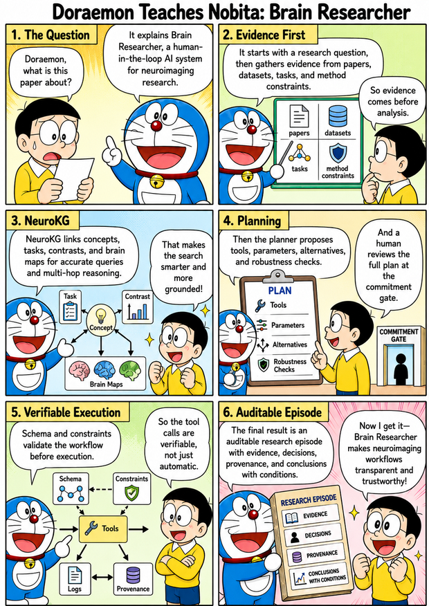
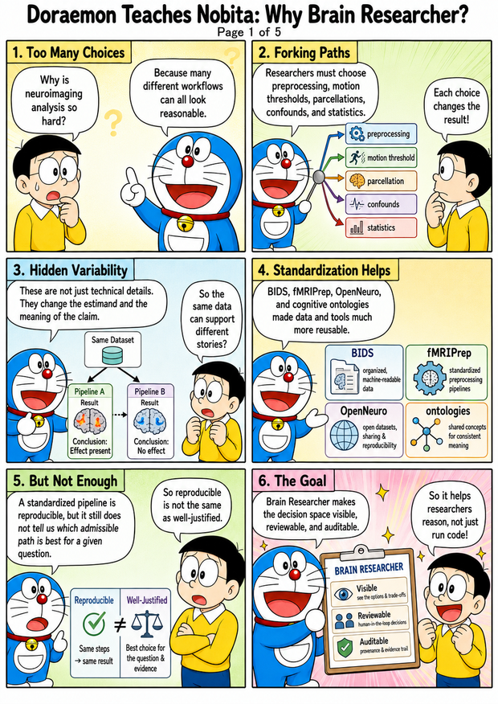
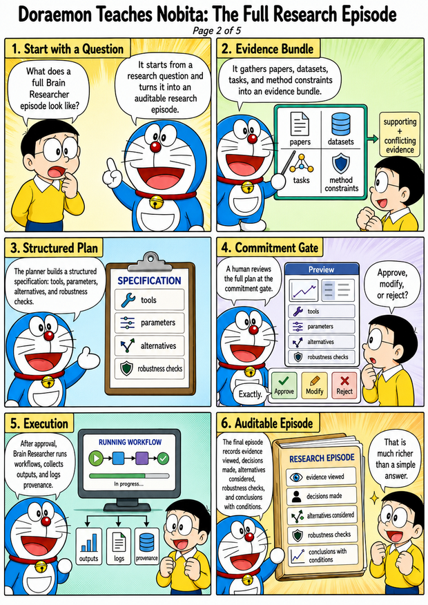
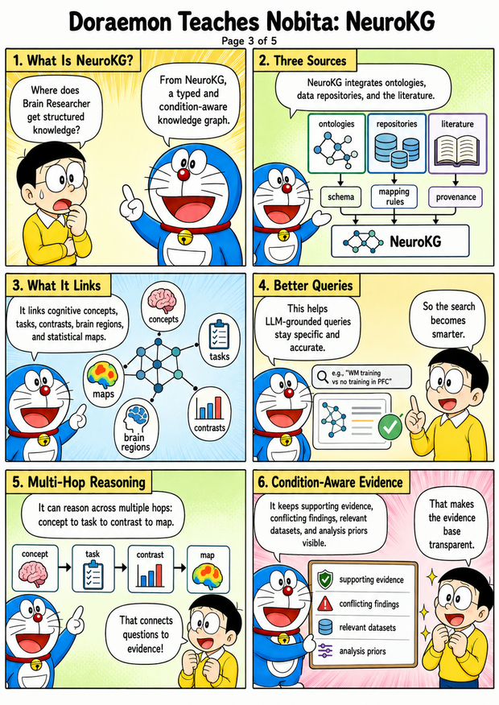
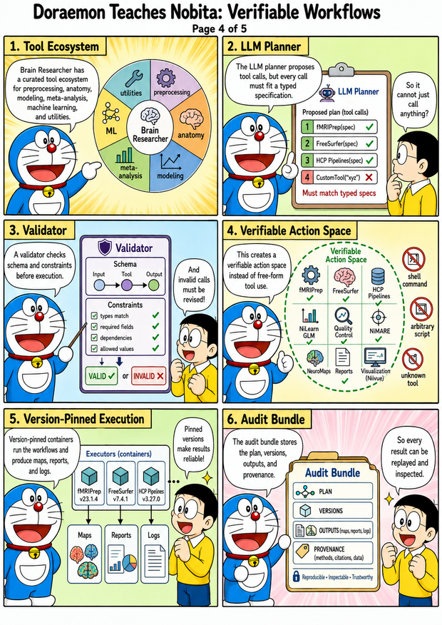
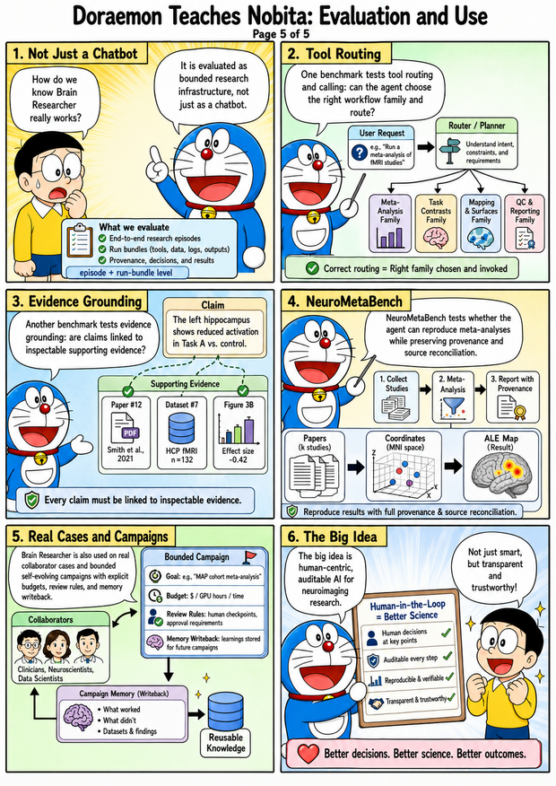

# Brain Researcher

**Brain Researcher is a workspace-centric infrastructure for auditable AI-assisted neuroimaging.** It turns research questions into bounded episodes that connect evidence, admissible analysis choices, tool/recipe selection, provenance, and review verdicts. This public repository ships the open code, MCP contracts, service stack, Web UI, docs, and public-safe helpers; private benchmark corpora, Neo4j graph contents, internal run artifacts, and site-specific launchers are not included.

Use it through MCP from Claude Code, Codex, Cursor, or another MCP client. For setup guides, MCP client configuration, skills, AGENTS templates, demos, and evaluation rubrics, see [`brain-researcher-agent-kit`](https://github.com/brain-researcher/brain-researcher-agent-kit).

## Understand Brain Researcher

The storyboard below is a quick visual overview of the intended workflow: start
with a research question, route planning and tools through MCP, connect KG
evidence and neuroimaging recipes, then review the result before treating it as
analysis output. For concrete services, paths, and setup commands, continue to
the sections below.

For more detailed, source-linked information about this repository, visit the
[Brain Researcher public DeepWiki](https://deepwiki.com/brain-researcher/brain-researcher-public).

<p align="center">
  <br>
  <br>
  <br>
  <br>
  <br>
  
</p>

---

## What it does

- **Plan → Recipe → Verify loop.** Natural-language research questions become typed plans, MCP recipes, local/agent handoff prompts, and evidence-grounded reports. Hosted execution is deployment-specific and should be treated as unavailable unless runtime readiness, auth, data, and credits pass.
- **Brain-researcher knowledge graph (BR-KG).** Neo4j-backed graph linking concepts, brain regions, datasets, tasks, methods, papers, and tools. Supports multi-hop QA, hypothesis-candidate retrieval, behavior↔fMRI cross-modal queries.
- **MCP tool surface.** Planning, KG search, workflow recipes, run inspection, scientific review, deep research, and hypothesis workflows exposed via the [Model Context Protocol](https://modelcontextprotocol.io/) for Claude Code, Codex, Cursor, or any MCP client. v0.1.0 ships **10 stable-tier tool contracts** under [`contracts/tools/`](contracts/tools/). Public compatibility claims are limited to these versioned contracts.
- **Neuroimaging toolchain.** Workflow recipes target [Neurodesk](https://www.neurodesk.org/) containers (FSL, MRtrix3, SPM, ANTs, FreeSurfer, fMRIPrep, MRIQC, …) and Python packages such as Nilearn, MNE, NiMARE, and custom pipelines.
- **SLURM-ready.** Pluggable cluster profiles (`configs/slurm/profiles/*.yaml`) — easy to add your own.

---

## Architecture (high level)

```
┌────────────────────────────────────────────────────────────────────────────┐
│                              Web UI  (Next.js)                              │
│  chat · studio · KG · dataset explorer · hypothesis · 3D brain viewer       │
└────────────┬──────────────────────────┬─────────────────────────────────────┘
             │                          │
             ▼                          ▼
   ┌────────────────────┐    ┌────────────────────┐     ┌───────────────────┐
   │   Orchestrator     │◀──▶│       Agent        │◀───▶│   MCP Server      │
   │  (FastAPI / SSE)   │    │ (LLM router +      │     │ stable public     │
   │ plans, runs, jobs  │    │   tool executor)   │     │  MCP contracts    │
   └────────┬───────────┘    └────────┬───────────┘     └─────────┬─────────┘
            │                         │                           │
            ▼                         ▼                           │
   ┌────────────────────┐    ┌────────────────────┐               │
   │     BR-KG API      │    │   Tool catalog     │◀──────────────┘
   │  (Neo4j-backed,    │    │ Nilearn / MNE /    │
   │ concepts · regions │    │ NiMARE / fMRIPrep /│
   │ · papers · tools)  │    │ Neurodesk modules  │
   └────────────────────┘    └────────────────────┘
```

For a deeper dive see [`docs/contract-tiers.md`](docs/contract-tiers.md) for the MCP surface contract and [`tests/architecture/test_import_boundaries.py`](tests/architecture/test_import_boundaries.py) for the import-boundary ratchet.

---

## Where the important pieces live

| Area | Start here | What to expect |
|---|---|---|
| Web UI | `apps/web-ui/src/` | Next.js app code for chat, Studio-style views, demos, and browser-facing workflows. |
| UI config, messages, assets | `apps/web-ui/next.config*.js`, `apps/web-ui/messages/`, `apps/web-ui/public/` | Frontend configuration, locale files, service workers, and public browser assets. |
| CLI entrypoints | `src/brain_researcher/cli/` | Typer commands behind `brain-researcher` / `br`, including service startup commands. |
| Agent runtime | `src/brain_researcher/services/agent/` | Agent planner, router, backends, execution helpers, logging, subagents, and state utilities. |
| Agent skills and templates | [`brain-researcher-agent-kit`](https://github.com/brain-researcher/brain-researcher-agent-kit) | Companion repository for skills, AGENTS templates, demos, adapters, and eval rubrics. |
| Orchestrator | `src/brain_researcher/services/orchestrator/` | FastAPI/SSE job, run, resource, and collaboration surfaces used by the web stack. |
| MCP server | `src/brain_researcher/services/mcp/server.py`, `src/brain_researcher/services/mcp/routers/` | MCP tool exposure, route grouping, planning/review/run/artifact adapters, and compatibility wrappers. |
| Stable contracts | `contracts/`, `docs/mcp_tools.schema.json`, `docs/contract-tiers.md` | Versioned public tool schemas and the policy for stable, experimental, and deprecated MCP surfaces. |
| Tool implementations | `src/brain_researcher/services/tools/` | Python tool wrappers for neuroimaging workflows, dataset utilities, KG bridge tools, visualization, and execution recipes. |
| Tool metadata/catalogs | `configs/tools_catalog_overrides.yaml`, `configs/catalog/`, `scripts/tools/` | Declarative tool metadata, family mappings, capability overlays, and catalog validation/generation helpers. |
| BR-KG service code | `src/brain_researcher/services/br_kg/` | Neo4j-backed API, graph/query/ETL/schema code. The compiled graph data itself is private. |
| KG configs and schemas | `configs/br-kg/`, `scripts/kg/schema.cypher` | Public-safe schema/config references for KG shape and local test setup; not KG dumps. |
| Review layer | `src/brain_researcher/services/review/`, `configs/review_rules.yaml`, `docs/appendices/07_appendix_G_review.md` | Scientific/code review rules, review bundles, and documented review boundaries. |
| Shared public Python namespace | `src/brain_researcher/br/` | Stable imports such as `br.retry`, `br.provenance`, `br.artifact`, `br.http`, and `br.redaction`. |
| Docs and appendices | `docs/` | Operations, MCP docs, release notes, appendices, use cases, and public-surface explanations. |
| Tests | `tests/` | Unit, integration, architecture, contract, and browser/e2e checks. |

---

## Quick start (local Docker)

Brings up the default runtime stack: Neo4j + Redis + BR-KG + agent + web UI.
Compose also runs a one-shot `init-local-dirs` job to prepare writable local
`data/` and `logs/` subdirectories for non-root service containers. The
orchestrator worker is optional and can be added with the `worker` profile.

```bash
git clone https://github.com/brain-researcher/brain-researcher-public.git
cd brain-researcher-public

# 1. Set required env vars (at least: NEO4J_PASSWORD, JWT_SECRET_KEY, NEXTAUTH_SECRET, one LLM API key).
cp .env.example .env
$EDITOR .env

# 2. Start the default stack.
docker compose up -d

# 3. Verify: the init job exits 0 and runtime services become healthy.
docker compose ps
# → init-local-dirs (Exited 0)
# → neo4j, redis, br-kg, agent, web-ui   (Status: healthy)

# 4. Open the web UI.
xdg-open http://localhost:3000   # or just navigate in your browser
```

To build and start every compose service, including the optional orchestrator:

```bash
docker compose --profile worker build
docker compose --profile worker up -d
docker compose --profile worker ps
# → init-local-dirs (Exited 0)
# → neo4j, redis, br-kg, agent, orchestrator, web-ui
```

**Port collision?** Override defaults via env vars:

```bash
BR_NEO4J_HTTP_PORT=7484 BR_NEO4J_BOLT_PORT=7697 BR_KG_PORT=5010 \
  AGENT_PORT=8010 ORCHESTRATOR_PORT=3011 WEB_UI_PORT=3010 \
  docker compose -p brpub up -d
```

**Minimal env vars** (see [`docs/ENVIRONMENT_SETUP.md`](docs/ENVIRONMENT_SETUP.md) for full reference):

| Variable | Purpose | Notes |
|---|---|---|
| `NEO4J_PASSWORD` | KG password | ≥ 8 chars |
| `JWT_SECRET_KEY` | service auth signing | ≥ 32 chars |
| `NEXTAUTH_SECRET` | web UI session signing | ≥ 32 chars |
| `OPENAI_API_KEY` / `ANTHROPIC_API_KEY` / `GEMINI_API_KEY` / `DEEPSEEK_API_KEY` | BR runtime LLM access (any one) | Directly read by the default runtime |
| `ZAI_API_KEY` / `OPENROUTER_API_KEY` | Optional external/coding-agent access | For GLM/OpenRouter/opencode-style clients or gateways |

Generate local service secrets:

```bash
python - <<'PY'
import secrets

print("NEO4J_PASSWORD=" + secrets.token_urlsafe(24))
print("JWT_SECRET_KEY=" + secrets.token_urlsafe(48))
print("NEXTAUTH_SECRET=" + secrets.token_urlsafe(48))
PY
```

Then paste those values into `.env` and add one LLM provider key. Official key
pages:

- Gemini: <https://aistudio.google.com/app/apikey>
- OpenAI: <https://platform.openai.com/api-keys>
- Anthropic: <https://console.anthropic.com/settings/keys>
- DeepSeek: <https://platform.deepseek.com/api_keys>
- Z.AI / GLM: <https://docs.z.ai/guides>
- OpenRouter: <https://openrouter.ai/docs/api-keys>
- OpenCode providers: <https://dev.opencode.ai/docs/providers/>

The default Brain Researcher runtime reads Gemini, OpenAI, Anthropic, or
DeepSeek keys directly. Z.AI/GLM, OpenRouter, and OpenCode are included for
external coding-agent or OpenAI-compatible gateway setups; configure those
clients explicitly before relying on them for runtime calls.

Example `.env` fragment:

```env
NEO4J_PASSWORD=replace_with_generated_value
JWT_SECRET_KEY=replace_with_generated_value
NEXTAUTH_SECRET=replace_with_generated_value

GEMINI_API_KEY=replace_with_key_from_google_ai_studio
DEFAULT_LLM_MODEL=gemini-3-flash-preview
```

### Neo4j data boundary

The first boot brings up an empty Neo4j. The compiled BR-KG graph, Neo4j
dumps, and internal graph-derived datasets are private and are not attached to
GitHub Releases. Populate Neo4j only from private or local sources you are
authorized to use.

---

## Install as a Python package

The MCP server + CLI live under `src/brain_researcher/` and can be installed from the repo root:

```bash
pip install -e ".[all]"
brain-researcher --help
```

Core CLI surfaces (`br` is a short alias; on systems where `br` is shadowed, use `brain-researcher`):

```bash
brain-researcher chat                            # interactive chat with the agent
brain-researcher serve agent | kg | mcp | web    # individual services
brain-researcher db init                         # initialize databases
brain-researcher data load-openneuro --dataset ds000114
```

For HPC / SLURM usage, see [`docs/hpc.md`](docs/hpc.md). For the contract layer that governs which tool names are stable across releases, see [`docs/contract-tiers.md`](docs/contract-tiers.md) and inspect `contracts/tools/*.json`.

---

## Kubernetes / Helm

Two deployment paths under [`infrastructure/k8s/`](infrastructure/k8s/):

```bash
# Helm chart (recommended)
helm template brain-researcher infrastructure/k8s/helm/brain-researcher/ \
  -f your-values.yaml | kubectl apply -f -

# Or raw manifests
kubectl apply -f infrastructure/k8s/manifests/
# (Istio overlay resources require Istio CRDs; see infrastructure/k8s/helm/brain-researcher-istio/)
```

The main Helm chart renders 26 Kubernetes resources cleanly; the Istio overlay subchart is experimental, so inspect its chart values and templates before use.

---

## What's in the repo

| Directory | Purpose |
|---|---|
| `src/brain_researcher/` | Python package: CLI, core, services (agent / MCP / BR-KG / orchestrator), semantics, autoresearch |
| `src/brain_researcher/br/` | Stable re-export namespace: `br.retry`, `br.provenance`, `br.artifact`, `br.http`, `br.redaction` |
| `apps/web-ui/` | Next.js 14 frontend (chat, studio, demo replay, KG explorer) |
| `contracts/` | OSS API stability surface: `VERSION`, `br-tool-contract.schema.json`, `tools/*.json` (10 stable-tier tool schemas) |
| `configs/` | Tool catalogs, mappings, taxonomy, and public runtime defaults |
| `docs/` | MCP docs, appendices, use cases, release notes, and contributor-facing docs |
| `tests/` | Unit + integration + contracts (Pact) + e2e (Playwright) |
| `infrastructure/` | docker-compose, Helm chart, K8s manifests, monitoring, nginx, haproxy |
| `scripts/` | ETL / analysis / build / CI helpers and focused maintenance utilities |

For the current import-boundary ratchet, see [`tests/architecture/test_import_boundaries.py`](tests/architecture/test_import_boundaries.py) and [`tests/architecture/services_layer_baseline.txt`](tests/architecture/services_layer_baseline.txt). For the agent-kit (skills + AGENTS templates + adapters + demos + eval rubrics), see the companion repo [`brain-researcher-agent-kit`](https://github.com/brain-researcher/brain-researcher-agent-kit).

---

## Citation

If you use Brain Researcher in published work, please cite:

```bibtex
@misc{brain_researcher_2026,
  author       = {Chen, Zijiao and {Brain Researcher contributors}},
  title        = {Brain Researcher: AI-assisted research infrastructure workspace for neuroimaging analyses},
  year         = {2026},
  howpublished = {\url{https://github.com/brain-researcher/brain-researcher-public}},
  note         = {arXiv:XXXX.XXXXX (preprint pending); Zenodo DOI pending}
}
```

A machine-readable citation lives in [`CITATION.cff`](CITATION.cff) and will be updated with the arXiv ID and Zenodo DOI at v1.0 release.

---

## Contributing

We welcome bug reports, feature ideas, case studies, and code contributions.

- **Read first:** [`CONTRIBUTING.md`](CONTRIBUTING.md) — dev workflow, codegraph-accelerated review, test conventions.
- **Code of conduct:** [`CODE_OF_CONDUCT.md`](CODE_OF_CONDUCT.md).
- **Security:** report vulnerabilities privately per [`SECURITY.md`](SECURITY.md); see also [`THREAT_MODEL.md`](THREAT_MODEL.md) for the MCP server attack surface. Runtime payload scrubbing is provided by `br.redaction`.
- **Adding a new tool:** see [`docs/how-to-add-tool.md`](docs/how-to-add-tool.md) for the workflow from `@mcp.tool` decoration through contract-layer inclusion.

For agent-policy templates (research / code-review / brain-researcher), see [`brain-researcher-agent-kit/agents/`](https://github.com/brain-researcher/brain-researcher-agent-kit).

---

## Acknowledgments

Brain Researcher builds on the work of many open-source neuroscience projects:

- **Datasets and ontologies:** [OpenNeuro](https://openneuro.org/), [BIDS](https://bids.neuroimaging.io/), [Cognitive Atlas](https://www.cognitiveatlas.org/), [NeuroSynth](https://neurosynth.org/), [NeuroBagel](https://neurobagel.org/), [Allen Brain Atlas](https://portal.brain-map.org/)
- **Toolchains:** [Nilearn](https://nilearn.github.io/), [MNE-Python](https://mne.tools/), [NiMARE](https://nimare.readthedocs.io/), [fMRIPrep](https://fmriprep.org/), [MRIQC](https://mriqc.readthedocs.io/), [FSL](https://fsl.fmrib.ox.ac.uk/), [Neurodesk](https://www.neurodesk.org/)
- **Infrastructure:** [Model Context Protocol](https://modelcontextprotocol.io/), [Neo4j](https://neo4j.com/), [Next.js](https://nextjs.org/), [FastAPI](https://fastapi.tiangolo.com/)

---

## License

[MIT](LICENSE) — © 2026 Brain Researcher Team
