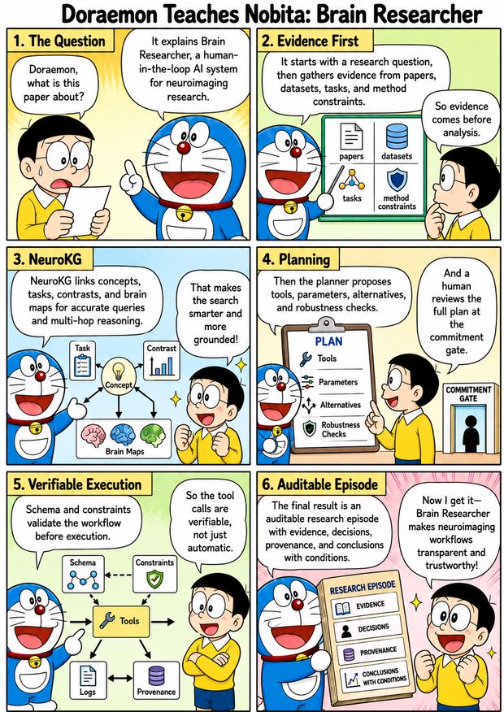
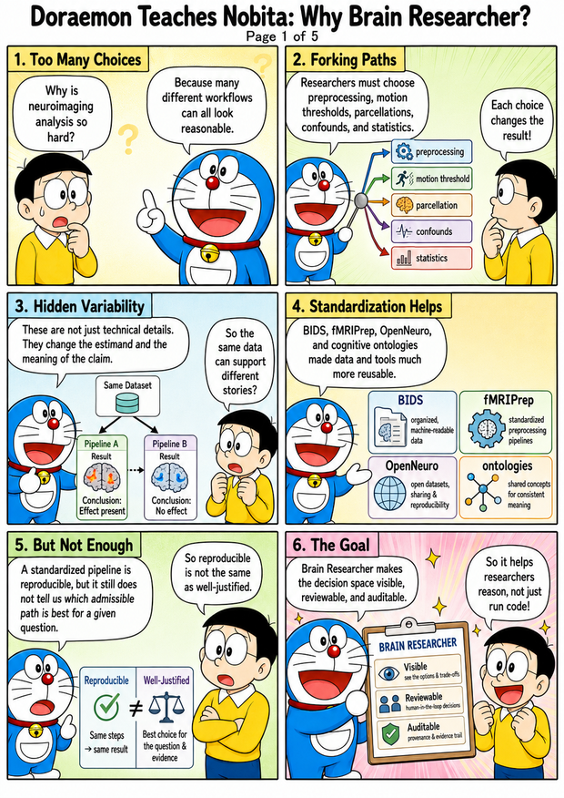
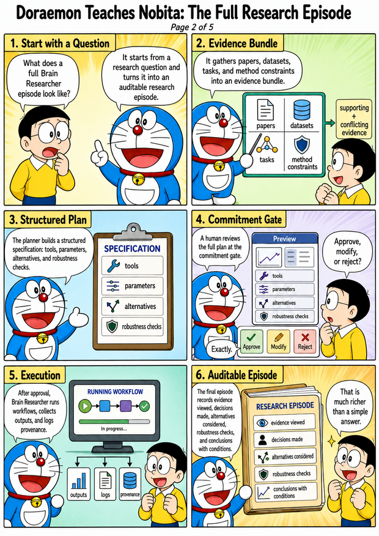
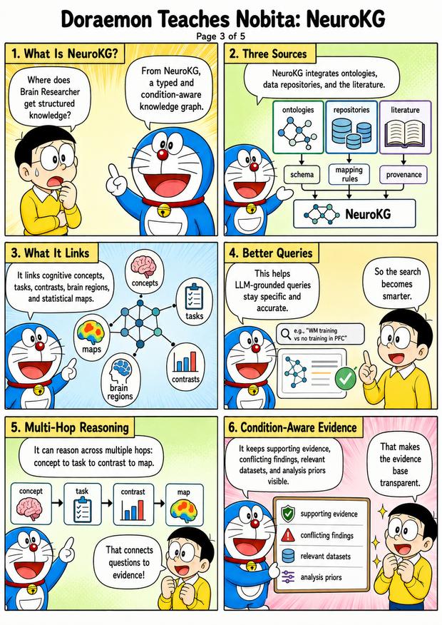
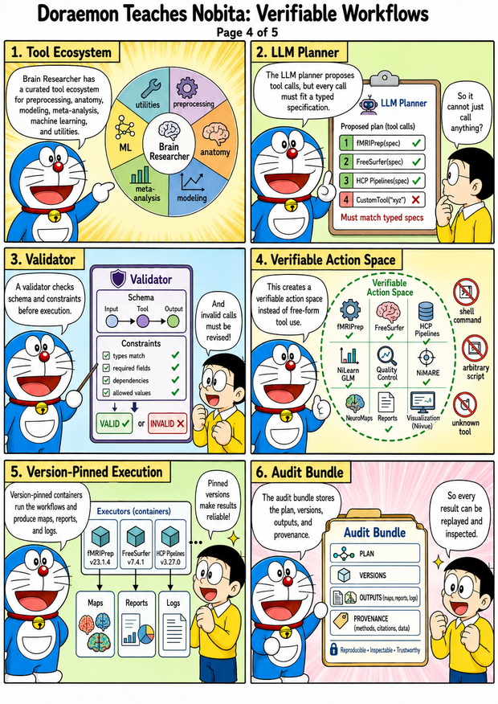
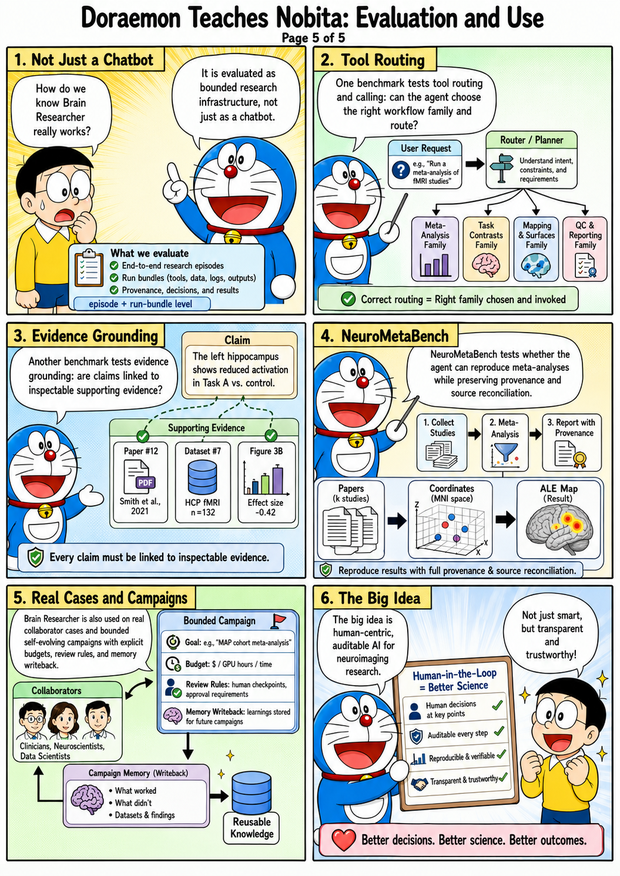

# Brain Researcher

Software release v0.3.0 (fixed version DOI pending). Zenodo is identified here
by its concept DOI until the published GitHub release is archived:
[](https://doi.org/10.5281/zenodo.21282319)

**Brain Researcher is a workspace-centric infrastructure for auditable AI-assisted neuroimaging.** It turns research questions into bounded episodes that connect evidence, admissible analysis choices, tool/recipe selection, provenance, and review verdicts. This public repository ships the open code, MCP contracts, service stack, Web UI, docs, and public-safe helpers; private benchmark corpora, Neo4j graph contents, internal run artifacts, and site-specific launchers are not included.

## Choose your path

| Goal | Start here | What to expect |
|---|---|---|
| Reproduce a public example | [`reproducibility/`](reproducibility/) | Verify committed snapshots or run the public-data examples. MCP is not required. |
| Use Brain Researcher through Claude Code, Codex, Cursor, or another MCP client | [`brain-researcher-agent-kit`](https://github.com/brain-researcher/brain-researcher-agent-kit) | MCP client setup, skills, AGENTS templates, demos, and evaluation rubrics. |
| Run the browser stack locally | [Quick start (local Docker)](#quick-start-local-docker) | Neo4j, Redis, BR-KG, agent, and Web UI. The default Compose stack does not start the MCP server. |
| Develop the Python CLI or MCP server | [Install as a Python package](#install-as-a-python-package) | Editable install plus the `brain-researcher` / `br` commands. |

## Public surface status

The v0.3.0 release contract uses the canonical status tokens `stable`,
`supported-local`, `experimental`, `deployment-specific`, and `historical`.
They describe what the public repository supports, not what a private or hosted
deployment may add.

| Status | Public surfaces | What the label means |
|---|---|---|
| **`stable`** | Python package/CLI release metadata and the 10 versioned MCP contracts under [`contracts/tools/`](contracts/tools/) | Compatibility is governed by the semantic software version and MCP contract epoch recorded in [`release/manifest.json`](release/manifest.json). |
| **`supported-local`** | Python 3.11 clean install, root Docker Compose development stack, pack verification, and documented public-data reruns | Required CI exercises clean installs, checksums, the Web build, and static Compose validation without starting services. Public-data reruns use a separate scheduled workflow; Compose runtime health remains a user-run local check. External credentials or data are required only where stated. |
| **`experimental`** | Helm/Kubernetes rendering assets, JupyterHub values, and experimental research workers | Inspect or develop these surfaces, but do not treat them as supported installation or production paths. |
| **`deployment-specific`** | Hosted execution, private BR-KG contents, governed datasets, cluster profiles, and optional MCP tools backed by configured services | Availability depends on a particular deployment's auth, data, runtime, and credits. A public checkout does not imply access. |
| **`historical`** | Dated archives, tombstones, old campaign reports, and `br-reproducibility-*` artifact tags/DOIs | Preserved for provenance. They are not active instructions and their versions are independent of the v0.3.0 software release. |

Reproducibility claims use a separate five-level vocabulary: **inspectable**
means the committed evidence can be reviewed; **integrity verified** means its
recorded checksums match; **public runnable** means the workflow can run from
shipped or unrestricted public inputs; **governed rerun** means the rerun also
needs access-controlled data or infrastructure; and **fully reproduced** means
a completed rerun met its declared scientific tolerances. See the
[reproduction status vocabulary](docs/reproducibility_packs.md#reproduction-status-vocabulary)
before interpreting a pack badge or verifier result.

## Understand Brain Researcher

The storyboard below is a quick visual overview of the intended workflow: start
with a research question, route planning and tools through MCP, connect KG
evidence and neuroimaging recipes, then review the result before treating it as
analysis output. For concrete services, paths, and setup commands, continue to
the sections below.

[](https://deepwiki.com/brain-researcher/brain-researcher-public)

For a more detailed walkthrough of the codebase, service boundaries, dependency
graph, and file-linked architecture notes, read the
[Brain Researcher public DeepWiki](https://deepwiki.com/brain-researcher/brain-researcher-public)
generated by Devin.

<p align="center">
  <br>
  <br>
  <br>
  <br>
  <br>
  
</p>

---

## What it does

- **Plan → Recipe → Verify loop.** Natural-language research questions become typed plans, MCP recipes, local/agent handoff prompts, and evidence-grounded reports. Hosted execution is deployment-specific and should be treated as unavailable unless runtime readiness, auth, data, and credits pass.
- **Brain-researcher knowledge graph (BR-KG).** Neo4j-backed graph linking concepts, brain regions, datasets, tasks, methods, papers, and tools. Supports multi-hop QA, hypothesis-candidate retrieval, behavior↔fMRI cross-modal queries.
- **MCP tool surface.** Planning, KG search, workflow recipes, run inspection, scientific review, deep research, and hypothesis workflows exposed via the [Model Context Protocol](https://modelcontextprotocol.io/) for Claude Code, Codex, Cursor, or any MCP client. v0.3.0 retains MCP contract epoch `2026-05-27` and ships **10 stable-tier tool contracts** under [`contracts/tools/`](contracts/tools/). Public compatibility claims are limited to these versioned contracts.
- **Neuroimaging toolchain.** Workflow recipes target [Neurodesk](https://www.neurodesk.org/) containers (FSL, MRtrix3, SPM, ANTs, FreeSurfer, fMRIPrep, MRIQC, …) and Python packages such as Nilearn, MNE, NiMARE, and custom pipelines.
- **SLURM-ready.** Pluggable cluster profiles (`configs/slurm/profiles/*.yaml`) — easy to add your own.

---

## Architecture (high level)

```
┌────────────────────────────────────────────────────────────────────────────┐
│                              Web UI  (Next.js)                              │
│  chat · studio · KG · dataset explorer · hypothesis · 3D brain viewer       │
└────────────┬──────────────────────────┬─────────────────────────────────────┘
             │                          │
             ▼                          ▼
   ┌────────────────────┐    ┌────────────────────┐     ┌───────────────────┐
   │   Orchestrator     │◀──▶│       Agent        │◀───▶│   MCP Server      │
   │  (FastAPI / SSE)   │    │ (LLM router +      │     │ stable public     │
   │ plans, runs, jobs  │    │   tool executor)   │     │  MCP contracts    │
   └────────┬───────────┘    └────────┬───────────┘     └─────────┬─────────┘
            │                         │                           │
            ▼                         ▼                           │
   ┌────────────────────┐    ┌────────────────────┐               │
   │     BR-KG API      │    │   Tool catalog     │◀──────────────┘
   │  (Neo4j-backed,    │    │ Nilearn / MNE /    │
   │ concepts · regions │    │ NiMARE / fMRIPrep /│
   │ · papers · tools)  │    │ Neurodesk modules  │
   └────────────────────┘    └────────────────────┘
```

For a deeper dive see [`docs/contract-tiers.md`](docs/contract-tiers.md) for the MCP surface contract and [`tests/architecture/test_import_boundaries.py`](tests/architecture/test_import_boundaries.py) for the import-boundary ratchet.

---

## Where the important pieces live

| Area | Start here | What to expect |
|---|---|---|
| Web UI | [`apps/web-ui/README.md`](apps/web-ui/README.md) | Canonical frontend entrypoint, status boundaries, and links to the Next.js app and tests. |
| UI config, messages, assets | `apps/web-ui/next.config*.js`, `apps/web-ui/messages/`, `apps/web-ui/public/` | Frontend configuration, locale files, service workers, and public browser assets. |
| CLI entrypoints | `src/brain_researcher/cli/` | Typer commands behind `brain-researcher` / `br`, including service startup commands. |
| Agent runtime | `src/brain_researcher/services/agent/` | Agent planner, router, backends, execution helpers, logging, subagents, and state utilities. |
| Agent skills and templates | [`brain-researcher-agent-kit`](https://github.com/brain-researcher/brain-researcher-agent-kit) | Companion repository for skills, AGENTS templates, demos, adapters, and eval rubrics. |
| Orchestrator | `src/brain_researcher/services/orchestrator/` | FastAPI/SSE job, run, resource, and collaboration surfaces used by the web stack. |
| MCP server | `src/brain_researcher/services/mcp/server.py`, `src/brain_researcher/services/mcp/routers/` | MCP tool exposure, route grouping, planning/review/run/artifact adapters, and compatibility wrappers. |
| Stable contracts | `contracts/`, `docs/mcp_tools.schema.json`, `docs/contract-tiers.md` | Versioned public tool schemas and the policy for stable, experimental, and deprecated MCP surfaces. |
| Tool implementations | `src/brain_researcher/services/tools/` | Python tool wrappers for neuroimaging workflows, dataset utilities, KG bridge tools, visualization, and execution recipes. |
| Tool metadata/catalogs | [Catalog guide](configs/catalog/README.md), `configs/tools_catalog_overrides.yaml`, `scripts/tools/` | Declarative tool metadata, family mappings, capability overlays, and catalog validation/generation helpers. |
| BR-KG service code | `src/brain_researcher/services/br_kg/` | Neo4j-backed API, graph/query/ETL/schema code. The compiled graph data itself is private. |
| KG configs and schemas | `configs/br-kg/`, `scripts/kg/schema.cypher` | Public-safe schema/config references for KG shape and local test setup; not KG dumps. |
| Review layer | `src/brain_researcher/services/review/`, `configs/review_rules.yaml`, `docs/appendices/07_appendix_G_review.md` | Scientific/code review rules, review bundles, and documented review boundaries. |
| Shared public Python namespace | `src/brain_researcher/br/` | Stable imports such as `br.retry`, `br.provenance`, `br.artifact`, `br.http`, and `br.redaction`. |
| Reproducibility | `reproducibility/` | Public-safe packs and runnable tutorials for inspecting or generating auditable records. |
| Dataset downloaders | [`scripts/DOWNLOADERS.md`](scripts/DOWNLOADERS.md) | Exact inventory and status boundaries for supported-public, private-input, experimental, and historical data acquisition scripts. |
| Worked claim-record tutorial | `reproducibility/auditable_claim_record/` | Runnable tutorial that generates claim-card JSON. It is not a manifest-backed reproducibility pack. |
| Autoresearch foundations | [`docs/autoresearch_public_foundations.md`](docs/autoresearch_public_foundations.md) | Experimental contract-only program identity and canonical episode-path derivation; no loop runtime, authority, or execution. |
| Autoresearch scripts | [`scripts/autoresearch/README.md`](scripts/autoresearch/README.md) | Status and input boundaries for runnable helpers, experimental workers, and historical campaign scripts. |
| Local deployment and infrastructure status | [`DEPLOYMENT.md`](DEPLOYMENT.md) and [`infrastructure/deployment/README.md`](infrastructure/deployment/README.md) | Supported local Compose instructions plus the canonical status matrix for experimental and historical assets. |
| Docs and appendices | `docs/` | Operations, MCP docs, release notes, appendices, use cases, and public-surface explanations. |
| Tests | `tests/` | Unit, BR-KG, architecture, contract, behavior, and performance checks. Web/browser checks live under `apps/web-ui/tests/`. |

---

## Quick start (local Docker)

Brings up the default runtime stack: Neo4j + Redis + BR-KG + agent + web UI.
Compose also runs a one-shot `init-local-dirs` job to prepare writable local
`data/` and `logs/` subdirectories for non-root service containers. The
orchestrator worker is optional and can be added with the `worker` profile.

```bash
git clone https://github.com/brain-researcher/brain-researcher-public.git
cd brain-researcher-public

# 1. Set required secrets, one LLM API key, and a matching DEFAULT_LLM_MODEL.
cp .env.example .env
# Edit .env and replace the required placeholders before continuing.

# 2. Validate the Compose model.
PUBLIC_HOSTNAME=localhost docker compose --env-file .env config --quiet

# 3. Build and start the default stack, then wait for health checks.
docker compose up -d --build --wait --wait-timeout 300

# 4. Verify: the init job exits 0 and runtime services are healthy.
docker compose ps --all
# → init-local-dirs (Exited 0)
# → neo4j, redis, br-kg, agent, web-ui   (Status: healthy)

# 5. Check the Agent, BR-KG, and Web UI HTTP surfaces.
bash scripts/smoke/health_smoke.sh

# 6. Open http://localhost:3000 in your browser.
```

Stop the local stack without deleting its volumes:

```bash
docker compose down
```

To build and start every compose service, including the optional orchestrator:

```bash
docker compose --profile worker up -d --build --wait --wait-timeout 300
docker compose --profile worker ps --all
# → init-local-dirs (Exited 0)
# → neo4j, redis, br-kg, agent, orchestrator, web-ui
```

**Port collision?** Override defaults via env vars:

```bash
BR_NEO4J_HTTP_PORT=7484 BR_NEO4J_BOLT_PORT=7697 BR_KG_PORT=5010 \
  AGENT_PORT=8010 ORCHESTRATOR_PORT=3011 WEB_UI_PORT=3010 \
  docker compose -p brpub up -d --build --wait --wait-timeout 300
docker compose -p brpub ps --all
BASE_AGENT=http://localhost:8010 BASE_NKG=http://localhost:5010 \
  BASE_UI=http://localhost:3010 bash scripts/smoke/health_smoke.sh
```

Open <http://localhost:3010> for this alternate-port stack. When finished,
stop the same Compose project without deleting its volumes:

```bash
docker compose -p brpub down
```

**Minimal env vars** (see [`docs/ENVIRONMENT_SETUP.md`](docs/ENVIRONMENT_SETUP.md) for full reference):

| Variable | Purpose | Notes |
|---|---|---|
| `NEO4J_PASSWORD` | KG password | ≥ 8 chars |
| `JWT_SECRET_KEY` | service auth signing | ≥ 32 chars |
| `NEXTAUTH_SECRET` | web UI session signing | ≥ 32 chars |
| `OPENAI_API_KEY` / `ANTHROPIC_API_KEY` / `GEMINI_API_KEY` / `DEEPSEEK_API_KEY` | BR runtime LLM access (any one) | Directly read by the default runtime |
| `DEFAULT_LLM_MODEL` | agent model selection | Must name a model served by the provider key you set |
| `ZAI_API_KEY` / `OPENROUTER_API_KEY` | Optional external/coding-agent access | For GLM/OpenRouter/opencode-style clients or gateways |

Generate local service secrets:

```bash
python3 - <<'PY'
import secrets

print("NEO4J_PASSWORD=" + secrets.token_urlsafe(24))
print("JWT_SECRET_KEY=" + secrets.token_urlsafe(48))
print("NEXTAUTH_SECRET=" + secrets.token_urlsafe(48))
PY
```

Then paste those values into `.env`, add one LLM provider key, and set
`DEFAULT_LLM_MODEL` to a model served by that provider. Matching examples are
in [`docs/ENVIRONMENT_SETUP.md`](docs/ENVIRONMENT_SETUP.md). Official key pages:

- Gemini: <https://aistudio.google.com/app/apikey>
- OpenAI: <https://platform.openai.com/api-keys>
- Anthropic: <https://console.anthropic.com/settings/keys>
- DeepSeek: <https://platform.deepseek.com/api_keys>
- Z.AI / GLM: <https://docs.z.ai/guides>
- OpenRouter: <https://openrouter.ai/docs/api-keys>
- OpenCode providers: <https://dev.opencode.ai/docs/providers/>

The default Brain Researcher runtime reads Gemini, OpenAI, Anthropic, or
DeepSeek keys directly. Z.AI/GLM, OpenRouter, and OpenCode are included for
external coding-agent or OpenAI-compatible gateway setups; configure those
clients explicitly before relying on them for runtime calls.

Example `.env` fragment:

```env
NEO4J_PASSWORD=replace_with_generated_value
JWT_SECRET_KEY=replace_with_generated_value
NEXTAUTH_SECRET=replace_with_generated_value

GEMINI_API_KEY=replace_with_key_from_google_ai_studio
DEFAULT_LLM_MODEL=gemini-3-flash-preview
```

### Neo4j data boundary

The first boot brings up an empty Neo4j. The compiled BR-KG graph, Neo4j
dumps, and internal graph-derived datasets are private and are not attached to
GitHub Releases. Populate Neo4j only from private or local sources you are
authorized to use.

---

## Install as a Python package

The MCP server + CLI live under `src/brain_researcher/`. From the repository
root, create an isolated Python 3.11 environment and install the base package:

```bash
python3.11 -m venv .venv
source .venv/bin/activate
python -m pip install -e .
brain-researcher --help
brain-researcher-mcp --help
```

Install only the runtime profile you need: `.[mcp]`, `.[agent]`, or `.[br-kg]`.
The `.[all]` contributor profile is intentionally heavy: it includes MCP,
BR-KG, agent, neuroimaging, UI, notebook, and development dependencies. If you
only want to run the public reproducibility examples, use their isolated setup
commands instead of installing this full stack.

For exact tested versions, profile mappings, regeneration commands, and the
fresh-venv smoke, see [`requirements/locks/README.md`](requirements/locks/README.md).

Core CLI surfaces (`br` is a short alias). If another installation shadows
both console-script names, use `python -m brain_researcher.cli.main` from the
activated, installed environment:

```bash
brain-researcher chat             # interactive chat; requires an LLM provider key
brain-researcher serve agent      # one foreground service per terminal
brain-researcher serve kg
brain-researcher serve mcp
brain-researcher serve web
brain-researcher db --help        # inspect database commands and prerequisites
brain-researcher data --help      # inspect the currently implemented data commands
```

For HPC / SLURM usage, see [`docs/hpc.md`](docs/hpc.md). For the contract layer that governs which tool names are stable across releases, see [`docs/contract-tiers.md`](docs/contract-tiers.md) and inspect `contracts/tools/*.json`.

---

## Kubernetes / Helm (experimental)

The Helm chart and raw manifests under
[`infrastructure/k8s/`](infrastructure/k8s/) are incomplete operator assets, not
apply-ready deployment paths:

Run these inspection commands from the repository root with Helm installed:

```bash
# Helm chart (experimental/incomplete): render for syntax inspection only.
cp infrastructure/k8s/helm/brain-researcher/values.yaml /tmp/brain-researcher-values.yaml
helm template brain-researcher infrastructure/k8s/helm/brain-researcher/ \
  -f /tmp/brain-researcher-values.yaml > /tmp/brain-researcher-rendered.yaml
grep -E '^[[:space:]]*image:' /tmp/brain-researcher-rendered.yaml | sort -u

# Inventory the empty Secret key contracts in the raw manifest templates.
grep -RInE '^[[:space:]]*kind:[[:space:]]*Secret|^[[:space:]]*(data|stringData):' \
  infrastructure/k8s/manifests/
```

Do **not** apply the current Helm output to a cluster. Although `helm template`
produces deterministic image references with fixed preview tags, the project
does not publish or support the corresponding application images. The chart
also emits no `Secret` resources and expects operator-supplied secret names and
keys. Rendering validates the static contract only; it does not prove that the
workloads can be pulled, started, secured, or kept healthy.

Do **not** run `kubectl apply -f infrastructure/k8s/manifests/` on the public
directory as shipped. Its `Secret` resources contain key contracts with empty
values, including TLS and basic-auth inputs, and some resources require cluster
CRDs such as cert-manager.
If you maintain a raw-manifest deployment, copy the templates into a private
deployment workspace, replace secrets through your secret-management workflow,
verify the required CRDs, review a server-side dry run or diff against the
intended cluster, and only then apply the reviewed files.
The retained raw Istio manifests under `infrastructure/k8s/istio/` are also
experimental templates; the unsupported secondary Istio chart and install
helpers were removed from the active tree.

---

The table above is the maintained repository map. For the current
import-boundary ratchet, see
[`tests/architecture/test_import_boundaries.py`](tests/architecture/test_import_boundaries.py)
and
[`tests/architecture/services_layer_baseline.txt`](tests/architecture/services_layer_baseline.txt).
For public audit artifacts, start with
[`docs/reproducibility_packs.md`](docs/reproducibility_packs.md) and
[`reproducibility/README.md`](reproducibility/README.md). Agent skills,
templates, demos, adapters, and eval rubrics remain in the companion
[`brain-researcher-agent-kit`](https://github.com/brain-researcher/brain-researcher-agent-kit)
repository.

Release v0.3.0 includes derived-artifact replay packs for the HCP workflow-search
and TRIBE speech--tools trajectories. Their pack manifests leave the containing
commit to the release gate, whose attached evidence binds the public archive to
the exact source commit.

The replay packs remain immutable, derived-data snapshots. The corresponding
producing-code surfaces are now also public: the governed HCP MVE100,
recovery, R2, and R3 drivers are documented in
[`foundation_episode/README.md`](src/brain_researcher/research/predictive/foundation_episode/README.md),
and the TRIBE speech--tools feature-to-result evaluators are documented in
[`discovery/programs/README.md`](src/brain_researcher/research/discovery/programs/README.md).
The HCP code still requires separately governed inputs and human authorization.
The TRIBE public evaluator starts from precomputed feature matrices; raw audio,
model checkpoints, and representation extraction remain external. Shipping
these code paths does not by itself constitute an independent scientific rerun.

---

## Citation

If you use Brain Researcher in published work, please cite:

```bibtex
@software{chen_2026_brain_researcher,
  author       = {Chen, Zijiao and {Brain Researcher contributors}},
  title        = {Brain Researcher: AI-assisted research infrastructure workspace for neuroimaging analyses},
  year         = {2026},
  version      = {0.3.0},
  url          = {https://github.com/brain-researcher/brain-researcher-public/releases/tag/v0.3.0}
}
```

The fixed v0.3.0 version DOI will be added after Zenodo archives the published
GitHub release. Until then, the Zenodo concept DOI
[`10.5281/zenodo.21282319`](https://doi.org/10.5281/zenodo.21282319)
identifies the version family and may resolve to its latest record; it is not a
fixed v0.3.0 identifier. The earlier version DOI
[`10.5281/zenodo.21282320`](https://doi.org/10.5281/zenodo.21282320)
identifies the historical `br-reproducibility-20260709.1` artifact archive.
The fixed v0.2.0 software DOI is
[`10.5281/zenodo.21392244`](https://doi.org/10.5281/zenodo.21392244).
A machine-readable software citation lives in [`CITATION.cff`](CITATION.cff),
and the pending archive state is explicit in
[`release/manifest.json`](release/manifest.json). No paper or preprint
identifier is claimed by this software citation.

---

## Contributing

We welcome bug reports, feature ideas, case studies, and code contributions.

- **Read first:** [`CONTRIBUTING.md`](CONTRIBUTING.md) — dev workflow, codegraph-accelerated review, test conventions.
- **Code of conduct:** [`CODE_OF_CONDUCT.md`](CODE_OF_CONDUCT.md).
- **Security:** report vulnerabilities privately per [`SECURITY.md`](SECURITY.md); see also [`THREAT_MODEL.md`](THREAT_MODEL.md) for the MCP server attack surface. Runtime payload scrubbing is provided by `br.redaction`.
- **Adding a new tool:** see [`docs/how-to-add-tool.md`](docs/how-to-add-tool.md) for the workflow from `@mcp.tool` decoration through contract-layer inclusion.

For agent-policy templates (research / code-review / brain-researcher), see [`brain-researcher-agent-kit/agents/`](https://github.com/brain-researcher/brain-researcher-agent-kit).

---

## Acknowledgments

Brain Researcher builds on the work of many open-source neuroscience projects:

- **Datasets and ontologies:** [OpenNeuro](https://openneuro.org/), [BIDS](https://bids.neuroimaging.io/), [Cognitive Atlas](https://www.cognitiveatlas.org/), [NeuroSynth](https://neurosynth.org/), [NeuroBagel](https://neurobagel.org/), [Allen Brain Atlas](https://portal.brain-map.org/)
- **Toolchains:** [Nilearn](https://nilearn.github.io/), [MNE-Python](https://mne.tools/), [NiMARE](https://nimare.readthedocs.io/), [fMRIPrep](https://fmriprep.org/), [MRIQC](https://mriqc.readthedocs.io/), [FSL](https://fsl.fmrib.ox.ac.uk/), [Neurodesk](https://www.neurodesk.org/)
- **Infrastructure:** [Model Context Protocol](https://modelcontextprotocol.io/), [Neo4j](https://neo4j.com/), [Next.js](https://nextjs.org/), [FastAPI](https://fastapi.tiangolo.com/)

---

## License

[MIT](LICENSE) — © 2026 Brain Researcher Team
