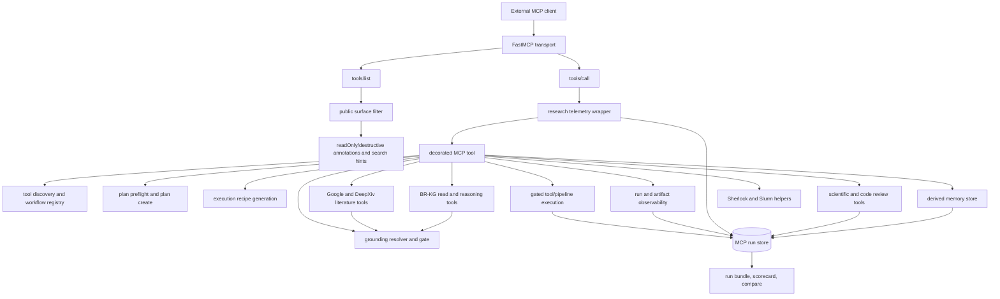

# Appendix D. Tool Registry and Specification Ledger Card

This appendix has two parts.

- **Part 1 — BR-MCP System Data Card.** System-level description of the MCP server that brokers all tool discovery, execution recipes, and admin execution. Documents the public surface (87 decorated tools), capability families, runtime boundaries, compute/control graph, neuroimaging tooling routing, execution backends, the LLM↔MCP decision split, storage and policy gates, access patterns, and downstream workflow roles. Re-issue when the MCP version or surface tiering changes.
- **Part 2 — Per-episode tool-ledger template.** Fillable card recording how a specific episode chose, ranked, and rejected candidate tools and produced an execution recipe.

---

# Part 1 — BR-MCP System Data Card

## D.S1 Evidence status

| Item | Value |
|------|-------|
| Primary implementation | `src/brain_researcher/services/mcp/server.py` |
| Helper modules | `execution_recipes.py`, `loop_primitives.py`, `research_summaries.py`, `sherlock_tools.py` |
| Decorated MCP tools in code | 87 |
| Published `docs/mcp_tools.schema.json` entries | 72 |
| Claude Code hint metadata entries | 83 |
| Exposed plus workflow tool specs loaded by quick self-test | 177 |
| All registry tool specs loaded by quick self-test | 2,089 |
| MCP-related test files found | 33 |
| Default loop profile | `external_coding_v1` |
| Current observed run root | `<repo>/data/runs/mcp_runs` |
| Current observed allowed roots | `/data/brain_researcher_data/repo_runtime/artifacts`, repo data, repo tmp |
| Current observed policy flags | network=false, dangerous=false, tool_execute=false |

## D.S2 Evidence sources

| Source | What it supports |
|--------|--------------------|
| `src/brain_researcher/services/mcp/server.py` | FastMCP server, tools, resources, auth, HTTP wrapper, run persistence, research logging, KG/literature/grounding entrypoints |
| `src/brain_researcher/services/mcp/loop_primitives.py` | loop profile, run bundle normalization, scorecards, run comparisons |
| `src/brain_researcher/services/mcp/execution_recipes.py` | execution recipe generation for Python, Neurodesk, container, and Slurm targets |
| `src/brain_researcher/services/mcp/research_summaries.py` | trajectory and bug-digest summaries over run/candidate artifacts |
| `src/brain_researcher/services/mcp/sherlock_tools.py` | Sherlock/OAK guide, Slurm rendering, log/job diagnostics |
| `docs/mcp.md` | user-facing MCP flow, env knobs, execution policy, external coding-agent loop |
| `docs/mcp.md#surface-tiers` | default, advanced, ops tiers and capability-family policy |
| `docs/specs/br_mcp_mode_profile_spec.md` | hosted cloud, local Docker, and HPC deployment-mode contract |
| `docs/mcp_tools.schema.json` | machine-readable tool catalog (72 entries) |
| `infrastructure/docker/Dockerfile.mcp` | Docker packaging, port 7000, runtime dependencies |
| `configs/claude/mcp.http.template.json.tmpl` | HTTP client template (`/mcp` URL + bearer header) |
| `tests/unit/mcp`, `tests/integration/mcp`, `tests/k8s/test_mcp_prod_values.py` | MCP unit, integration, auth, surface-tier, workflow, and deployment tests |

## D.S3 MCP public surface

Brain Researcher MCP exposes a `FastMCP("brain-researcher")` server with:

- 87 decorated operational tools in `server.py`.
- 3 resources: `tool://{tool_id}`, `dataset://{dataset_ref}`, `workflow://{workflow_id}`.
- Tool discovery and execution-recipe helpers over the broader BR tool registry.
- Read-only KG, dataset, literature, grounding, run, artifact, and memory helpers.
- Manual/admin execution paths that are intentionally gated.
- Transport modes: stdio, SSE, and streamable HTTP.
- A Starlette HTTP wrapper that adds `/healthz`, `/resolve`, bearer/JWT auth, allowed host/origin checks, and MCP session-bootstrap middleware.

### Capability families and tools

| Capability family | Tools |
|-------------------|-------|
| artifact_inspection | `artifact_list`, `artifact_read_text`, `artifact_get_metadata`, `artifact_read_bytes` |
| autoresearch_review | `run_autoresearch_scientific_review` |
| dataset_resolution | `dataset_get_resources` |
| execution_recipe | `get_execution_recipe` |
| google_research | `google_file_search`, `google_deep_research_start`, `google_deep_research_get`, `google_deep_research` |
| grounding | `grounding_resolve`, `grounding_gate_evidence_basis` |
| kg_explore | `kg_search_nodes`, `kg_get_node`, `kg_neighbors`, `kg_search_datasets`, `kg_related_datasets`, `kg_behavior_to_fmri_retrieval`, `kg_list_dataset_onvoc_links` |
| kg_hypothesis | `kg_verify_hypothesis`, `verify_hypothesis_with_kg`, `kg_sample_ood_hypothesis`, `kg_hypothesis_workflow`, `kg_verify_sampled_hypotheses`, `kg_sample_and_verify_hypotheses`, `kg_hypothesis_candidate_cards`, `hypothesis_hot_load_research`, `hypothesis_run_start`, `hypothesis_run_get`, `kg_hypothesis_candidate_cards_start`, `kg_hypothesis_candidate_cards_get` |
| kg_probe | `kg_probe`, `kg_find_structural_leverage`, `kg_detect_contradiction_motifs`, `kg_find_contradiction_frontiers`, `kg_mine_assumption_cracks`, `kg_find_analogy_transfers`, `kg_detect_topology_shifts` |
| kg_reasoning | `kg_multihop_qa` |
| literature_search | `deepxiv` |
| memory | `memory_write`, `memory_search`, `memory_get` |
| pipeline_execution | `pipeline_plan_validate`, `pipeline_plan_review`, `run_code_review`, `run_scientific_review`, `pipeline_execute` |
| plan_handoff | `get_latest_plan` |
| planning | `plan_preflight`, `plan_create` |
| report_generation | `latex_report_render` |
| research_logging | `log_research_event`, `write_session_snapshot`, `research_session_digest`, `research_log_summary` |
| research_synthesis | `generate_research_trajectory_and_insights`, `generate_bug_digest`, `generate_repo_repair_context` |
| run_observability | `run_get`, `run_bundle_get`, `run_scorecard`, `run_compare`, `run_list`, `run_logs`, `run_find_latest_reviewable`, `run_request_summary`, `run_cancel`, `run_metrics` |
| scientific_report | `scientific_report_generate` |
| scientific_review | `request_scientific_review`, `request_external_scientific_review_directive`, `submit_external_scientific_review_verdict`, `refuted_landscape_summary`, `companion_diagnostic_suggester` |
| server_ops | `server_info`, `loop_profile_get`, `system_self_test` |
| sherlock | `sherlock_guide`, `sherlock_slurm` |
| tool_discovery | `tool_search`, `workflow_search`, `tool_search_structured`, `tool_resolve`, `tool_get` |
| tool_execution_admin | `tool_execute` |

## D.S4 Architecture and runtime boundaries

| Layer | Component | Responsibility | Notes |
|-------|-----------|----------------|-------|
| Transport | FastMCP | MCP protocol server over stdio, SSE, or streamable HTTP | `mcp = FastMCP("brain-researcher")` |
| HTTP wrapper | `build_http_app` | Starlette wrapper for auth, `/healthz`, `/resolve`, session bootstrap | Used for HTTP transports only |
| Tool surface | decorated functions in `server.py` | Public MCP tools and resources | 87 tools, 3 resources |
| Discovery layer | `UnifiedToolRegistry`, `tool_search`, `tool_get` | Search BR tool specs and workflow specs | Quick self-test loaded 177 exposed+workflow specs, 2,089 all specs |
| Recipe layer | `execution_recipes.py` | Build stateless local execution recipes | Targets: python, neurodesk, container, slurm |
| Admin execution layer | `tool_execute`, `pipeline_execute` | Preview or execute gated tools/pipelines | Disabled by default for agents; allowlist and policy gates apply |
| Run store | `data/runs/mcp_runs` by default | Persist run records, traces, artifacts, bundles, research logs | Uses `build_mcp_run_dir`, `iter_mcp_run_dir_candidates` |
| Loop primitives | `loop_primitives.py` | Normalize run bundles, scorecards, comparisons | Used by external coding-agent loop |
| KG access | `kg_*` tools | Read-only Neo4j query helpers plus hypothesis/probe workflows | Fail fast unless degraded mode is explicitly allowed |
| Dataset resolution | `dataset_get_resources` | Resolve local paths, BIDS paths, derivatives, URLs | Uses shared dataset mounts/resources |
| Grounding | `grounding_resolve`, `grounding_gate_evidence_basis` | Resolve and gate evidence anchors | Rejects malformed anchors, downgrades unresolved grounded anchors |
| Research logging | `log_research_event`, `write_session_snapshot` | Durable session start/note/snapshot record | Also attached to automatic tool-call telemetry |
| Memory | `MemoryStore`, `memory_*` tools | Derived memory cards and relation events | Local store under run-root memory index/cards when present |
| Literature | Google tools, DeepXiv | File search, Gemini Deep Research, arXiv/PMC search/read | Network and API-key gated |
| Sherlock/HPC | `sherlock_tools.py` | Slurm script rendering, validation, job/log diagnostics | Advanced surface |
| Docker package | `infrastructure/docker/Dockerfile.mcp` | Slim MCP runtime image | Exposes port 7000 |
| Neuroimaging registry | BR tool registry and workflow catalog | Stores the broader neuroimaging method/workflow surface that MCP can search, resolve, and package into recipes | Inventory: 177 exposed+workflow specs, 2,089 total |
| Backend recipe targets | Python, Neurodesk, container, Slurm | Converts a selected registry tool/workflow into a backend-specific command, container invocation, or batch script | Recipes are stateless handoffs unless admin execution gate is explicitly enabled |
| LLM client boundary | External coding agent, notebook, IDE, web assistant | Interprets the goal, calls MCP tools, chooses among returned candidates, explains results | LLM does not bypass policy gates and is not the default repository mutator inside MCP |

## D.S5 Compute and control graph

### Compute nodes

| Node | Inputs | Outputs | Persistence |
|------|--------|---------|--------------|
| MCP transport | JSON-RPC over stdio, SSE, or streamable HTTP | tool list, tool result, resource result | none |
| HTTP middleware | headers, auth token, host/origin, optional session id | authenticated request, session bootstrap, errors | in-memory session cache |
| Tool list wrapper | FastMCP tool manager | MCP tool schemas plus optional Claude Code annotations/search hints | none |
| Research telemetry wrapper | tool name, args, result, session binding | trace events, directives, session binding metadata | run root |
| Discovery registry | tool registry configs, workflow catalog, query | ranked tool/workflow cards | in-memory caches + registry files |
| Planning | user query, domain/modality, inputs | preflight facts, blockers, display plan, execution envelope | latest handoff cache |
| Execution recipe | tool/workflow id, params, runtime target | command/script/container/Slurm recipe | response only unless caller persists |
| Admin execution | gated plan/tool call, policy flags, allowlist, roots | run id, step records, artifacts, preflight issues | run root |
| Run observability | run id | run status, logs, metrics, bundle, scorecard, compare | reads run root |
| KG access | KG ids/query/hypothesis | nodes, neighbors, paths, evidence, candidate cards | Neo4j read; optional run artifacts |
| Grounding | reference anchors, evidence rows, resolvers | resolved support or downgraded evidence basis | response and optional run/session artifacts |
| Research logging | session id, event/snapshot payload | research event log, session snapshot, digest | run root |
| Memory | card payloads, query filters | memory cards, relation events, search hits | run-root memory store |

### High-level directed edges

| Edge | Trigger | Main function/tool | Main output |
|------|---------|--------------------|-------------|
| client → discovery | user asks what to use | `tool_search`, `workflow_search`, `tool_get` | candidate tools/workflows |
| discovery → recipe | selected tool/workflow | `get_execution_recipe` | local execution instructions |
| query → preflight → plan | user asks for a plan | `plan_preflight`, `plan_create` | display plan + execution envelope |
| plan → admin execution | explicit manual/admin approval | `pipeline_plan_validate`, `pipeline_execute` | persisted run |
| tool id → admin execution | explicitly allowed single-tool call | `tool_execute` | preview or persisted run |
| run → bundle | user/agent needs evidence | `run_bundle_get` | normalized run observation |
| bundle → scorecard | quality inspection | `run_scorecard` | artifact completeness + quality signals |
| baseline + candidate → compare | keep/discard decision | `run_compare` | directional metric comparison |
| query/entities → KG | research grounding/hypothesis work | `kg_*` tools | KG evidence + structural signals |
| KG/literature → grounding | final-answer evidence check | `grounding_resolve`, `grounding_gate_evidence_basis` | valid, downgraded, or rejected anchors |
| work session → durable memory | start/note/close | `log_research_event`, `write_session_snapshot` | session digest + resumable snapshot |

## D.S6 Neuroimaging tooling behind MCP

| Layer | What it contains | MCP entrypoints | Decision value |
|-------|--------------------|------------------|------------------|
| Registry-scale tool catalog | 177 exposed+workflow specs, 2,089 total registry specs | `tool_search`, `workflow_search`, `tool_search_structured`, `tool_resolve`, `tool_get` | Narrows a broad scientific request into a small set of concrete tools or workflows |
| Dataset and BIDS resources | Dataset references, local paths, BIDS-style resources, derivatives, URLs | `dataset_get_resources`, `dataset://{dataset_ref}` | Prevents planning around missing or unresolved inputs |
| Workflow definitions | Multi-step analysis recipes and exposed workflow specifications | `workflow_search`, `workflow://{workflow_id}` | Moves from single-method selection to end-to-end analysis plans |
| Neuroimaging runtime wrappers | Tool specs convertible into Python commands, Neurodesk calls, container invocations, or Slurm scripts | `get_execution_recipe` with `target_runtime` | Separates scientific tool choice from execution backend |
| Quality and review layer | Run bundles, scorecards, comparisons, code/scientific review, artifact inspection | `run_bundle_get`, `run_scorecard`, `run_compare`, `artifact_*`, `run_scientific_review` | Lets the LLM decide whether outputs are complete, reproducible, and scientifically usable |

> Release note: this document explains how all registry tools are surfaced and executed through MCP. The 2,089 registry tool specs are catalogued separately; for a literal complete tool list, export the registry catalog as its own machine-readable appendix.

## D.S7 Execution backends and where work actually runs

| Backend | Hosted where | Typical use | Who triggers it | Persistence / evidence |
|---------|---------------|-------------|------------------|--------------------------|
| Local Python | Local repo checkout, developer machine, or lightweight container | Small scripts, wrappers, quick checks, validation jobs, or tools with Python entrypoints | Usually external coding agent or user shell, using a recipe from MCP | If run through MCP admin execution, records land under the MCP run root; otherwise MCP observes imported artifacts/logs |
| Neurodesk | Containerized neuroimaging runtime with domain software images | Neuroimaging tools that need a curated imaging software environment | External agent/user launches the generated Neurodesk recipe | Outputs written to allowed mounted roots; inspectable through run/artifact tools |
| Generic container | Docker/Singularity-style runtime with controlled mounts | Reproducible execution when dependencies should not leak into MCP service image | External agent/user, or gated admin execution if enabled | Recipe declares mounts, command, parameters, expected output locations |
| Slurm / HPC | Cluster login/dev node and scheduler-managed compute nodes | Long-running or high-memory neuroimaging jobs (batch or array workloads) | External agent/user submits scripts rendered by `get_execution_recipe` or `sherlock_slurm` | Job logs, status, and produced artifacts become evidence for run bundles and review |
| MCP admin execution | The MCP service process or worker process spawned by it | Explicitly approved manual/admin runs, previews, or policy-tested pipeline execution | `tool_execute` or `pipeline_execute`; disabled by default | Persisted run ids, step records, trace logs, metrics, artifacts in run root |
| Hosted HTTP MCP service | A long-running FastMCP/Starlette service (commonly port 7000 for streamable HTTP/SSE) | Remote discovery, planning, evidence retrieval, observability from notebooks/web assistants | Authenticated clients call `/mcp` | Service calls logged by the research telemetry wrapper when session/run binding is present |

## D.S8 How MCP decides vs. what the LLM decides

| Step | LLM / client role | MCP role | Evidence returned |
|------|---------------------|----------|---------------------|
| 1. Interpret request | Turn a natural-language research goal into candidate modalities, datasets, methods, and constraints | Receives structured or semi-structured query arguments | Initial query, session context, optional plan handoff |
| 2. Discover tools | Ask for candidate tools/workflows; inspect summaries instead of guessing a command | Searches the registry, applies exposed/default filters, returns ranked cards/specs | Tool cards, workflow cards, schema summaries, optional totals |
| 3. Resolve selection | Choose a specific method/software/workflow | Resolves method/software/op keys to a concrete registry tool or workflow id | Resolved tool id, metadata, parameter schema |
| 4. Preflight inputs | Check whether the proposed analysis has required datasets, modality, safe roots | Runs `plan_preflight`, `dataset_get_resources`, policy-aware validation | Blockers, missing inputs, resolved resource paths, execution envelope |
| 5. Generate recipe | Ask for a backend-specific recipe rather than writing ad-hoc commands | Builds a stateless recipe for Python, Neurodesk, container, or Slurm | Recipe text, expected mounts, parameters, output conventions |
| 6. Execute work | Normally delegates to an external coding agent, shell, container runtime, or scheduler | Only executes if the ops/admin gate is enabled, allowlisted, and approved | Run id, logs, stdout/stderr, Slurm status, produced files |
| 7. Review outputs | Decide whether the result supports the scientific claim or needs another iteration | Normalizes bundles, scorecards, comparisons, artifacts, review results | Observation bundle, scorecard, metric deltas, artifact metadata, review verdicts |
| 8. Explain or iterate | Summarize evidence, cite run/artifact support, choose next MCP call | Provides durable logs, memory, grounding checks, run/session digests | Final evidence basis or next-step plan |

## D.S9 Storage and artifact model

| Artifact family | Typical files | Produced by | Used by |
|-----------------|----------------|--------------|---------|
| Run records | `run.json`, step records, progress metadata | `tool_execute`, `pipeline_execute`, background hypothesis/google runs, research logging | `run_get`, `run_list`, `run_metrics` |
| Trace logs | `trace.jsonl`, `tool_trace.jsonl`, event rows | MCP telemetry and run execution | `run_bundle_get`, `research_session_digest` |
| Observation bundle | `observation.json`, `trajectory.json`, `analysis_bundle.json`, `provenance.json` (when present) | agent/runtime/harness surfaces | `run_bundle_get`, `run_scorecard` |
| Session logs | `research_events.jsonl`, `session_snapshot.json`, `session_transcript.jsonl`, `conversation_log.jsonl` | research logging tools + automatic wrapper | `research_session_digest`, `research_log_summary` |
| Artifact files | logs, reports, TeX/PDF, JSON, TSV, images | execution/report tools | `artifact_list`, `artifact_read_text`, `artifact_read_bytes`, report tools |
| Memory store | memory index + card files under run root | `memory_write`, distillation helpers | `memory_search`, hypothesis novelty filtering |
| Registry/catalog files | `configs/catalog/*`, workflow catalog, `docs/mcp_tools.schema.json` | repo config and schema generation | discovery, schema docs, surface-tier tests |

## D.S10 Safety and policy gates

| Gate | Default / current behavior | Controlled by |
|------|-----------------------------|----------------|
| Filesystem roots | work/output paths must stay under allowed roots | `BR_MCP_ALLOWED_ROOTS`; default repo artifacts, data, tmp |
| Network | disabled in observed local config | `BR_MCP_ALLOW_NETWORK` |
| Dangerous tools | disabled in observed local config | `BR_MCP_ALLOW_DANGEROUS` |
| Direct tool execution | disabled in observed local config | `BR_MCP_ENABLE_TOOL_EXECUTE`, `BR_MCP_TOOL_EXECUTE_ALLOWLIST` |
| Tool timeout | optional worker-process timeout with terminate/kill grace | `BR_MCP_TOOL_TIMEOUT_S`, cancel/kill grace vars |
| KG timeout | read and multihop budgets | `BR_MCP_KG_READ_TIMEOUT_S`, `BR_MCP_KG_MULTIHOP_TIMEOUT_S` |
| HTTP auth | fail-closed in auto mode without token/JWT | `BR_MCP_AUTH_MODE`, token/JWT env vars |
| Host/origin checks | allowlists optional but enforced if set | `BR_MCP_ALLOWED_HOSTS`, `BR_MCP_ALLOWED_ORIGINS` |
| Grounding | malformed references fail; unresolved grounded refs downgrade | `grounding_resolve`, `grounding_gate_evidence_basis` |
| External coding loop | MCP does not edit repo in `external_coding_v1` | loop profile mutation policy |

## D.S11 Access patterns

| Access path | Command / config | Notes |
|-------------|--------------------|-------|
| Local stdio | `brain-researcher-mcp` or `python -m brain_researcher.services.mcp.server` | recommended local coding-agent path |
| Docker stdio | `scripts/ops/mcp_docker_stdio.sh` | mounts repo artifacts, data, tmp into container |
| HTTP streamable | `BR_MCP_TRANSPORT=streamable-http`, port 7000 | Starlette wrapper adds auth, `/healthz`, `/resolve` |
| SSE | `BR_MCP_TRANSPORT=sse` | supported by same `main()` selection |
| Claude HTTP template | `configs/claude/mcp.http.template.json.tmpl` | URL `http://127.0.0.1:7000/mcp`, bearer header |
| Kubernetes / prod | Docker image from `infrastructure/docker/Dockerfile.mcp` | exposes port 7000; prod route may be mounted under `/mcp` |

## D.S12 Downstream workflow roles

| Downstream use | MCP role | Primary tools |
|----------------|----------|----------------|
| External coding-agent loop | deterministic discovery, recipe, observation, comparison, session logging | `loop_profile_get`, `tool_search`, `get_execution_recipe`, `run_bundle_get`, `run_scorecard`, `run_compare`, `write_session_snapshot` |
| Neuroimaging planning | read-only facts, blockers, tool candidates, handoff envelope | `plan_preflight`, `plan_create`, `get_latest_plan` |
| Run review | correctness/completeness/judgment review over BR or external artifacts | `run_code_review`, `run_scientific_review`, `request_external_scientific_review_directive`, `submit_external_scientific_review_verdict` |
| BR-KG reasoning | retrieve nodes, paths, datasets, structural signals, hypotheses | `kg_search_nodes`, `kg_neighbors`, `kg_multihop_qa`, `kg_probe`, `kg_hypothesis_workflow` |
| Hypothesis generation | candidate cards, hot-load research, topology shifts | `kg_hypothesis_candidate_cards`, `hypothesis_hot_load_research`, `kg_detect_topology_shifts` |
| Literature grounding | file search, deep research, arXiv/PMC search/read | `google_file_search`, `google_deep_research_start`, `google_deep_research`, `deepxiv` |
| Evidence-basis gate | validate/downgrade final-answer anchors | `grounding_resolve`, `grounding_gate_evidence_basis` |
| HPC/Sherlock execution support | render Slurm scripts and diagnose jobs/logs | `sherlock_guide`, `sherlock_slurm` |
| Report artifacts | render report templates and inspect produced files | `scientific_report_generate`, `latex_report_render`, `artifact_*` |
| Neuroimaging execution handoff | Selects registry tool/workflow → executable backend recipe; leaves heavy execution outside MCP by default | `tool_search`, `tool_resolve`, `tool_get`, `get_execution_recipe`, `sherlock_slurm`, `dataset_get_resources` |

## D.S13 Decorated MCP tool inventory

> `status=schema` means the tool exists in code **and** in `docs/mcp_tools.schema.json`. `status=compat/manual` means the tool exists in code but is not in the published schema and has been classified from code/docs context.

| Tool | Family | Tier | Arguments | Status |
|------|--------|------|-----------|--------|
| server_info | server_ops | ops | — | schema |
| loop_profile_get | server_ops | ops | profile_id | schema |
| system_self_test | server_ops | ops | mode, include_kg, include_container, include_script, include_inventory, inventory_limit, kg_query, strict | schema |
| sherlock_guide | sherlock | advanced | action, topic, intent, sunet, pi_group, partition, qos, time, cpus, mem, gpus, dataset, script_path, job_id, log_path, mount_path | schema |
| sherlock_slurm | sherlock | advanced | action, cluster_profile, template_kind, job_name, time, partition, qos, account, cpus_per_task, mem, nodes, ntasks_per_node, gpus, gpus_per_node, array, array_concurrency, output, error, mail_user, mail_type, workdir, module_lines, env_lines, command, task_file, launcher, include_export_none, change_request, script_text, script_path, job_id, include_squeue, include_sacct, include_scontrol, log_path, stream, tail, grep, stdout_text, stderr_text, sacct_state | schema |
| tool_search | tool_discovery | default | query, limit, offset, modalities, kind, phases, exposed_only, include_workflows, include_total | schema |
| workflow_search | tool_discovery | advanced | query, limit, offset, include_param_schema_summary | schema |
| tool_search_structured | tool_discovery | advanced | query, primary_intents, softwares, exposed_only, default_only, k_methods, k_softwares, k_candidates, force_fallback | schema |
| tool_resolve | tool_discovery | advanced | method, software, op_key, prefer_version, exposed_only, default_only, force_fallback | schema |
| tool_get | tool_discovery | default | tool_id, include_schema | schema |
| get_execution_recipe | execution_recipe | advanced | tool_id, params, target_runtime, cluster_profile | schema |
| plan_preflight | planning | default | query, domain, modality, inputs, allowlist_mode, semantic, selection_mode | schema |
| plan_create | planning | default | query, domain, modality, inputs, allowlist_mode, query_understanding, include_debug, semantic | schema |
| get_latest_plan | plan_handoff | default | thread_id | schema |
| tool_execute | tool_execution_admin | ops | tool_id, params, work_dir, output_dir, preview, allow_remap, allow_fallback | schema |
| pipeline_plan_validate | pipeline_execution | ops | plan | schema |
| pipeline_plan_review | pipeline_execution | ops | plan, workflow_id, use_kg | schema |
| run_code_review | pipeline_execution | ops | run_id, workflow_id, force_recompute, use_kg | schema |
| run_scientific_review | pipeline_execution | ops | run_id, workflow_id, use_judgment_critic, force_recompute | schema |
| run_autoresearch_scientific_review | autoresearch_review | ops | autoresearch_dir, logs_dir, task_id, use_judgment_critic, force_recompute | schema |
| request_scientific_review | scientific_review | advanced | goal, run_id, autoresearch_dir, hints, workflow_id, logs_dir, task_id, use_judgment_critic, force_recompute, session_id, source_client, client_session_id | compat/manual |
| scientific_report_generate | scientific_report | ops | run_id, autoresearch_dir, workflow_id, logs_dir, task_id, title, authors, analysis_sections, subtitle, institution, date, use_judgment_critic, force_recompute, compile_pdf, halt_on_review_block, revision_instructions, revision_source_artifacts, local_workspace, local_workspace_manifest | schema |
| request_external_scientific_review_directive | scientific_review | advanced | goal, hints, session_id, source_client, client_session_id | schema |
| submit_external_scientific_review_verdict | scientific_review | advanced | directive_id, verdict, session_id, reviewer, notes, source_client, client_session_id | schema |
| refuted_landscape_summary | scientific_review | advanced | findings, session_id, run_ids, top_k | schema |
| companion_diagnostic_suggester | scientific_review | advanced | metric_name, observed_value, context, top_k | schema |
| pipeline_execute | pipeline_execution | ops | plan, dry_run, approval_phrase | schema |
| log_research_event | research_logging | advanced | kind, content, session_id, run_id, source, context, tags, source_client, client_session_id | schema |
| write_session_snapshot | research_logging | advanced | goal, done, open, next_command, session_id, run_id, source, tags, source_client, client_session_id, context | schema |
| research_session_digest | research_logging | advanced | run_id, session_id | schema |
| research_log_summary | research_logging | advanced | top_k, since_days | schema |
| memory_write | memory | advanced | card_type, card_data | schema |
| memory_search | memory | advanced | query, card_type, filters, limit | schema |
| memory_get | memory | advanced | card_id | schema |
| run_get | run_observability | default | run_id | schema |
| run_bundle_get | run_observability | advanced | run_id | schema |
| run_scorecard | run_observability | advanced | run_id, profile_id | schema |
| run_compare | run_observability | advanced | baseline_run_id, candidate_run_id, profile_id, metric_keys | schema |
| generate_research_trajectory_and_insights | research_synthesis | advanced | run_id, candidate_id, agent_log_paths, persist | schema |
| generate_bug_digest | research_synthesis | advanced | run_id, candidate_id, bug_query, agent_log_paths, persist | schema |
| generate_repo_repair_context | research_synthesis | advanced | top_n, persist | schema |
| run_list | run_observability | default | limit, cursor | schema |
| run_logs | run_observability | advanced | run_id | schema |
| run_find_latest_reviewable | run_observability | advanced | limit, max_candidates, include_non_succeeded | schema |
| run_request_summary | run_observability | default | top_k, since_days | schema |
| run_cancel | run_observability | advanced | run_id, reason | schema |
| run_metrics | run_observability | advanced | run_id | schema |
| latex_report_render | report_generation | advanced | title, authors, sections, subtitle, institution, date, compile_pdf, sections_are_latex, template_preset, front_matter_latex, back_matter_latex, bibliography_bibtex, bibliography_style, include_execution_pack | schema |
| artifact_list | artifact_inspection | advanced | run_id | schema |
| artifact_read_text | artifact_inspection | advanced | run_id, relpath, max_bytes | schema |
| artifact_get_metadata | artifact_inspection | advanced | run_id, relpath, include_sha256 | schema |
| artifact_read_bytes | artifact_inspection | advanced | run_id, relpath, max_bytes, offset, start, end | schema |
| kg_search_nodes | kg_explore | default | query, node_types, limit, allow_degraded | schema |
| kg_get_node | kg_explore | default | kg_id, allow_degraded | schema |
| kg_neighbors | kg_explore | default | kg_id, relation_types, direction, limit, allow_degraded | schema |
| kg_search_datasets | kg_explore | advanced | text, task_ids, modality, min_subjects, species, limit, allow_degraded | schema |
| dataset_get_resources | dataset_resolution | default | dataset_ref, dataset_version | schema |
| kg_related_datasets | kg_explore | advanced | kg_id, limit, allow_degraded | schema |
| kg_behavior_to_fmri_retrieval | kg_explore | advanced | seed_id, label, name, limit, max_maps, max_paths, max_regions_per_map, max_behavior_neighbors, min_behavior_similarity, allow_degraded | schema |
| kg_list_dataset_onvoc_links | kg_explore | advanced | onvoc_id, page, page_size, allow_degraded | schema |
| kg_multihop_qa | kg_reasoning | advanced | question, max_hops, mode, max_results, allowed_edge_types, return_subgraph, allow_degraded, semantic | schema |
| kg_verify_hypothesis | kg_hypothesis | default | hypothesis, entity_hints, allowed_node_types, max_evidence, max_paths, strictness, min_evidence_score, include_subgraph, include_path_details, confidence_scoring_version, candidate_lane_mode, semantic | schema |
| verify_hypothesis_with_kg | kg_hypothesis | compat | same as `kg_verify_hypothesis` | compat/manual |
| kg_probe | kg_probe | advanced | probe_type, query, entity_hints, seed_kg_ids, start_kg_ids, kg_id, max_results, top_k, max_hops, allowed_edge_types, hypothesis, claim, semantic | schema |
| kg_find_structural_leverage | kg_probe | compat | start_kg_ids, max_hops, top_k, allowed_edge_types, seed_kg_ids, kg_id, semantic | compat/manual |
| kg_detect_contradiction_motifs | kg_probe | compat | hypothesis, entity_hints, max_results, claim, semantic | compat/manual |
| kg_find_contradiction_frontiers | kg_probe | compat | hypothesis, entity_hints, max_results, claim, allowed_edge_types, semantic | compat/manual |
| kg_mine_assumption_cracks | kg_probe | compat | hypothesis, entity_hints, max_results, claim, semantic | compat/manual |
| kg_find_analogy_transfers | kg_probe | compat | hypothesis, entity_hints, max_results, claim, allowed_edge_types, semantic | compat/manual |
| kg_sample_ood_hypothesis | kg_hypothesis | compat | seed_kg_ids, n_samples, max_hops, strategy, start_kg_ids, kg_id, semantic | compat/manual |
| kg_hypothesis_workflow | kg_hypothesis | advanced | operation, query, sampled_hypotheses, seed_kg_ids, start_kg_ids, kg_id, n_samples, verify_top_k, max_hops, strategy, strictness, allowed_node_types, max_evidence, max_paths, min_evidence_score, include_subgraph, include_path_details, confidence_scoring_version, candidate_lane_mode, use_external_literature, external_literature_top_k, external_literature_recency_days, external_literature_exclude_domains, semantic | schema |
| kg_verify_sampled_hypotheses | kg_hypothesis | compat | sampled hypotheses + verification options | compat/manual |
| kg_sample_and_verify_hypotheses | kg_hypothesis | compat | query, seed ids, sampling + verification options | compat/manual |
| kg_hypothesis_candidate_cards | kg_hypothesis | advanced | query, seed_kg_ids, relation_types, top_n, top_k, taste_mode, controller_mode, candidate_lane_mode, frontier_mode, with_deep_research, deep_research_interaction_id, recency_days, exclude_domains, semantic | schema |
| hypothesis_hot_load_research | kg_hypothesis | advanced | query, max_cards, depth, candidate_lane_mode, frontier_mode, seed_kg_ids, exclude_domains | schema |
| hypothesis_run_start | kg_hypothesis | advanced | query, max_cards, depth, candidate_lane_mode, frontier_mode, seed_kg_ids, exclude_domains | schema |
| hypothesis_run_get | kg_hypothesis | compat | run_id | compat/manual |
| kg_hypothesis_candidate_cards_start | kg_hypothesis | advanced | candidate-card arguments + background launch | schema |
| kg_hypothesis_candidate_cards_get | kg_hypothesis | compat | run_id | compat/manual |
| kg_detect_topology_shifts | kg_probe | advanced | mode, baseline_ref, current_ref, scope, approval_phrase | schema |
| google_file_search | google_research | advanced | operation, store_name, display_name, file_path, file_name, query, metadata_filter, max_tokens_per_chunk, max_overlap_tokens, top_k, page_size, page_token | schema |
| grounding_resolve | grounding | advanced | ref, document_resolver, kg_resolver, session_resolver | compat/manual |
| grounding_gate_evidence_basis | grounding | advanced | evidence_basis, anchors, document_resolver, kg_resolver, session_resolver, alignment_mode, partial_action, min_claim_chars | compat/manual |
| google_deep_research_start | google_research | advanced | input, agent, file_search_store_names, store_names, previous_interaction_id, query, scientific_mode | schema |
| google_deep_research_get | google_research | compat | interaction_id, include_raw | compat/manual |
| google_deep_research | google_research | advanced | query, model, max_output_tokens, temperature, recency_days, exclude_domains, scientific_mode, include_raw | schema |
| deepxiv | literature_search | default | action, query, paper_id, section_name, limit, search_mode, categories, date_from, date_to, authors, min_citation, days | schema |

## D.S14 Supplement addendum: registry and execution contract

| Question a reviewer may ask | Answer |
|------------------------------|--------|
| Are the 87 MCP tools the whole neuroimaging tool catalog? | No. They are the MCP control surface. The broader BR registry holds 177 exposed+workflow specs and 2,089 total registry specs (loaded by quick self-test). |
| How are neuroimaging tools exposed to an LLM client? | The LLM does not receive a flat shell menu. It uses `tool_search`, `workflow_search`, `tool_resolve`, `tool_get`, and resources such as `tool://{tool_id}` / `workflow://{workflow_id}`. |
| How does a selected tool become executable? | `get_execution_recipe` converts the selected tool/workflow and parameters into a target-runtime recipe (Python, Neurodesk, container, Slurm). |
| Where does execution happen? | Heavy work happens outside MCP by default: local shell/coding agent, container runtime, Neurodesk, or HPC. MCP admin execution exists through `tool_execute` / `pipeline_execute`, gated and disabled by default. |
| What does MCP host? | Protocol server, auth/session boundary, tool discovery, planning, recipe generation, KG/literature/grounding access, policy gates, telemetry wrapper, and run/artifact observability APIs. |
| What does the LLM decide? | Interprets the user goal, asks MCP for candidates, chooses among returned options, requests recipes, evaluates evidence. Does not bypass policy gates, mutate the repo through MCP by default, or decide a run succeeded without observed artifacts/metrics. |
| How are results judged? | LLM reads MCP-normalized run bundles, scorecards, comparisons, logs, artifacts, grounding checks, and review outputs. Keep/discard decisions should be tied to these evidence objects rather than free-form model confidence. |
| What should be exported later? | If the supplement claims a complete tool catalog, export the 2,089 registry specs as a separate machine-readable appendix or data card. |

### Compact operational sequence

1. LLM/client receives a research goal and calls MCP discovery tools instead of guessing commands.
2. MCP searches the registry and returns candidate tools/workflows with structured metadata.
3. LLM/client selects or resolves a tool/workflow and asks MCP for an execution recipe.
4. MCP produces a Python, Neurodesk, container, or Slurm/HPC recipe under current policy constraints.
5. External execution backend runs the job by default; gated MCP admin execution is optional and disabled unless explicitly configured.
6. MCP observes logs, artifacts, metrics, run bundles, and scorecards.
7. LLM/client uses those observations to explain results, revise the plan, or launch the next iteration.

---

# Part 2 — Per-episode tool ledger template

Records how the system chose, ranked, and rejected candidate tools and workflows for this episode.

## D.1 Card identity

| Field | Value |
|-------|-------|
| Card ID | D-<episode-id>-001 |
| Episode ID | |
| Registry snapshot | |
| MCP version | |
| Date | |
| Prepared by | |
| Review status | draft / reviewed / final |

## D.2 Family cards

| Family ID | Family name | Domain | Primary intent | Candidate count | Notes |
|-----------|-------------|--------|----------------|----------------:|-------|
| F-001 | | preprocessing / GLM / connectivity / MVPA / report | | | |

## D.3 Resource categories invoked

| Category | Examples | Why required |
|----------|----------|--------------|
| Python module | | |
| Container image | | |
| Neurodesk module | | |
| Slurm template | | |

## D.4 Ranked candidates

| Rank | Tool ID | Family | Software | Version | Score | Why ranked here |
|-----:|---------|--------|----------|---------|------:|-----------------|
| 1 | | | | | | |
| 2 | | | | | | |
| 3 | | | | | | |

## D.5 Rejected candidates

| Tool ID | Reason rejected | Evidence | Rule / policy invoked | Reversible? |
|---------|-----------------|----------|------------------------|-------------|
| | wrong modality / failed compatibility / disallowed / superseded | | | yes / no |

## D.6 Canonical selection

| Field | Value |
|-------|-------|
| Selected tool ID | |
| Canonical name | |
| Workflow ID (if any) | |
| Selection rationale | |
| Selected by | planner / user / reviewer |

## D.7 Backend recipe

| Field | Value |
|-------|-------|
| Target runtime | python / neurodesk / container / slurm |
| Cluster profile (if HPC) | |
| Entry command | |
| Container image / module | |
| Mounts | |
| Environment variables | |
| Expected outputs | |
| Recipe produced by | `get_execution_recipe` / manual |
| Recipe hash | |

## D.8 Parameter schema

| Parameter | Type | Default | Value used | Source | Notes |
|-----------|------|---------|-----------|--------|-------|
| | int / float / str / bool / enum / path | | | tool default / user / policy | |

## D.9 Tool-contract clauses

| Clause | Required | Status | Evidence |
|--------|----------|--------|----------|
| Inputs schema satisfied | yes | pass / fail | |
| Outputs schema satisfied | yes | pass / fail | |
| Side-effect declaration | yes | pass / fail | |
| Idempotency guarantee | yes / no | | |
| Failure semantics declared | yes | pass / fail | |

## D.10 Compatibility checks

| Check | Result | Notes |
|-------|--------|-------|
| Modality match | pass / fail | |
| Template-space compatibility | pass / fail | |
| Software version compatibility | pass / fail | |
| Dependency satisfaction | pass / fail | |
| License compatibility | pass / fail | |

## D.11 Neuroimaging-tool readiness

| Field | Value |
|-------|-------|
| Tool reachable in target backend | yes / no |
| Test fixture available | yes / no |
| Dry-run executed | yes / no |
| Dry-run outcome | pass / fail |
| Smoke test artifact path | |

## D.12 Recipe-vs-plan reconciliation

| Field | Value |
|-------|-------|
| Plan referenced (Appendix A / E) | |
| Recipe matches plan? | yes / no |
| Discrepancies | |

## D.13 MCP execution path used

| Field | Value |
|-------|-------|
| Execution mode | external coding agent / MCP admin exec (`tool_execute`) / MCP admin exec (`pipeline_execute`) / HPC submit / no execution |
| Approval phrase (if `pipeline_execute`) | |
| Allowlist entry used (if `tool_execute`) | |
| Run root | |
| Run ID produced | |

## D.14 Cross-references

| Pointer | Target |
|---------|--------|
| Episode card | Appendix A card ID |
| Dataset card | Appendix C card ID |
| Constraints / commitments | Appendix E card ID |
| Run bundle | Appendix F card ID |
