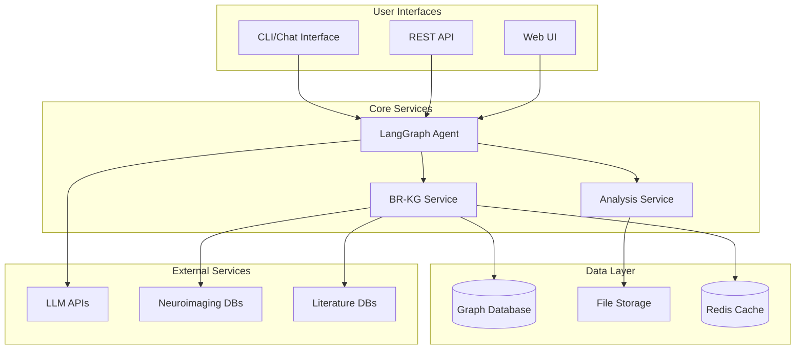
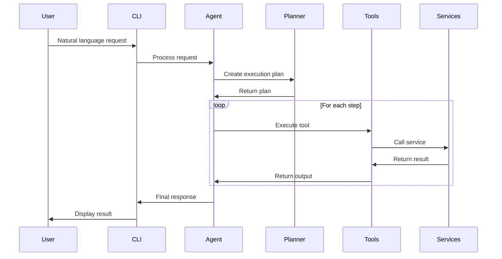
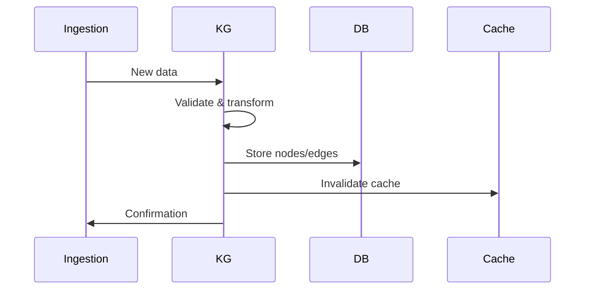

# Architecture

Brain Researcher follows a modular, microservices-based architecture designed for extensibility and scalability.

## System Overview



## Core Components

### 1. Agent Service (`src/brain_researcher/services/agent/`)

The central orchestrator that:
- Processes natural language requests
- Plans multi-step operations
- Coordinates tool execution
- Manages conversation state

**Key modules:**
- `chat_orchestrator.py`: Main request orchestration
- `planner/`: Planning, scoring, and catalog selection
- `tool_retriever.py`: Tool discovery and ranking
- `streaming.py`: Streaming response support

### 2. BR-KG Service (`src/brain_researcher/services/neurokg/`)

Knowledge graph management system:
- NetworkX-based graph operations
- Semantic and spatial search
- Literature integration
- Coordinate mapping

**Key modules:**
- `query_service.py`: Graph query entrypoints
- `search/orchestrator.py`: Search orchestration
- `spatial/`: Spatial coordinate handling
- `etl/`: Data ingestion and transforms

### 3. Analysis & Tooling (`src/brain_researcher/core/` + `src/brain_researcher/services/tools/`)

Neuroimaging analysis capabilities:
- Statistical analysis (GLM, contrasts)
- Visualization generation
- Meta-analysis via NiMARE
- Preprocessing pipelines

**Key modules:**
- `core/ingestion/`: Dataset and atlas ingestion
- `services/tools/pipeline_tools.py`: Analysis pipeline entrypoints
- `services/tools/dataset_resources_tool.py`: Dataset resource discovery
- `services/tools/neurokg_tools.py`: Knowledge graph analysis helpers

### 4. Tool System (`src/brain_researcher/services/tools/`)

Unified tool interface:
- Standardized tool definitions
- Input/output validation
- Error handling
- Tool discovery

**Tool categories:**
- Data ingestion tools
- Query and search tools
- Analysis tools
- Visualization tools
- Utility tools

## Data Flow

### 1. Request Processing



### 2. Knowledge Graph Updates



## Design Principles

### 1. Modularity
- Each component has a single responsibility
- Clear interfaces between modules
- Pluggable architecture for extensions

### 2. Scalability
- Stateless services where possible
- Horizontal scaling support
- Efficient caching strategies

### 3. Extensibility
- Tool system allows easy additions
- Service interfaces are versioned
- Configuration-driven behavior

### 4. Reliability
- Comprehensive error handling
- Graceful degradation
- Logging and monitoring

## Configuration

### Service Configuration

Services are configured via environment variables and the helpers under
`src/brain_researcher/config/`, including:

- `config_loader.py`: Config loading helpers
- `paths.py`: Canonical repo/runtime paths
- `run_artifacts.py`: Artifact root and retention-related path helpers

### Tool Registration

Tools are automatically discovered and registered:

```python
# src/brain_researcher/services/tools/tool_registry.py
class UnifiedToolRegistry:
    def register_tool(self, tool):
        tool_name = tool.get_tool_name()
        self.tools[tool_name] = tool
```

## Deployment Architecture

### Local Development

```yaml
# docker-compose.dev.yml
services:
  neurokg:
    build:
      target: development
    volumes:
      - ./src/brain_researcher:/app/src/brain_researcher
    command: python -m brain_researcher.services.neurokg.app
```

### Production Deployment

```yaml
# docker-compose.yml
services:
  neurokg:
    build:
      target: neurokg
    deploy:
      replicas: 2
      resources:
        limits:
          cpus: '2'
          memory: 4G
```

## Security Considerations

### API Security
- API key authentication
- Rate limiting
- Input sanitization
- CORS configuration

### Data Security
- Encrypted connections
- Access control
- Audit logging
- Data anonymization

## Performance Optimization

### Caching Strategy
- Redis for frequently accessed data
- Query result caching
- Embedding cache for similarity search

### Database Optimization
- Indexed searches
- Query optimization
- Connection pooling
- Batch operations

## Monitoring and Observability

### Logging
- Structured logging with context
- Log aggregation
- Error tracking

### Metrics
- Service health checks
- Performance metrics
- Usage analytics

### Tracing
- Distributed tracing
- Request tracking
- Performance profiling

## Future Enhancements

### Planned Improvements
1. GraphQL API support
2. Real-time collaboration
3. Advanced caching strategies
4. Kubernetes deployment
5. Plugin system

### Research Directions
1. Federated learning
2. Multi-modal analysis
3. Advanced NLP models
4. Graph neural networks
