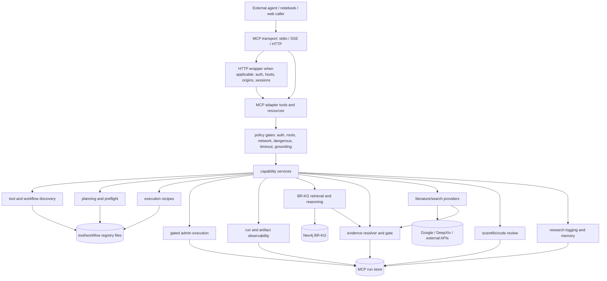
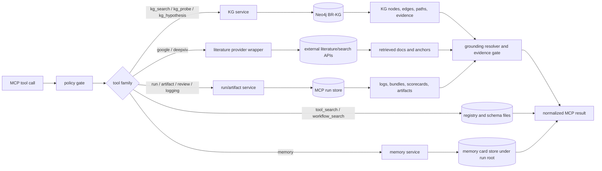
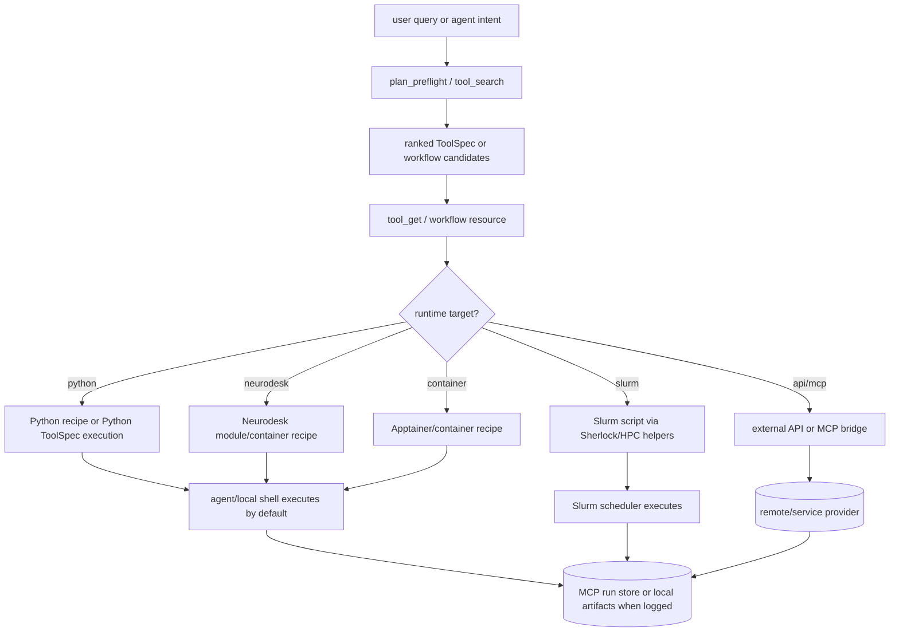
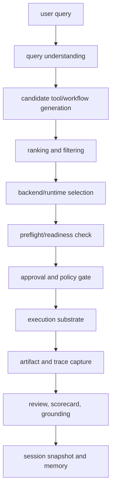
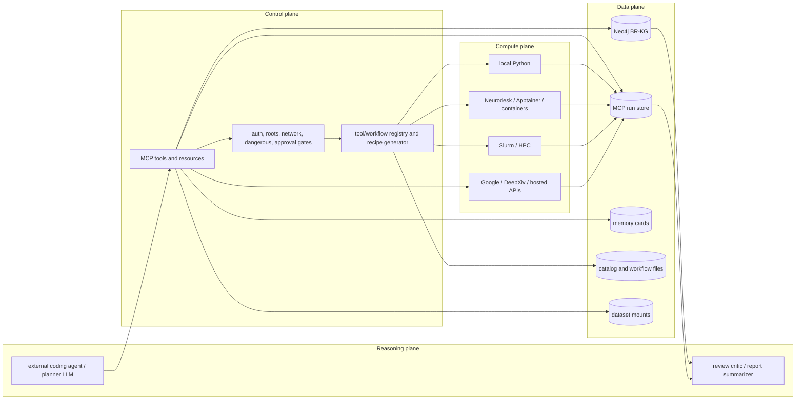
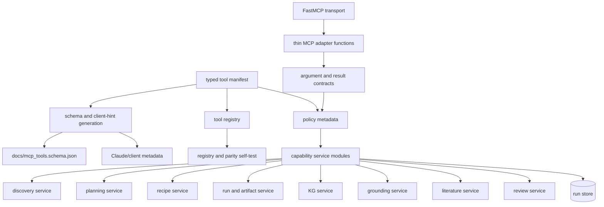
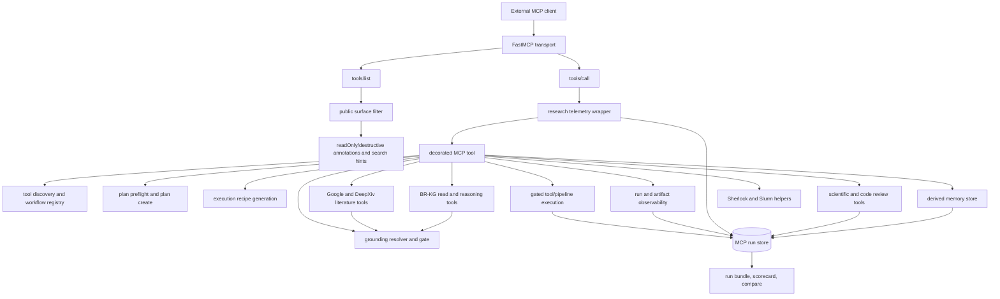

# Brain Researcher MCP Reader-Question Inventory

Generated: 2026-05-04

This is the MCP counterpart to the BR-KG reader-question inventory. It is
organized so paper text, methods, supplement, data card, ops notes, and release
notes can take different slices from the same code-backed inventory.

## Evidence Status

| Item | Value |
|---|---|
| Primary implementation | `src/brain_researcher/services/mcp/server.py` |
| Helper modules | `execution_recipes.py`, `loop_primitives.py`, `research_summaries.py`, `sherlock_tools.py` |
| Decorated MCP tools in code | 87 |
| MCP resources in code | 3 |
| Published `docs/mcp_tools.schema.json` entries | 72 |
| Claude Code hint metadata entries | 83 |
| Generated tool catalog entries | 2,044 |
| Merged ToolSpecs, no workflows | 2,089 |
| Merged ToolSpecs, including workflows | 2,151 |
| Exposed ToolSpecs, no workflows | 116 |
| Exposed plus workflow tool specs loaded by quick self-test | 177 |
| All registry tool specs loaded by quick self-test | 2,089 |
| Exposed neuroimaging-like ToolSpecs, no workflows | 78 |
| Exposed neuroimaging-like ToolSpecs, including workflows | 99 |
| Workflow catalog entries | 61 |
| Workflows with artifact contracts | 32 |
| Workflows with runbooks | 28 |
| Workflows with acceptance gates | 20 |
| Workflows with params schema | 31 |
| Workflows missing primary target | 22 |
| Configured NiWrap/Neurodesk container package profiles | 6 plus `_default` |
| MCP-related test files found | 33 |
| Quick self-test run | pass, 3 pass, 0 warn, 0 fail, inventory 8 |
| Default loop profile | `external_coding_v1` |
| Current observed run root | `<repo>/data/runs/mcp_runs` |
| Current observed allowed roots | `/data/brain_researcher_data/repo_runtime/artifacts`, repo `data`, repo `tmp` |
| Current observed policy flags | network false, dangerous false, tool_execute false |

Important interpretation:

- The MCP server is a deterministic harness and tool surface, not the code
  mutator. External coding agents own repository edits.
- The current tool layer is implemented and usable, but it should not be
  described as a clean target architecture. It is a large adapter module with
  mixed concerns, hand-maintained metadata, and schema drift.
- The compute graph below is the MCP operational data/control graph. There is
  no dedicated MCP tool that snapshots a source-code import graph.
- The published schema is stale relative to decorated tools: 15 decorated tools
  are missing from `docs/mcp_tools.schema.json`.

## Evidence Sources

| Source | What it supports |
|---|---|
| `src/brain_researcher/services/mcp/server.py` | FastMCP server, tools, resources, auth, HTTP wrapper, run persistence, research logging, KG/literature/grounding entrypoints |
| `src/brain_researcher/services/mcp/loop_primitives.py` | loop profile, run bundle normalization, scorecards, run comparisons |
| `src/brain_researcher/services/mcp/execution_recipes.py` | execution recipe generation for Python, Neurodesk, container, and Slurm targets |
| `src/brain_researcher/services/mcp/research_summaries.py` | trajectory and bug-digest summaries over run/candidate artifacts |
| `src/brain_researcher/services/mcp/sherlock_tools.py` | Sherlock/OAK guide, Slurm rendering, log/job diagnostics |
| `src/brain_researcher/services/tools/catalog_loader.py` | ToolSpec construction from generated catalog, overlays, categories, NiWrap metadata, and workflows |
| `src/brain_researcher/services/tools/registry.py` | unified tool registry, exposed/all ToolSpec loading, search, and candidate ranking |
| `src/brain_researcher/services/tools/executor.py` | ToolSpec execution dispatcher for Python, NiWrap/container, external API, MCP bridge, and workflow fallback paths |
| `src/brain_researcher/services/tools/neurodesk_compiler.py` | Neurodesk/CLI workflow compilation and runtime delegation behavior |
| `src/brain_researcher/services/agent/web_service.py` | `/agent/plan`, catalog planner endpoint, chat/action LLM surfaces, Neurodesk dispatch endpoints |
| `src/brain_researcher/services/agent/preflight.py` | query-understanding preflight and candidate diagnostics; parser constructed with `llm=None` by default |
| `docs/mcp.md` | user-facing MCP flow, env knobs, execution policy, external coding-agent loop |
| `docs/mcp.md#surface-tiers` | default, advanced, ops tiers and capability-family policy |
| `docs/mcp_tools.schema.json` | machine-readable tool catalog, currently 72 entries |
| `configs/tools_catalog_merged.json` | generated tool universe, currently 2,044 catalog entries |
| `configs/tools_catalog_overrides.yaml` | tracked overlay for critical Python/MCP tool entries |
| `configs/workflows/workflow_catalog.yaml` | 61 declarative workflows, runtime targets, stages, artifact contracts, and runbooks |
| `configs/catalog/niwrap_mapping.yaml` | suite-level modality and intent enrichment for NiWrap/generated tools |
| `configs/niwrap_containers.yaml` | Neurodesk/CVMFS Apptainer image map for AFNI, FSL, ANTs, FreeSurfer, MRtrix, Workbench |
| `infrastructure/docker/Dockerfile.mcp` | Docker packaging, port 7000, runtime dependencies |
| `infrastructure/jupyterhub/values.mvp.yaml` | hosted notebook MCP URL and service-to-service shape |
| `infrastructure/deployment/gce_k3s/values.prod.yaml` | prod MCP env values, auth, run-root, and execution flags |
| `infrastructure/k8s/helm/brain-researcher/templates/mcp-deployment.yaml` | Helm MCP deployment, image/env wiring, transport, port, mount path |
| `configs/claude/mcp.http.template.json.tmpl` | HTTP client template with `/mcp` URL and bearer header |
| `tests/unit/mcp`, `tests/integration/mcp`, `tests/k8s/test_mcp_prod_values.py` | focused MCP unit, integration, auth, surface-tier, workflow, and deployment tests |

## 1. What System Is This?

Reader question: what is the system boundary, and what is MCP responsible for?

Brain Researcher MCP is the external control and evidence interface for Brain
Researcher. It exposes deterministic access to planning, tool discovery,
execution recipes, run/artifact observation, BR-KG retrieval, grounding,
literature search, review, and session logging.

The important boundary is that MCP is not the whole Brain Researcher runtime and
is not the default code mutator. External agents, notebooks, shell processes,
container workers, or HPC jobs perform repository edits and heavy execution.
MCP provides contracts, evidence, gates, recipes, and durable observations.

| Boundary item | MCP owns | MCP does not own by default |
|---|---|---|
| Client protocol | MCP tool/resource contract over stdio, SSE, or streamable HTTP | agent conversation policy or UI behavior outside the protocol |
| Planning | preflight checks, handoff envelopes, tool/workflow candidates | final human/agent choice to execute a plan |
| Execution | recipes, previews, gated admin execution paths, run records | ordinary repository mutation by coding agents |
| Evidence | KG/literature retrieval, grounding resolver, evidence-basis gates | free-form citation writing by the LLM |
| State | MCP run store, traces, artifacts, session logs, derived memory cards | upstream KG build provenance or external provider persistence |
| Safety | auth, root allowlists, network/dangerous-tool flags, timeouts | OS/container/HPC scheduler security boundaries |

## 2. What Is The System Architecture?

Reader question: what are the main architecture layers before looking at
individual tools?

The system architecture has six layers:

| Layer | Role | Current implementation status |
|---|---|---|
| Client layer | external coding agents, notebook clients, web/orchestrator callers | implemented through stdio, SSE, and streamable HTTP access paths |
| Protocol layer | FastMCP transport plus HTTP wrapper, auth, session bootstrap, health/resolve routes | implemented in `server.py` and Starlette wrapper helpers |
| Adapter layer | MCP tools/resources that translate client calls into capability operations | implemented, but too much business logic still lives in the adapter module |
| Policy layer | auth, roots, network/dangerous-tool switches, timeouts, grounding checks, execution gates | implemented as env/config/tool-local checks; target is manifest-driven |
| Capability layer | discovery, planning, recipes, execution admin, KG, grounding, literature, review, memory, run/artifact observation | partially modular; several services have helper modules, but many tool bodies remain in `server.py` |
| State/provider layer | Neo4j BR-KG, run-store filesystem, memory cards, registry/catalog files, dataset mounts, external literature/search APIs | implemented as read/write state stores and external dependencies with different freshness/availability guarantees |

### Architecture Principle

Tools should be public entrypoints over the capability layer, not the
architecture itself. A clean target design would let an MCP tool do only four
things: validate arguments, apply policy, call a capability service, and return
a normalized result with evidence/provenance. The current implementation only
partly follows this principle.

## 3. How Do Tools, KG, And Databases Interact?

Reader question: what is the interplay between MCP tools, BR-KG, databases,
run storage, and external providers?

The short version:

- MCP tools are protocol/API entrypoints.
- BR-KG is the semantic graph database, reached through `kg_*` tools.
- The MCP run store is the episodic/provenance database for runs, traces,
  artifacts, observations, reviews, and session logs.
- Registry/catalog files are the configuration database for tool discovery and
  execution recipes.
- External APIs such as Google and DeepXiv are provider dependencies, not local
  BR databases.
- Grounding sits across KG, literature, and run outputs to decide whether
  evidence anchors are valid, downgraded, or rejected.

### State Store Roles

| Store/provider | System role | Main MCP access path | Read/write behavior | Release note |
|---|---|---|---|---|
| Neo4j BR-KG | semantic memory for entities, relations, datasets, hypotheses, and graph evidence | `kg_search_nodes`, `kg_get_node`, `kg_neighbors`, `kg_multihop_qa`, `kg_probe`, `kg_hypothesis_*` | MCP KG tools are read-oriented in normal use; KG build/update is outside this MCP surface | active KG availability must be reported separately from static MCP health |
| MCP run store filesystem | episodic/provenance store for runs, traces, logs, artifacts, bundles, reviews, reports, and session snapshots | `run_*`, `artifact_*`, `research_*`, review/report tools | read/write; execution, logging, review, background jobs, and reports persist here | current observed root is repo `data/runs/mcp_runs` |
| Memory card store | derived memory cards and relation events from sessions/runs | `memory_write`, `memory_search`, `memory_get` | read/write under the run-root memory store when present | derived memory, not upstream truth |
| Tool/workflow registry files | capability catalog for discovery and recipe generation | `tool_search`, `workflow_search`, `tool_get`, `tool_resolve`, `get_execution_recipe` | read-oriented at runtime; generated/edited through repo workflows | quick self-test loaded 177 exposed+workflow specs and 2,089 all specs |
| Published MCP schema | client-facing tool catalog | `docs/mcp_tools.schema.json`, tool list metadata | generated/manual artifact, currently stale relative to decorated code | 72 schema entries vs 87 decorated tools |
| Dataset mounts and resource configs | local/public data location resolver | `dataset_get_resources`, selected KG dataset tools, execution recipes | mostly read-only resolution; actual analysis writes artifacts elsewhere | paths must respect allowed roots |
| External literature/search APIs | fresh literature and file-search retrieval | `google_file_search`, `google_deep_research_*`, `deepxiv` | remote provider calls; optional local persistence via run artifacts | network/API-key gated and not reproducible without snapshotting outputs |
| HTTP session/auth state | request/session boundary for hosted MCP | HTTP wrapper, bearer/JWT/API-key resolvers | in-memory/request-scoped plus env/config | unauthenticated public checks can return expected `401` |

### Tool Family To Store Matrix

| Tool family | Reads registry | Reads KG | Calls external APIs | Writes run store | Reads run store | Writes memory | Typical output |
|---|---|---|---|---|---|---|---|
| `tool_discovery` | yes | no | no | no | no | no | ranked tool/workflow cards |
| `execution_recipe` | yes | no | no | no | no | no | command, container, or Slurm recipe |
| `planning` | yes | optionally through semantic helpers | no by default | no | no | no | preflight blockers and handoff plan |
| `tool_execution_admin` | yes | tool-dependent | tool-dependent | yes | yes | no | run id, step records, artifacts |
| `run_observability` | no | no | no | no | yes | no | status, logs, metrics, bundle, scorecard |
| `artifact_inspection` | no | no | no | no | yes | no | artifact metadata/text/bytes |
| `kg_explore`, `kg_reasoning`, `kg_probe`, `kg_hypothesis` | no | yes | optional for some hypothesis flows | optional for background workflows | optional | no | graph evidence, paths, candidate cards |
| `grounding` | no | indirectly through anchors | no | optional | optional | no | resolved, downgraded, or rejected evidence basis |
| `google_research`, `literature_search` | no | no | yes | optional for background/deep research | optional | no | retrieved documents and tool-emitted anchors |
| `scientific_review`, `pipeline_execution`, `scientific_report` | yes for workflows | optional | optional | yes | yes | optional via summaries | review verdicts, reports, repair context |
| `research_logging` | no | no | no | yes | yes | optional through later distillation | session events, snapshot, digest |
| `memory` | no | no | no | optional metadata | optional | yes | memory cards/search hits |

### Canonical Request Flows

| Flow | Sequence | Database/provider interplay |
|---|---|---|
| Tool discovery to recipe | client calls `tool_search` -> registry ranks candidate tools -> client calls `get_execution_recipe` | registry/config files are read; no KG or run-store write is required |
| KG evidence lookup | client calls `kg_search_nodes` or `kg_neighbors` -> KG service queries Neo4j -> result returns nodes/edges/provenance fields | Neo4j is the semantic source; MCP adds telemetry and optional grounding checks |
| Hypothesis candidate generation | client calls `kg_hypothesis_candidate_cards` or background start tool -> KG paths/candidate lanes are retrieved -> optional literature search augments candidates -> result may be persisted | Neo4j supplies graph structure; external APIs supply fresh literature; run store records background jobs/artifacts |
| Literature grounding | client calls `google_file_search`, `google_deep_research_*`, or `deepxiv` -> provider returns hits/anchors -> grounding gate validates anchor shape | external provider is the source; grounding normalizes evidence; run store is used when the flow is long-running or persisted |
| Admin execution | client calls `tool_execute`/`pipeline_execute` with explicit gates -> registry resolves tool/workflow -> runtime writes step records/artifacts | run store is the database of execution truth; KG/literature use depends on the selected tool |
| Run review | client calls `run_bundle_get`, `run_scorecard`, or review tools -> run store bundle is normalized -> optional KG/literature/review logic adds evidence | run store supplies observed artifacts; KG/external providers can add interpretive evidence, but should be labeled separately |

### Interplay Rules To Preserve

1. KG facts and run observations are different evidence classes. KG is semantic
   memory; the run store is episodic/provenance memory.
2. MCP should not silently mutate BR-KG through read-facing `kg_*` tools.
   KG ingestion and rebuild provenance belong to the BR-KG pipeline docs.
3. Long-running or decision-relevant tool calls should write enough run-store
   state to make later review possible.
4. Final-answer references should come from tool-emitted anchors or resolver
   outputs, not hand-written citation strings.
5. External API outputs need either snapshot artifacts or an explicit
   non-reproducibility caveat.

## 4. What Neuroimaging Tool Universe Sits Behind MCP?

Reader question: what neuroimaging tools and workflows can MCP expose or route
to?

There are two different tool surfaces:

- MCP public tools: the protocol entrypoints such as `tool_search`,
  `get_execution_recipe`, `kg_search_nodes`, `run_bundle_get`, and
  `artifact_read_text`.
- Brain Researcher domain tools: the neuroimaging and research capabilities
  indexed by the unified tool registry and surfaced through discovery, recipes,
  planner contracts, and gated execution paths.

Current catalog snapshot:

| Catalog surface | Count | What it means |
|---|---:|---|
| Generated `configs/tools_catalog_merged.json` tools | 2,044 | full generated plus configured tool catalog |
| Merged ToolSpecs, no workflows | 2,089 | runtime-facing ToolSpecs after overlays/fallbacks |
| Merged ToolSpecs including workflows | 2,151 | all ToolSpecs plus workflow IDs |
| Exposed ToolSpecs, no workflows | 116 | normal discovery surface |
| Exposed ToolSpecs including workflows | 177 | normal discovery plus workflow IDs |
| Exposed neuroimaging-like tools, no workflows | 78 | heuristic: modality/name/category/intent scan |
| Exposed neuroimaging-like tools including workflows | 99 | heuristic: exposed plus workflow IDs |
| Workflow catalog entries | 61 | declarative high-level workflows |

### Neuroimaging Backend Families

| Family/source | Catalog evidence | Execution role |
|---|---:|---|
| FreeSurfer | 700 name-prefix entries, 696 package entries | structural/surface reconstruction, segmentation, QC |
| AFNI | 569 name-prefix entries, 565 package entries | fMRI preprocessing, GLM, cluster simulation, utilities |
| FSL | 257 name-prefix entries, 243 package entries | BET, FEAT, FLIRT/FNIRT, MELODIC/FIX, PALM, diffusion utilities |
| MRtrix/MRtrix3 | 117 name-prefix entries, 115 package entries | diffusion modeling and tractography |
| ANTs | 72 name-prefix entries, 71 package entries | registration and transforms |
| Python wrappers | 299 catalog entries; 333 merged ToolSpecs | Nilearn/MNE/FitLins/custom Python tools, dataset utilities, KG clients |
| MCP/external API entries | 5 catalog `mcp` entries; 16 merged external/API ToolSpecs | MCP bridge tools, Gemini/Google/DeepXiv style providers |
| Other configured suites | NiftyReg, C3D, dcm2niix, FastSurfer, Greedy, SPM12, MNE, Nilearn | smaller targeted tool families |

### Container And Neurodesk Runtime Map

`configs/niwrap_containers.yaml` is the current container map.

| Package | Runtime | Image source | Default network policy | Notes |
|---|---|---|---|---|
| `afni` | Apptainer | CVMFS Neurodesk path | disabled | AFNI image under `/cvmfs/neurodesk.ardc.edu.au/containers` |
| `fsl` | Apptainer | CVMFS Neurodesk path | disabled | sets `FSLOUTPUTTYPE=NIFTI_GZ` |
| `ants` | Apptainer | CVMFS Neurodesk path | disabled | ANTs registration/transforms |
| `freesurfer` | Apptainer | CVMFS Neurodesk path | disabled | requires FreeSurfer license resolution |
| `mrtrix` | Apptainer | CVMFS Neurodesk path | disabled | diffusion/tractography suite |
| `workbench` | Apptainer | CVMFS Neurodesk path | disabled | surface/CIFTI operations |
| `_default` | Apptainer | package-specific or derived | disabled | fallback for unknown packages |

### Public Exposed Neuroimaging Tools

This table lists the exposed neuroimaging-like ToolSpec surface from the current
scan. The generated all-tools catalog is too large to inline fully; the source
of truth for the complete universe is `configs/tools_catalog_merged.json`.

| Capability bucket | Exposed tool IDs |
|---|---|
| Dataset/data access | `bids.manifest`, `validate_bids`, `run_bids_app`, `openneuro.client`, `openneuro.search`, `openneuro_download`, `prefetch.openneuro_cache`, `datasets.list_resources`, `list_dataset_assets`, `resolve_dataset_asset`, `list_neuroimage_assets`, `resolve_neuroimage_asset` |
| Atlas/maps/assets | `fetch_atlas`, `query_neuromaps`, `resolve_reference_map`, `resolve_transform` |
| Preprocessing/QC | `fmriprep_preprocessing`, `mriqc_group_report`, `fsl_bet`, `fsl_topup`, `fsl_prepare_fieldmap`, `freesurfer_qc`, `motion_quantification` |
| Registration/alignment | `fsl_flirt`, `fsl_fnirt`, `ants_registration`, `fsl_epi_reg` |
| Segmentation/surface | `freesurfer_recon_all`, `fsl_fast`, `spm12_vbm`, `individual_parcellation` |
| fMRI GLM/statistics | `fsl_feat`, `afni_3dDeconvolve`, `afni_3dClustSim`, `fsl_palm`, `glm_first_level`, `glm_second_level`, `run_fitlins_recipe`, `fitlins.multiverse_robustness_report` |
| Connectivity/networks | `connectivity_matrix`, `seed_based_fc`, `fmri.connectivity_client.light` |
| Diffusion | `fsl_bedpostx`, `diffusion_tractography`, `mrtrix.3.0.4.dwi2fod.run` |
| ICA/denoising | `fsl_melodic`, `fsl_melodic_ica`, `fsl_fix`, `fsl_dual_regression` |
| EEG/MEG/electrophysiology | `mne_ica`, `mne_source_localization`, `mne_timefreq`, `timefreq_tfr`, `localize_source` |
| ML/decoding/encoding | `mvpa`, `searchlight_analysis`, `encoding_models`, `visual_feature_decoder`, `compute_brain_age`, `tribe_predict` |
| Simulation/realtime | `brain_simulation`, `realtime_fmri` |
| Visualization | `visualize_interactive`, `viz_stat_maps` |
| KG/meta-analysis/literature | `br_kg.client`, `br_kg.search_nodes`, `br_kg.find_structural_leverage`, `br_kg.detect_contradiction_motifs`, `br_kg.detect_topology_shifts`, `br_kg.sample_ood_hypothesis`, `coordinate_to_concept`, `coordinate_meta_analysis`, `literature_mining` |
| Generic/advanced adapters | `advanced_analysis.client`, `neurodesk_command`, `mcp.tool_search` |

### Workflow Catalog

| Workflow class | Count | Primary examples |
|---|---:|---|
| All workflow catalog entries | 61 | full source: `configs/workflows/workflow_catalog.yaml` |
| Primary target `python` | 27 | `workflow_rest_connectome_e2e`, `workflow_seed_based_connectivity`, `workflow_task_glm_group`, `workflow_fitlins_direct`, `workflow_longitudinal_lme`, `workflow_hypothesis_candidate_cards` |
| Primary target `neurodesk` | 9 | `workflow_preprocessing_qc`, `workflow_fmriprep_preprocessing`, `workflow_mriqc`, `workflow_qsiprep`, `workflow_ppi_analysis`, `workflow_dwi_connectome`, `workflow_vbm_analysis`, `workflow_asl_perfusion` |
| Primary target `container` | 3 | `workflow_smriprep`, `workflow_qsirecon`, `workflow_fastsurfer` |
| Missing primary target | 22 | release gap: target/backend should be filled or explicitly marked exploratory |
| Supports `python` recipes | 27 | portable Python and Python-orchestrated workflows |
| Supports `neurodesk` recipes | 9 | heavy Neurodesk-backed workflows |
| Supports `container` recipes | 12 | direct container runtime or Neurodesk-compatible container path |
| Supports `slurm` recipes | 11 | cluster/HPC recipe path |

Workflow stages in the current catalog: clinical 11, preprocessing 8,
connectivity 8, interpretation 6, prediction 5, dataset 4, task_glm 4,
dynamics 4, reporting 3, acquisition 2, meta_analysis 2, and one each for qc,
local_activity, ephys, and decoding.

## 5. How Are Tools Hosted, Routed, And Executed?

Reader question: how does MCP host the tool surface and decide which execution
backend should handle a request?

### Hosting Modes

| Mode | MCP process shape | Transport | Execution substrate | LLM/client role |
|---|---|---|---|---|
| Local stdio | `brain-researcher-mcp` or `python -m brain_researcher.services.mcp.server` | stdio | local Python, local containers, local files, optional local Neo4j | coding agent calls deterministic MCP tools and edits repo outside MCP |
| Docker stdio | `scripts/ops/mcp_docker_stdio.sh` | stdio through Docker | containerized MCP runtime with repo `artifacts`, `data`, `tmp` bind mounts | coding agent talks stdio to Docker-wrapped MCP |
| Hosted HTTP | MCP Docker image, uvicorn, port 7000 | streamable HTTP or SSE | hosted workspace, service-to-service auth, optional in-cluster Neurodesk/Jupyter runtime | notebook assistant or web service calls MCP; browser should not hold raw MCP credentials |
| HPC | repo-local MCP process on login/dev node | stdio by default | Neurodesk/CVMFS, Apptainer, Slurm, Sherlock/OAK helpers | coding agent asks MCP for recipes/scripts; scheduler executes jobs |
| Kubernetes/prod | `infrastructure/docker/Dockerfile.mcp` image | HTTP route, often mounted under `/mcp` | service deployment with run-root storage and configured KG/API credentials | orchestrator/notebook/service clients call MCP with auth |

The same phrase should be "same MCP contract family", not "same operational
server". Hosted, local, Docker, and HPC deployments may use different auth,
allowlists, filesystem roots, run roots, and execution substrates.

### Runtime Dispatch Model

| Decision point | Current source of truth | Effect |
|---|---|---|
| Tool exists | `UnifiedToolRegistry`, `configs/tools_catalog_merged.json`, overlays, workflow catalog | determines whether `tool_search`/`tool_get` can find the capability |
| Tool type | ToolSpec `backend`, `runtime_kind`, `requires_runtime`, `python_class`, `niwrap_id` | selects Python, NiWrap/container, external API/MCP bridge, or workflow path |
| Tool visibility | exposed-tool config, surface tiers, MCP schema/client metadata | determines what normal agents see by default |
| Candidate ranking | registry search, modality/phase filters, intent matching, optional semantic matching/tool retriever | returns ranked candidates; does not execute |
| Recipe backend | `get_execution_recipe(target_runtime=python/neurodesk/container/slurm)` plus workflow metadata | creates a stateless execution plan for the selected runtime |
| Direct execution | `tool_execute` or `pipeline_execute` only after env gates/allowlists/approval phrases | writes run records and artifacts when enabled |
| Heavy execution | external coding agent, local shell, Neurodesk, container runtime, or Slurm | actual compute happens outside normal read-only MCP calls |

### Execution Backends

| Backend | Source/tooling | Typical tools | Execution behavior |
|---|---|---|---|
| Python ToolSpec backend | `python_class` wrappers and repo Python modules | Nilearn/MNE/custom analysis, dataset helpers, KG clients, FitLins wrappers | called directly by executor when enabled, or rendered into Python recipes |
| NiWrap/container backend | generated NiWrap catalog plus `configs/niwrap_containers.yaml` | AFNI/FSL/ANTs/FreeSurfer/MRtrix/Workbench suites | rendered as container/Neurodesk/Apptainer commands; previewable; network disabled by default |
| Workflow backend | `configs/workflows/workflow_catalog.yaml` plus bridge wrappers | preprocessing QC, BIDS-app workflows, connectomes, hypothesis cards, clinical workflows | recipe-first for agents; `pipeline_execute` is manual/admin gated |
| External API backend | MCP bridge, Gemini/Google/DeepXiv-style tools | `mcp.*`, Google File Search, Deep Research, DeepXiv | network/API-key gated; outputs need snapshotting for reproducibility |
| Hosted/stateful service | tools marked hosted or service-backed | KG, datasets, Google file-search stores, long-running background jobs | returns status/run IDs or service-backed retrieval results |
| HPC/Slurm backend | `sherlock_slurm`, `get_execution_recipe(..., target_runtime=slurm)` | heavy Neurodesk/container workflows | renders Slurm scripts and diagnostics; scheduler owns execution |

### Backend Selection Flow

## 6. What Does The LLM Decide?

Reader question: where is the LLM in the system, and what authority does it
have?

The LLM is not the execution backend and should not be described as the source
of truth for tools. It can propose, summarize, critique, and choose among
exposed options, but registry, policy, and runtime gates decide what is valid.

| Surface | LLM role | Deterministic/system role | Authority boundary |
|---|---|---|---|
| External coding agent using MCP | decides which MCP tool to call next after reading tool outputs | MCP returns tool cards, recipes, KG facts, artifacts, and gates | LLM edits repo outside MCP; MCP does not trust LLM to bypass gates |
| `tool_search`, `tool_get`, `get_execution_recipe` | none inside the MCP tool | registry search, schema lookup, recipe generation | deterministic catalog/metadata path |
| `plan_preflight` | none by default; query parser is created with `llm=None` | query understanding, tool candidates, recommended next calls | read-only; no execution |
| `/agent/plan` called by `plan_create` | active planner mode is catalog-only | unified planner, candidates, tool retriever, KG/dataset hints, plan envelope | produces plan/handoff; execution remains separate |
| Agent chat/action surfaces | LLM can answer, select tools, or use native tool calling | tool router, schema compression, budgeted executor, telemetry | separate from deterministic MCP recipe-first path |
| Scientific review/report tools | optional LLM judgment critic and report drafting | review bundles, rule checks, artifacts, KG/literature evidence | verdicts should be labeled as review judgments, not raw execution facts |
| Google/Deep Research/literature tools | provider LLM/search may summarize or generate grounded text | network/API-key gates, grounding anchors, run artifacts | fresh provider output needs provenance/snapshot caveats |
| Grounding | LLM should not hand-write anchors | resolver classifies anchors as valid, downgraded, or malformed | tool-emitted/resolved anchors are the evidence contract |

Decision ownership:

| Decision | Owner |
|---|---|
| Which capabilities are visible | MCP profile, exposure policy, surface tiering, schema/client metadata |
| Which candidate tools are ranked | registry search, planner, modality/phase filters, optional semantic/tool retriever paths |
| Which backend is valid | ToolSpec runtime metadata plus `get_execution_recipe` supported targets |
| Whether execution is allowed | MCP env gates, allowlists, filesystem roots, approval phrase, auth |
| Whether heavy compute actually runs | external agent/local shell, hosted workspace, container runtime, or Slurm scheduler |
| How results are interpreted | reviewer/LLM may summarize; run artifacts, KG facts, and grounding anchors remain separate evidence classes |

## 7. What Is The End-To-End Decision Lifecycle?

Reader question: what happens between a user request and a grounded, reviewable
result?

The MCP lifecycle should be described as a sequence of decisions with explicit
owners. The LLM may initiate or choose among exposed actions, but the MCP server,
registry metadata, policy gates, execution substrate, and artifact contracts
decide what is valid and what can be audited.

| Stage | Primary owner | Code/config source | LLM role | Artifact proving it | Release gap |
|---|---|---|---|---|---|
| User query | client or external agent | client transcript | writes intent in natural language | conversation/request log | client-side transcript retention policy is not release-documented |
| Query understanding | MCP preflight or agent planner | `src/brain_researcher/services/agent/preflight.py`, `/agent/plan` path | none by default in `plan_preflight`; possible in chat/action surfaces | preflight result, parsed query facts | prompt/model contracts for LLM-native planner surfaces are not fully inventoried here |
| Candidate generation | registry/planner | `UnifiedToolRegistry`, `tool_search`, workflow catalog, exposed-tool config | may request search; deterministic search does the candidate work | ranked tool/workflow cards | ranking evaluation by modality/backend is not release-complete |
| Tool/workflow ranking | registry search, optional retriever | `registry.py`, `catalog_loader.py`, modality/phase filters | optional semantic intent in some planner paths | candidate scores/reasons when returned | tie-breaking and confidence thresholds need a public contract |
| Backend selection | recipe generator and ToolSpec metadata | `get_execution_recipe`, `execution_recipes.py`, ToolSpec `backend`, `runtime_kind`, `requires_runtime` | chooses target only when asked by client; backend validity is deterministic | recipe JSON/script/command | backend readiness matrix is not yet automatically attached to recipes |
| Preflight/readiness | MCP policy plus external runtime | env knobs, allowed roots, runtime deps, KG/API checks | can ask for checks but cannot assert readiness | preflight blockers, self-test output, backend smoke logs | per-backend smoke evidence is not complete |
| Approval gate | MCP env/config/tool gate | `BR_MCP_ENABLE_TOOL_EXECUTE`, allowlist, roots, network/dangerous flags, approval phrase | cannot bypass gate | allow/deny result, run record if executed | release docs need per-tool destructive/write/network classification |
| Execution substrate | local Python, container/Neurodesk, external API, hosted service, Slurm | executor, Neurodesk compiler, container map, Sherlock tools, provider clients | not the executor | process logs, scheduler job id, provider response, run id | direct execution is intentionally admin/manual and disabled by default |
| Artifact capture | MCP run store or external agent logging | run-store helpers, tool telemetry wrapper, workflow artifact contracts | may summarize artifacts after capture | `run.json`, traces, logs, output manifests, reports | 29 of 61 workflows lack explicit `artifact_contract` in current scan |
| Review/grounding | review services, run scorecard, grounding resolver | `run_scorecard`, review tools, `grounding_resolve`, KG/literature tools | can critique/summarize; evidence anchors should be tool-emitted | scorecard, verdict, resolved anchors | review/grounding coverage is not complete across all backend families |
| Memory/session snapshot | research logging and memory store | `log_research_event`, `write_session_snapshot`, memory tools | writes summary text when requested | `research_events.jsonl`, `session_snapshot.json`, memory cards | retention, export, and privacy policy are not release-documented |

Minimum lifecycle contract for release:

1. Every executable path should state whether it is `plan-only`, `recipe-only`,
   `preview`, `admin-executable`, or `production-executable`.
2. Every backend decision should cite the ToolSpec/workflow metadata field that
   selected the backend.
3. Every run should have a durable result object, even on failure.
4. Review summaries should separate observed artifacts, KG facts, external
   provider outputs, and LLM judgment.

## 8. What Are The Control, Data, Compute, And Reasoning Planes?

Reader question: how should the system architecture be drawn so tools, KG,
databases, execution backends, and LLMs are not conflated?

Use four planes:

| Plane | What it owns | Main components | What it should not claim |
|---|---|---|---|
| Control plane | protocol, routing, policy, auth, state transitions | MCP transport, HTTP wrapper, registry search, recipe generation, approval gates, run status | scientific truth or compute completion without artifacts |
| Data plane | state and evidence stores | BR-KG/Neo4j, run store, memory cards, registry/config files, dataset mounts, external provider snapshots | tool selection authority |
| Compute plane | actual work execution | local Python, container/Neurodesk/Apptainer, hosted services, Google/DeepXiv providers, Slurm/HPC | LLM reasoning or permanent evidence unless results are persisted |
| Reasoning plane | interpretation and choice among valid actions | external coding agent, chat/action LLMs, reviewer critics, provider LLM summaries | bypassing policy gates, inventing anchors, or marking execution complete |

Release wording should say "the MCP control plane routes to compute substrates"
rather than "MCP runs all neuroimaging tools" unless direct execution has been
enabled, audited, and observed for that deployment.

## 9. What Is The Tool Catalog Provenance And Source Of Truth?

Reader question: where do the tool definitions come from, and which catalog is
authoritative for release?

There is not yet one single manifest source of truth. The current release
inventory should say this directly and distinguish generated catalog entries,
runtime ToolSpecs, exposed tools, published MCP schema, and client hint
metadata.

| Catalog/source | Current count/status | Role | Current provenance evidence | Release gap |
|---|---:|---|---|---|
| `configs/tools_catalog_merged.json` | 2,044 entries | generated full tool universe | loaded by `catalog_loader.py`; overlay comments say it is generated/gitignored-style output | generator command, snapshot date, and input artifact paths are not release-verified in this pass |
| `configs/tools_catalog_overrides.yaml` | tracked overlay | stable metadata for critical Python/MCP entries | merged on top of generated catalog by `catalog_loader.py` | overlay precedence should be documented as policy, not only code behavior |
| runtime ToolSpecs without workflows | 2,089 | executable/searchable runtime specs after fallback/overlay expansion | quick registry scan | not every ToolSpec has equivalent public schema/hint metadata |
| runtime ToolSpecs with workflows | 2,151 | ToolSpecs plus workflow IDs | quick registry scan | workflow metadata maturity is uneven |
| exposed ToolSpecs without workflows | 116 | normal discovery surface | `load_exposed_tools`/exposed config path | exposure profile version is not release-versioned |
| exposed ToolSpecs with workflows | 177 | normal discovery plus workflow IDs | quick self-test registry load | workflow exposure should be tied to readiness status |
| workflow catalog | 61 workflows | high-level reusable workflows | `configs/workflows/workflow_catalog.yaml` | 22 workflows lack primary target; 29 lack artifact contract |
| NiWrap/container map | 6 package profiles plus `_default` | container runtime enrichment | `configs/niwrap_containers.yaml` | per-host CVMFS/Apptainer readiness is external to catalog |
| public MCP schema | 72 entries | client-facing machine-readable MCP docs | `docs/mcp_tools.schema.json` | stale relative to 87 decorated tools |
| Claude/client hint metadata | 83 entries | read-only/destructive annotations and search hints | `_BR_CC_TOOL_META` scan | 4 decorated tools missing hint rows |
| decorated MCP tools | 87 tools | actual protocol surface in code | AST parse of `server.py` | schema/hint generation should come from a single typed manifest |

Generated catalog metadata gaps from the current scan:

| Raw catalog field | Current result | Interpretation |
|---|---:|---|
| entries with `python_module` | 339 | many generated tools have Python route metadata |
| entries with `entrypoint` | 0 | direct executable command entrypoint is not represented in this field |
| entries with `modality` | 1,705 | modality coverage exists for most NiWrap/generated tools |
| entries with `intents` | 1,705 | intent coverage exists for most NiWrap/generated tools |
| missing `category` | 2,044 | raw generated catalog category is not release-filled |
| missing `implementation_level` | 2,044 | implementation status is supplied later or inferred, not in raw catalog |
| missing `approval_level` | 2,044 | approval status is supplied later or inferred, not in raw catalog |

Release-safe provenance rule: a tool can be counted as `cataloged` from the
generated catalog, `runtime-loadable` from ToolSpec scan, `exposed` from the
exposed ToolSpec surface, `protocol-exposed` from decorated MCP tools, and
`client-documented` only when schema/client metadata are current.

## 10. What Is The Capability Status Matrix?

Reader question: what is implemented, wrapper-only, recipe-only, generated-only,
tested, and release-ready?

The current numeric pass can support a conservative status matrix, but it does
not fully prove real-data execution readiness for each capability family.

### Runtime ToolSpec Surface

| Surface | Total | Neuroimaging-like | Python backend | NiWrap/container backend | External/API backend | Confirm-gated | No approval | Release interpretation |
|---|---:|---:|---:|---:|---:|---:|---:|---|
| Exposed ToolSpecs | 116 | 78 | 92 | 11 | 13 | 81 | 35 | normal discoverable surface; not all are direct-execution-ready |
| Exposed ToolSpecs plus workflows | 177 | 99 | 153 | 11 | 13 | 81 | 96 | normal discovery plus workflow IDs; workflow maturity varies |
| All ToolSpecs | 2,089 | 1,928 | 333 | 1,740 | 16 | 2,011 | 78 | full runtime catalog; mostly generated/container-backed |
| All ToolSpecs plus workflows | 2,151 | 1,949 | 395 | 1,740 | 16 | 2,011 | 140 | full universe plus workflows; too broad to call release-ready without per-family checks |

### Current Capability Maturity Signals

| Capability family/status signal | Current value | What it proves | What it does not prove |
|---|---:|---|---|
| Decorated MCP tools | 87 | protocol methods exist in code | schemas/hints are fully current |
| Public schema entries | 72 | documented client entries exist | all decorated tools are documented |
| Quick self-test loaded exposed+workflow specs | 177 | registry loading works in current environment | backend execution works |
| Quick self-test loaded all specs | 2,089 | full registry can be loaded | real-data execution works |
| Workflow catalog entries | 61 | workflow specs exist | all workflows have complete targets/contracts |
| Workflows with `artifact_contract` | 32 | some workflows define required outputs | all workflow outputs are auditable |
| Workflows with runbook | 28 | some workflows define operational guidance | all workflows are runnable without extra knowledge |
| Workflows with acceptance gate | 20 | some workflows define success criteria | all workflows have verifier-style completion checks |
| Workflows with params schema | 31 | some workflows have structured input shape | all workflows are safely callable |
| Workflows missing primary target | 22 | target/backend metadata gap is known | those workflows are release-routable |

### Capability Release Classification

| Class | Definition | Current examples | Release status |
|---|---|---|---|
| Protocol-implemented | decorated MCP tool exists and can be listed/called under policy | `tool_search`, `run_get`, `kg_search_nodes`, `grounding_resolve` | implemented, but schema parity must be fixed |
| Registry-loadable | ToolSpec can be loaded and searched | 2,089 ToolSpecs in quick self-test | implemented as catalog surface |
| Exposed-discoverable | ToolSpec is in the normal discovery surface | 116 exposed ToolSpecs | implemented as discovery surface |
| Recipe-capable | tool/workflow can render an execution recipe | Python/Neurodesk/container/Slurm recipe paths | partial; depends on workflow/backend metadata |
| Admin-executable | MCP can execute when policy gates are enabled | `tool_execute`, `pipeline_execute` | implemented but disabled by default and not normal agent path |
| Real-data tested | observed successful execution on representative inputs | not measured in this pass | release blocker for capability claims |
| Release-ready | schema, provenance, policy, backend readiness, artifact contract, and tests are all current | not globally true for the full catalog | requires per-family readiness table |

## 11. What Backend Readiness Must Be Checked?

Reader question: what has to be true before a tool can actually run in each
deployment mode?

Backend readiness is separate from catalog existence. The registry can know a
tool exists even when the host lacks CVMFS, Apptainer, a FreeSurfer license, a
dataset mount, Neo4j credentials, or API keys.

| Dependency/readiness item | Local stdio | Docker stdio | Hosted HTTP/Jupyter | HPC/Slurm | Prod k8s | Current evidence/gap |
|---|---|---|---|---|---|---|
| Python package install | required | baked into image plus bind mounts | baked into service/notebook image | required in env/module | baked into image | quick self-test proves current Python import path only |
| Writable run root | repo run root by default | mounted `data`/`artifacts`/`tmp` | configured service workspace | scratch/project path | configured env/PV | observed local run root; prod persistence/backup not measured here |
| Allowed filesystem roots | env-configured | container bind roots | service workspace roots | project/scratch mounts | env-configured mount roots | implemented with `BR_MCP_ALLOWED_ROOTS`; per-deployment values need release table |
| Neo4j BR-KG | optional until KG tools run | reachable from container if configured | service DNS/secret needed | network/VPC route needed | secret/service route needed | static MCP health is separate from active KG availability |
| Network/API keys | gated | gated and passed as env/secrets | service secrets/browser proxy boundary | account/env secrets | k8s secrets | Google/DeepXiv paths require explicit provider readiness |
| Docker runtime | optional | required on host | not usually used directly | optional | build/deploy path | Docker stdio wrapper exists; per-host smoke not measured |
| Apptainer | optional for local containers | possible if available/mounted | usually via hosted runtime | required for Neurodesk/HPC path | depends on cluster image/runtime | CVMFS/Apptainer readiness not proven by catalog scan |
| CVMFS Neurodesk | optional | optional mount | cluster/service dependent | commonly required | environment dependent | container map points to CVMFS paths, but mount availability is host-specific |
| FreeSurfer license | required for FreeSurfer tools | env/file mount required | secret or mounted file required | license file/module required | secret/PV required | license resolution is a release readiness item |
| Slurm | not needed | not needed | not usually available | required for Slurm recipes | not unless cluster-backed | Sherlock helpers render scripts; scheduler execution evidence is separate |
| Dataset mounts | required for real runs | bind-mounted data | workspace/PV/dataset service | project/scratch paths | PV/object-store mounts | `dataset_get_resources` helps resolve, but access must be checked per run |
| Browser credential boundary | not applicable | not applicable | required | not applicable | required for web-hosted callers | docs warn browser should not hold raw MCP credentials |
| HTTP auth token/JWT | not applicable for stdio | not applicable for stdio | required unless disabled | not applicable for stdio | required/fail-closed in auto | unauthenticated `401` can mean route exists but token missing |
| Artifact retention/backups | local disk | container bind path | service policy | project/scratch policy | PV/backup policy | not measured in current numeric pass |

Readiness states to use in release docs:

| State | Meaning |
|---|---|
| `cataloged` | present in generated or registry catalog |
| `recipe-renderable` | MCP can produce a command/script/Slurm recipe |
| `preflight-pass` | required local files, env vars, credentials, and runtime deps are present |
| `smoke-tested` | minimal representative run completed |
| `real-data-tested` | representative dataset run completed with expected artifacts |
| `release-ready` | preflight, smoke, artifact contract, review, and docs are complete |

## 12. What Is The Routing Algorithm?

Reader question: how does the system decide which tool, workflow, or backend to
use?

There are multiple routing layers. They should not be described as one
monolithic LLM router.

| Routing layer | Current implementation | Inputs | Output | LLM involved? |
|---|---|---|---|---|
| ToolSpec search | `tool_search`, `UnifiedToolRegistry.search_toolspecs` | query, modality, kind, phase, include/exclude workflows, exposed/all surface | ranked tool cards | no by default |
| Structured tool resolution | `tool_get`, `tool_resolve`, resources | exact tool id or alias | normalized tool metadata | no |
| Workflow search | `workflow_search`, workflow catalog | query/filters | ranked workflow cards | no by default |
| Preflight planning | `plan_preflight` | natural-language query, optional domain/modality/data hints | blockers, candidate tools, recommended next calls | no by default; parser uses `llm=None` |
| Agent plan endpoint | `/agent/plan`, called by `plan_create` | plan request | catalog planner envelope and handoff | active planner mode is catalog-oriented; separate LLM surfaces may exist |
| Execution recipe routing | `get_execution_recipe` | selected tool/workflow id, params, target runtime | Python/Neurodesk/container/Slurm recipe | no |
| Admin execution dispatch | `tool_execute`, `pipeline_execute` | selected tool/workflow, params, gates | preview or persisted run | no for dispatch; tool internals may call providers |
| Chat/action tool selection | agent chat/action services | conversation and tool schema | tool call or answer | yes, separate from deterministic MCP recipe-first path |

Current deterministic routing factors:

- exposure profile: default exposed tools vs full/all registry;
- modality and neuroimaging domain hints;
- tool kind/family and workflow phase filters;
- exact ID/alias resolution before fuzzy candidate selection;
- generated ToolSpec metadata including backend/runtime fields;
- workflow `supported_recipe_targets` and `primary_target` when present;
- policy gates and runtime targets after a candidate is selected.

Current routing gaps for release:

| Gap | Why it matters |
|---|---|
| Confidence/tie-breaking contract is not fully documented | reviewers need to know whether top-1 selection is deterministic, heuristic, semantic, or LLM-chosen |
| Semantic vs keyword ranking split is not quantified here | benchmark claims need route attribution |
| No-suitable-tool behavior needs explicit contract | planner should return blockers/fallback, not force a weak tool |
| Backend preflight is not always attached to ranking | a top-ranked container tool may be unusable on a host without CVMFS/Apptainer |
| LLM-native chat/action routing must be evaluated separately | otherwise deterministic MCP routing and LLM tool-calling accuracy are mixed |

## 13. What Are The LLM Prompt And Model Contracts?

Reader question: when LLMs are involved, what prompt/model/schema contract is
used, and how is output validated?

This inventory currently verifies LLM authority boundaries from code paths, but
it does not yet provide a release-ready prompt/model manifest. That should be a
separate table generated from provider config and prompt files.

| Surface | LLM/model role | Schema visible to LLM | Parser/gate | Current status |
|---|---|---|---|---|
| External coding agent with MCP | chooses MCP calls and edits repo outside MCP | MCP tool list, tool schemas, tool outputs, repo files | MCP policy/auth/tool gates; user/coding-agent validation | implemented usage pattern; model/prompt is client-side and not owned by MCP |
| `plan_preflight` | none by default | deterministic preflight result schema | query parser created with `llm=None`; no execution | implemented deterministic path |
| `/agent/plan` via `plan_create` | planner service may use catalog/planner logic | plan envelope/tool candidates | handoff envelope, no direct execution | implemented surface; prompt/provider details not fully inventoried here |
| Agent chat/action | LLM may select tools or answer | compressed schemas/tool metadata | tool router, executor budget, telemetry | separate from MCP deterministic route; prompt version not documented in this file |
| Scientific review/report | LLM may critique/draft | run bundle, artifacts, scorecard, evidence rows | review verdict/result schema, grounding checks when used | partial; LLM judgment must be labeled |
| Google/Deep Research | provider LLM/search may summarize | provider-specific context | API response, grounding anchors, run artifacts | network/API-key gated; provider model/version/snapshot not fully measured |
| BR-KG ETL/mining | LLM may have been used outside runtime MCP | ingestion prompts/artifacts outside this file | KG provenance pipeline checks | belongs primarily to BR-KG inventory, not MCP runtime inventory |

Release-ready LLM contract fields still needed:

| Field | Required content |
|---|---|
| prompt id/version | stable prompt file or config key, checksum/date |
| model/provider | exact model name, provider route, fallback order |
| schema exposed | tool list/schema compression, hidden fields, read/write/destructive annotations |
| parser | JSON schema, pydantic model, free-text fallback, retry policy |
| policy gate | what can block or downgrade an LLM-generated action |
| telemetry | where prompt, output, tool calls, and errors are logged |
| evaluation split | whether metrics are deterministic routing, LLM-native tool calling, review judgment, or grounded answer quality |

## 14. What Is The Execution Artifact Contract?

Reader question: what files or records prove that execution happened and was
reviewable?

MCP should use different contracts for recipe-only planning, admin execution,
workflow execution, provider calls, and review/report artifacts.

| Path | Minimum artifact contract | Current evidence | Release gap |
|---|---|---|---|
| Recipe-only tool/workflow | selected tool id, params, target runtime, command/script, env requirements, input/output expectations | `get_execution_recipe` and workflow metadata | not all workflows have complete targets/artifact contracts |
| MCP admin execution | `run.json`, step records, status, command/recipe, logs, output artifacts, error object on failure | run store and executor paths exist | disabled by default; per-backend execution evidence not complete |
| Workflow execution | workflow id/version, stage list, params schema, runbook, required outputs, acceptance gate | 61 workflows; 32 artifact contracts, 28 runbooks, 20 gates, 31 params schemas | 29 missing artifact contracts; 33 missing runbooks; 41 missing acceptance gates |
| External provider call | request metadata, provider/model, query, returned anchors, snapshot of response, error/fallback | Google/DeepXiv tools and run artifacts for long flows | provider model/version and snapshot policy are not fully inventoried |
| KG retrieval | query, node/edge ids, paths, evidence fields, KG snapshot/version when available | KG tools return structured evidence | live KG snapshot/version belongs to BR-KG release docs and must be linked |
| Review/report | input run bundle, scorecard, evidence basis, reviewer/verdict, rendered artifacts | review/report tools and `run_scorecard` | reviewer LLM prompt/model manifest and acceptance criteria are incomplete |
| Session logging | start/note/final snapshot, run id, open/done/next command | research logging tools | retention/export/privacy policy not release-documented |

Minimum run artifact names for release examples:

| Artifact | Purpose |
|---|---|
| `run.json` | run identity, status, timing, environment summary |
| `trace.jsonl` | step-by-step execution trace |
| `tool_trace.jsonl` | MCP tool-call telemetry |
| `research_events.jsonl` | explicit research logging events |
| `session_snapshot.json` | final done/open/next-command summary |
| `analysis_bundle.json` or equivalent | normalized result bundle when produced |
| `provenance.json` or provenance block | input, command, data, provider, and tool provenance |
| logs/stdout/stderr files | runtime evidence and failure diagnosis |
| output manifest/checksums | artifact integrity and reproducibility |
| scorecard/review verdict | post-run quality/completeness assessment |

## 15. What Is The Operations Topology?

Reader question: how is MCP hosted operationally, and what deployment evidence
matters?

| Topology | Current shape | Key config/evidence | Release gap |
|---|---|---|---|
| Local stdio | process launched by coding agent or shell | `brain-researcher-mcp`, `BR_MCP_TRANSPORT=stdio` default | local env reproducibility and dependency matrix |
| Docker stdio | stdio wrapped through MCP Docker image | `scripts/ops/mcp_docker_stdio.sh`, `Dockerfile.mcp` | host Docker availability and bind-mount policy |
| Hosted notebook/Jupyter | HTTP MCP service reachable from notebook runtime | JupyterHub config references in-cluster `brain-researcher-mcp...:7000/mcp` | credential proxy, per-user isolation, run-root persistence |
| Prod k8s/Helm | MCP deployment image with env-configured transport/host/port/mount path | Helm templates, prod values, port 7000, `/mcp` mount path | current replica/PV/backup/observability state must be measured from cluster for release |
| HPC/Sherlock | local MCP plus rendered Slurm/Neurodesk scripts | `sherlock_guide`, `sherlock_slurm`, Slurm recipe target | scheduler smoke runs and quota/module docs |

Operational items that should be present in a release topology table:

| Item | Current status in this inventory |
|---|---|
| service name/pod/deployment | code/config path identified; live cluster state not measured in this pass |
| ingress/mount path | `/mcp` path documented in templates/configs |
| auth mode | env-driven, auto mode fail-closed without token/JWT |
| replicas | not measured in current pass |
| persistent volumes/run-root backups | not measured in current pass |
| logs/observability | run-store logs and k8s tests exist; live log retention not measured |
| health checks | `/healthz` exists for HTTP wrapper; active KG/provider readiness is separate |
| rollback/version | Docker/Helm config exists; release versioning policy not documented here |

## 16. What Are The Security And Governance Boundaries?

Reader question: what prevents unsafe data access, credential exposure, or
uncontrolled execution?

| Boundary | Current implementation/evidence | Release gap |
|---|---|---|
| PHI/subject data stance | MCP can access configured dataset mounts and user workspaces; release docs should assume neuroimaging inputs may be sensitive unless explicitly public/aggregate | PHI/data-governance audit is not complete in this file |
| Filesystem isolation | allowed-root checks through `BR_MCP_ALLOWED_ROOTS` | per-deployment allowed-root table and tests should be published |
| Network access | disabled in observed local policy; env-gated | external provider allowlist and data-egress policy needed |
| Dangerous/admin execution | disabled in observed local policy; approval/allowlist gates | per-tool destructive/write classification not complete |
| HTTP auth | bearer/JWT/API-key modes, auto fail-closed | credential rotation and tenant isolation policy not documented |
| Browser credential boundary | hosted docs warn browser should not hold raw MCP credentials | proxy/session design needs release-ready threat model |
| Secrets | env vars/k8s secrets expected | secret inventory and minimum required keys per tool family needed |
| Container execution | Neurodesk/Apptainer network disabled by default in container map | sandbox limitations and mount policy need explicit docs |
| Audit logging | run store, tool traces, research logs | retention, redaction, and export policy not documented |
| Upstream licenses | tool containers, datasets, KG sources, provider APIs may carry license obligations | release needs a license/redistribution matrix linked to source inventories |

Security wording should avoid claiming the system is PHI-free. The safer claim
is: MCP itself does not require subject-level PHI to operate, but it can be
pointed at neuroimaging datasets, so release/deployment policy must define which
data classes are allowed and how outputs are retained.

## 17. What Validation Matrix Is Needed Before Release?

Reader question: what evidence exists now, and what validation is still missing
before release?

| Validation item | Current evidence | Missing release proof | Status |
|---|---|---|---|
| MCP protocol surface exists | 87 decorated tools, 3 resources | schema/hint parity | partial |
| Public schema parity | 72 schema entries, 15 missing decorated tools | regenerated schema and CI parity gate | blocker |
| Client hint parity | 83 hint rows, 4 missing decorated tools | generated client hints or explicit hidden/internal classification | blocker |
| Registry load | quick self-test loaded 2,089 all ToolSpecs | CI/local reproducibility and drift tracking | partial |
| Exposed tool surface | 116 exposed ToolSpecs; 177 with workflows | release version for exposure profile | partial |
| Workflow maturity | 61 workflows, 32 artifact contracts, 28 runbooks, 20 acceptance gates, 31 params schemas | fill or classify incomplete workflows | blocker for workflow-release claims |
| Neuroimaging container map | 6 package profiles plus `_default` | host-level CVMFS/Apptainer/FreeSurfer smoke | blocker for execution claims |
| Backend smoke tests | not measured in this pass | local Python, container, Neurodesk, Slurm, hosted HTTP, provider smoke matrix | blocker |
| Real-data execution | not measured in this pass | representative BIDS/fMRI/dMRI/sMRI/EEG workflow runs | blocker for scientific execution claims |
| KG readiness | KG tools implemented | live Neo4j snapshot/version/reachability check linked to BR-KG docs | partial |
| External provider readiness | Google/DeepXiv tools implemented | key/network/model/version/snapshot tests | partial |
| LLM prompt/model contract | authority boundary documented | prompt manifest, model versions, schemas, parser/fallback policy | blocker for LLM-method claims |
| Artifact completeness | run scorecard/bundle tools exist | per-backend required artifacts and failure records | partial |
| Security/governance | env gates and auth implemented | PHI/data retention/secrets/license audit | blocker |
| Latency/throughput | not measured in this pass | per-tool family and hosted transport benchmark | not measured |
| Benchmark routing accuracy | separate benchmark artifacts exist in repo history | connect exact benchmark set, denominator, and MCP config state | partial |

Validation reporting rule: separate `static implemented`, `loadable`,
`recipe-renderable`, `smoke-tested`, `real-data-tested`, and `release-ready`.
Do not collapse these into a single "available" label.

## 18. Release-Ready MCP Architecture Gap Register

Reader question: what exactly must be closed before the architecture can be
presented as release-ready?

| Gap | Why a reviewer/operator will ask | Current evidence | Required action | Priority |
|---|---|---|---|---|
| Single source of truth for MCP tools | schema, hints, code, and docs drift today | 87 decorated tools vs 72 schema entries vs 83 hint rows | generate schema and hints from one typed manifest; add CI drift gate | blocker |
| Tool catalog provenance | the 2,044-entry catalog is generated but generator/snapshot is not documented here | generated catalog loaded; generator path not release-verified | document generator command, input artifacts, snapshot date, refresh policy | blocker |
| Capability readiness classification | counts do not prove execution readiness | ToolSpec counts and workflow maturity counts exist | add per-family `cataloged/recipe/smoke/real-data/release` matrix | blocker |
| Backend readiness automation | catalog can rank unusable tools on a host lacking runtime deps | env gates and container map exist | attach readiness/preflight results to recipes and hosted self-test | blocker |
| Workflow metadata gaps | incomplete workflows can be overclaimed | 22 missing primary targets; 29 missing artifact contracts | fill fields or mark exploratory/not release-routable | blocker |
| LLM prompt/model manifest | methodological reviewers need reproducibility | boundaries documented; prompt versions not measured | inventory prompts, models, schemas, parsers, fallbacks, telemetry | blocker |
| Execution artifact contract | execution claims need durable proof | run-store and scorecard tools exist | define required artifacts per backend and fail/downgrade missing bundles | blocker |
| Ops topology evidence | release docs need deployment facts, not just templates | Docker/Helm/Jupyter paths identified | measure live replicas, PVs, backups, health, logs, auth state | release blocker |
| Security/PHI governance | MCP may touch sensitive neuroimaging data | roots/auth/network gates exist | publish data-class policy, retention/redaction, secrets, license matrix | release blocker |
| Routing evaluation | tool choice claims require denominators and config state | registry search exists; benchmark evidence separate | tie benchmark runs to exact MCP profile, schema, and exposed catalog version | high |
| KG/provider freshness | KG and external APIs can drift | KG/provider tools exist | link KG snapshot/version and provider snapshot artifacts | high |
| Latency/throughput | hosted deployment needs SLO-style evidence | not measured | benchmark common tool families and transport modes | medium |

## 19. What Tools Expose The System?

Reader question: what exactly is exposed to external clients?

Brain Researcher MCP exposes a `FastMCP("brain-researcher")` server with:

- 87 decorated tools in `server.py`.
- 3 resources: `tool://{tool_id}`, `dataset://{dataset_ref}`, and
  `workflow://{workflow_id}`.
- Tool discovery and execution-recipe helpers over the broader BR tool registry.
- Read-only KG, dataset, literature, grounding, run, artifact, and memory helpers.
- Manual/admin execution paths that are intentionally gated.
- Transport modes: stdio, SSE, and streamable HTTP.
- A Starlette HTTP wrapper that adds `/healthz`, `/resolve`, bearer/JWT auth,
  allowed host/origin checks, and MCP session-bootstrap middleware.

### Public Surface Counts

| Surface | Count | Evidence |
|---|---:|---|
| Decorated `@mcp.tool()` functions | 87 | AST parse of `server.py` |
| Decorated `@mcp.resource()` functions | 3 | AST parse of `server.py` |
| Published schema entries | 72 | `docs/mcp_tools.schema.json` |
| Decorated tools missing from published schema | 15 | schema parity check |
| Decorated tools missing from Claude Code hint metadata | 4 | `_BR_CC_TOOL_META` parity check |
| Published schema entries missing from code | 0 | schema parity check |

### Tool Families

| Capability family | Count | Tier mix | Tools |
|---|---:|---|---|
| `artifact_inspection` | 4 | advanced 4 | `artifact_list`, `artifact_read_text`, `artifact_get_metadata`, `artifact_read_bytes` |
| `autoresearch_review` | 1 | ops 1 | `run_autoresearch_scientific_review` |
| `dataset_resolution` | 1 | default 1 | `dataset_get_resources` |
| `execution_recipe` | 1 | advanced 1 | `get_execution_recipe` |
| `google_research` | 4 | advanced 3, compat 1 | `google_file_search`, `google_deep_research_start`, `google_deep_research_get`, `google_deep_research` |
| `grounding` | 2 | advanced 2 | `grounding_resolve`, `grounding_gate_evidence_basis` |
| `kg_explore` | 7 | default 3, advanced 4 | `kg_search_nodes`, `kg_get_node`, `kg_neighbors`, `kg_search_datasets`, `kg_related_datasets`, `kg_behavior_to_fmri_retrieval`, `kg_list_dataset_onvoc_links` |
| `kg_hypothesis` | 12 | default 1, advanced 5, compat 6 | `kg_verify_hypothesis`, `verify_hypothesis_with_kg`, `kg_sample_ood_hypothesis`, `kg_hypothesis_workflow`, `kg_verify_sampled_hypotheses`, `kg_sample_and_verify_hypotheses`, `kg_hypothesis_candidate_cards`, `hypothesis_hot_load_research`, `hypothesis_run_start`, `hypothesis_run_get`, `kg_hypothesis_candidate_cards_start`, `kg_hypothesis_candidate_cards_get` |
| `kg_probe` | 7 | advanced 2, compat 5 | `kg_probe`, `kg_find_structural_leverage`, `kg_detect_contradiction_motifs`, `kg_find_contradiction_frontiers`, `kg_mine_assumption_cracks`, `kg_find_analogy_transfers`, `kg_detect_topology_shifts` |
| `kg_reasoning` | 1 | advanced 1 | `kg_multihop_qa` |
| `literature_search` | 1 | default 1 | `deepxiv` |
| `memory` | 3 | advanced 3 | `memory_write`, `memory_search`, `memory_get` |
| `pipeline_execution` | 5 | ops 5 | `pipeline_plan_validate`, `pipeline_plan_review`, `run_code_review`, `run_scientific_review`, `pipeline_execute` |
| `plan_handoff` | 1 | default 1 | `get_latest_plan` |
| `planning` | 2 | default 2 | `plan_preflight`, `plan_create` |
| `report_generation` | 1 | advanced 1 | `latex_report_render` |
| `research_logging` | 4 | advanced 4 | `log_research_event`, `write_session_snapshot`, `research_session_digest`, `research_log_summary` |
| `research_synthesis` | 3 | advanced 3 | `generate_research_trajectory_and_insights`, `generate_bug_digest`, `generate_repo_repair_context` |
| `run_observability` | 10 | default 3, advanced 7 | `run_get`, `run_bundle_get`, `run_scorecard`, `run_compare`, `run_list`, `run_logs`, `run_find_latest_reviewable`, `run_request_summary`, `run_cancel`, `run_metrics` |
| `scientific_report` | 1 | ops 1 | `scientific_report_generate` |
| `scientific_review` | 5 | advanced 5 | `request_scientific_review`, `request_external_scientific_review_directive`, `submit_external_scientific_review_verdict`, `refuted_landscape_summary`, `companion_diagnostic_suggester` |
| `server_ops` | 3 | ops 3 | `server_info`, `loop_profile_get`, `system_self_test` |
| `sherlock` | 2 | advanced 2 | `sherlock_guide`, `sherlock_slurm` |
| `tool_discovery` | 5 | default 2, advanced 3 | `tool_search`, `workflow_search`, `tool_search_structured`, `tool_resolve`, `tool_get` |
| `tool_execution_admin` | 1 | ops 1 | `tool_execute` |

## 20. What Does The Current Implementation Look Like?

Reader question: which concrete modules implement the architecture today?

### Current Implementation Inventory

| Layer | Component | Responsibility | Notes |
|---|---|---|---|
| Transport | FastMCP | MCP protocol server over stdio, SSE, or streamable HTTP | `mcp = FastMCP("brain-researcher")` |
| HTTP wrapper | `build_http_app` | Starlette wrapper for auth, `/healthz`, `/resolve`, session bootstrap | Used for HTTP transports only |
| Tool surface | decorated functions in `server.py` | Public MCP tools and resources | 87 tools, 3 resources |
| Discovery layer | `UnifiedToolRegistry`, `tool_search`, `tool_get` | Search BR tool specs and workflow specs | Quick self-test loaded 177 exposed+workflow specs and 2,089 all specs |
| Recipe layer | `execution_recipes.py` | Build stateless local execution recipes | Targets: `python`, `neurodesk`, `container`, `slurm` |
| Admin execution layer | `tool_execute`, `pipeline_execute` | Preview or execute gated tools/pipelines | Disabled by default for agents; allowlist and policy gates apply |
| Run store | `data/runs/mcp_runs` by default | Persist run records, traces, artifacts, bundles, research logs | Uses `build_mcp_run_dir`, `iter_mcp_run_dir_candidates` |
| Loop primitives | `loop_primitives.py` | Normalize run bundles, scorecards, comparisons | Used by external coding-agent loop |
| KG access | `kg_*` tools | Read-only Neo4j query helpers plus hypothesis/probe workflows | KG reads fail fast unless degraded mode is explicitly allowed |
| Dataset resolution | `dataset_get_resources` | Resolve local paths, BIDS paths, derivatives, URLs | Uses shared dataset mounts/resources |
| Grounding | `grounding_resolve`, `grounding_gate_evidence_basis` | Resolve and gate evidence anchors | Rejects malformed anchors, downgrades unresolved grounded anchors |
| Research logging | `log_research_event`, `write_session_snapshot` | Durable session start/note/snapshot record | Also attached to automatic tool-call telemetry |
| Memory | `MemoryStore`, `memory_*` tools | Derived memory cards and relation events | Local store under run-root memory index/cards when present |
| Literature | Google tools, DeepXiv | File search, Gemini Deep Research, arXiv/PMC search/read | Network and API-key gated |
| Sherlock/HPC | `sherlock_tools.py` | Slurm script rendering, validation, job/log diagnostics | Advanced surface, not separate product |
| Docker package | `infrastructure/docker/Dockerfile.mcp` | Slim MCP runtime image | Exposes port 7000; leaves behavior-task heavy deps out |

### Tool-Layer Architecture Assessment

Reader question: is the current MCP tool layer a good architecture?

Short answer: it is a pragmatic integration surface, not yet a good modular
tool architecture. It works as a single external contract for agents, but its
internal shape mixes protocol adapters, policy, metadata, service logic,
compatibility wrappers, persistence, and research workflows in one very large
module.

| Concern | Current implemented shape | Why it is weak | Release-grade target |
|---|---|---|---|
| Source of truth | Decorated functions in `server.py`, `docs/mcp_tools.schema.json`, and `_BR_CC_TOOL_META` coexist | Tool definitions, published schema, and client hints can drift; current scan already finds 87 decorated tools vs 72 schema entries | Generate published schemas and client annotations from one typed tool manifest or registration API |
| Module boundary | `server.py` owns transport setup, auth wrapper helpers, policy checks, tool implementations, run persistence, logging, KG/literature entrypoints, and compatibility tools | The module is hard to review, hard to test by capability, and easy to extend by appending another tool | Keep MCP functions as thin adapters; move capability logic into family modules such as discovery, planning, execution, KG, grounding, literature, runs, artifacts, and review |
| Tool taxonomy | Families and tiers are inferred from docs/metadata plus code naming | Default/advanced/ops policy is not enforced from a single manifest; compatibility/manual tools are ambiguous | Every tool should declare `family`, `tier`, read/write/destructive flags, auth needs, network needs, persistence behavior, timeout class, and release status |
| Public contract | MCP exposes many narrowly related tools directly | Clients see a broad and uneven API surface; some tools are convenience wrappers around the same underlying workflow | Publish a small stable default surface plus explicit advanced/admin bundles; keep deprecated aliases in a compatibility namespace |
| Execution path | `get_execution_recipe` is the preferred agent path; `tool_execute`/`pipeline_execute` also exist but are gated | The boundary between recommendation, local execution, and MCP-admin execution is easy to overstate | Treat recipe generation, preview, and execution as separate state transitions with explicit approvals and audit records |
| Validation | Static parse, schema parity checks, tier tests, and quick self-test exist, but parity still drifts | Tests prove the surface is real; they do not yet guarantee architecture hygiene | Add CI gates for manifest/schema/metadata parity, per-family contract tests, and hidden-vs-public classification |
| Versioning | The surface is documented by current counts and schema file | No clear compatibility policy for adding/removing/renaming tools is documented here | Add MCP surface version, deprecation policy, and generated changelog for tool contract changes |

### Target Tool Architecture

This is the architecture the document should use when describing future cleanup,
not the architecture to claim as already implemented.

Minimum cleanup sequence:

1. Make a generated manifest the source of truth for tool name, family, tier,
   release status, argument schema, result schema, auth/network/destructive
   flags, and client hints.
2. Split the current `server.py` tool implementations into capability service
   modules while keeping stable MCP adapter names.
3. Regenerate `docs/mcp_tools.schema.json` and Claude/client metadata from the
   manifest; fail CI on drift.
4. Move compatibility wrappers into an explicit compatibility section with
   deprecation dates or hidden/internal status.
5. Add per-family contract tests that assert policy behavior and result shape,
   not only that the decorated function exists.

### Deployment Modes

| Mode | Primary shell | Transport | Auth boundary | Execution boundary |
|---|---|---|---|---|
| Local repo | coding agent or terminal | stdio | process boundary, no HTTP token by default | coding agent edits; MCP discovers, plans, observes |
| Docker stdio | coding agent plus Docker wrapper | stdio through container | host/container process boundary | bind-mounted `artifacts`, `data`, `tmp` |
| Hosted HTTP | notebook or web assistant | streamable HTTP or SSE | bearer token, API key, or JWT; host/origin checks | MCP runs as service; browser should not hold raw MCP credentials |
| HPC | coding agent on login/dev node | stdio by default | local process/account boundary | recipes route heavy work to Slurm/Neurodesk |

## 21. What Is The Runtime Compute Graph?

Reader question: how does computation flow from client request to evidence,
execution, artifacts, and final decisions?

The MCP compute graph is a control/data-flow graph over requests, registries,
runtime policies, KG/literature services, and persisted run artifacts.

### Compute Nodes

| Node | Inputs | Outputs | Persistence |
|---|---|---|---|
| MCP transport | JSON-RPC over stdio, SSE, or streamable HTTP | tool list, tool result, resource result | none by itself |
| HTTP middleware | headers, auth token, host/origin, optional session id | authenticated request, session bootstrap, errors | in-memory session cache |
| tool list wrapper | FastMCP tool manager | MCP tool schemas plus optional Claude Code annotations/search hints | none |
| research telemetry wrapper | tool name, args, result, session binding | trace events, directives, session binding metadata | run root |
| discovery registry | tool registry configs, workflow catalog, query | ranked tool/workflow cards | in-memory caches and registry files |
| planning | user query, domain/modality, inputs | preflight facts, blockers, display plan, execution envelope | latest handoff cache |
| execution recipe | tool/workflow id, params, runtime target | command/script/container/Slurm recipe | response only unless caller persists |
| admin execution | gated plan/tool call, policy flags, allowlist, roots | run id, step records, artifacts, preflight issues | run root |
| run observability | run id | run status, logs, metrics, bundle, scorecard, compare | reads run root |
| KG access | KG ids/query/hypothesis | nodes, neighbors, paths, evidence, candidate cards | Neo4j read; optional run artifacts for workflows |
| grounding | reference anchors, evidence rows, resolvers | resolved support or downgraded evidence basis | response and optional run/session artifacts |
| research logging | session id, event/snapshot payload | research event log, session snapshot, digest | run root |
| memory | card payloads, query filters | memory cards, relation events, search hits | run-root memory store |

### High-Level Directed Edges

| Edge | Trigger | Main function/tool | Main output |
|---|---|---|---|
| client -> discovery | user asks what to use | `tool_search`, `workflow_search`, `tool_get` | candidate tools/workflows |
| discovery -> recipe | selected tool/workflow | `get_execution_recipe` | local execution instructions |
| query -> preflight -> plan | user asks for a plan | `plan_preflight`, `plan_create` | display plan and execution envelope |
| plan -> admin execution | explicit manual/admin approval | `pipeline_plan_validate`, `pipeline_execute` | persisted run |
| tool id -> admin execution | explicitly allowed single-tool call | `tool_execute` | preview or persisted run |
| run -> bundle | user/agent needs evidence | `run_bundle_get` | normalized run observation |
| bundle -> scorecard | quality inspection | `run_scorecard` | artifact completeness and quality signals |
| baseline + candidate -> compare | keep/discard decision | `run_compare` | directional metric comparison |
| query/entities -> KG | research grounding/hypothesis work | `kg_*` tools | KG evidence and structural signals |
| KG/literature -> grounding | final-answer evidence check | `grounding_resolve`, `grounding_gate_evidence_basis` | valid, downgraded, or rejected anchors |
| work session -> durable memory | start/note/close | `log_research_event`, `write_session_snapshot` | session digest and resumable snapshot |

## 22. What Is Stored And Where?

Reader question: what artifacts does MCP create or read?

| Artifact family | Typical files | Produced by | Used by |
|---|---|---|---|
| Run records | `run.json`, step records, progress metadata | `tool_execute`, `pipeline_execute`, background hypothesis/google runs, research logging | `run_get`, `run_list`, `run_metrics` |
| Trace logs | `trace.jsonl`, `tool_trace.jsonl`, event rows | MCP telemetry and run execution | `run_bundle_get`, `research_session_digest` |
| Observation bundle | `observation.json`, `trajectory.json`, `analysis_bundle.json`, `provenance.json` when present | agent/runtime/harness surfaces | `run_bundle_get`, `run_scorecard` |
| Session logs | `research_events.jsonl`, `session_snapshot.json`, `session_transcript.jsonl`, `conversation_log.jsonl` | research logging tools and automatic wrapper | `research_session_digest`, `research_log_summary` |
| Artifact files | logs, reports, TeX/PDF, JSON, TSV, images | execution/report tools | `artifact_list`, `artifact_read_text`, `artifact_read_bytes`, report tools |
| Memory store | memory index and card files under run root | `memory_write`, distillation helpers | `memory_search`, hypothesis novelty filtering |
| Registry/catalog files | `configs/catalog/*`, workflow catalog, `docs/mcp_tools.schema.json` | repo config and schema generation | discovery, schema docs, surface-tier tests |

## 23. What Are The Main Policy Gates?

Reader question: what stops MCP from doing unsafe or ambiguous work?

| Gate | Default/current behavior | Controlled by |
|---|---|---|
| Filesystem roots | work/output paths must stay under allowed roots | `BR_MCP_ALLOWED_ROOTS`; default repo `artifacts`, `data`, `tmp` |
| Network | disabled in observed local config | `BR_MCP_ALLOW_NETWORK` |
| Dangerous tools | disabled in observed local config | `BR_MCP_ALLOW_DANGEROUS` |
| Direct tool execution | disabled in observed local config | `BR_MCP_ENABLE_TOOL_EXECUTE`, `BR_MCP_TOOL_EXECUTE_ALLOWLIST` |
| Tool timeout | optional worker-process timeout with terminate/kill grace | `BR_MCP_TOOL_TIMEOUT_S`, cancel/kill grace vars |
| KG timeout | read and multihop budgets | `BR_MCP_KG_READ_TIMEOUT_S`, `BR_MCP_KG_MULTIHOP_TIMEOUT_S` |
| HTTP auth | fail-closed in auto mode without token/JWT | `BR_MCP_AUTH_MODE`, token/JWT env vars |
| Host/origin checks | allowlists optional but enforced if set | `BR_MCP_ALLOWED_HOSTS`, `BR_MCP_ALLOWED_ORIGINS` |
| Grounding | malformed references fail; unresolved grounded refs downgrade | `grounding_resolve`, `grounding_gate_evidence_basis` |
| External coding loop | MCP does not edit repo in `external_coding_v1` | loop profile mutation policy |

## 24. How Is It Accessed?

Reader question: how do clients connect and what contract do they see?

| Access path | Command/config | Notes |
|---|---|---|
| Local stdio | `brain-researcher-mcp` or `python -m brain_researcher.services.mcp.server` | recommended local coding-agent path |
| Docker stdio | `scripts/ops/mcp_docker_stdio.sh` | mounts repo `artifacts`, `data`, `tmp` into container |
| HTTP streamable | `BR_MCP_TRANSPORT=streamable-http`, port 7000 | Starlette wrapper adds auth, `/healthz`, `/resolve` |
| SSE | `BR_MCP_TRANSPORT=sse` | supported by same `main()` selection |
| Claude HTTP template | `configs/claude/mcp.http.template.json.tmpl` | URL `http://127.0.0.1:7000/mcp`, bearer header |
| Kubernetes/prod | Docker image from `infrastructure/docker/Dockerfile.mcp` | exposes port 7000; prod route may be mounted under `/mcp` |

## 25. How Is It Used Downstream?

Reader question: what roles does MCP play in Brain Researcher workflows?

| Downstream use | MCP role | Primary tools |
|---|---|---|
| External coding-agent loop | deterministic discovery, recipe, observation, comparison, session logging | `loop_profile_get`, `tool_search`, `get_execution_recipe`, `run_bundle_get`, `run_scorecard`, `run_compare`, `write_session_snapshot` |
| Neuroimaging planning | read-only facts, blockers, tool candidates, handoff envelope | `plan_preflight`, `plan_create`, `get_latest_plan` |
| Run review | correctness/completeness/judgment review over BR or external artifacts | `run_code_review`, `run_scientific_review`, `request_external_scientific_review_directive`, `submit_external_scientific_review_verdict` |
| BR-KG reasoning | retrieve nodes, paths, datasets, structural signals, hypotheses | `kg_search_nodes`, `kg_neighbors`, `kg_multihop_qa`, `kg_probe`, `kg_hypothesis_workflow` |
| Hypothesis generation | candidate cards, hot-load research, topology shifts | `kg_hypothesis_candidate_cards`, `hypothesis_hot_load_research`, `kg_detect_topology_shifts` |
| Literature grounding | file search, deep research, arXiv/PMC search/read | `google_file_search`, `google_deep_research_start`, `google_deep_research`, `deepxiv` |
| Evidence-basis gate | validate/downgrade final-answer anchors | `grounding_resolve`, `grounding_gate_evidence_basis` |
| HPC/Sherlock execution support | render Slurm scripts and diagnose jobs/logs | `sherlock_guide`, `sherlock_slurm` |
| Report artifacts | render report templates and inspect produced files | `scientific_report_generate`, `latex_report_render`, `artifact_*` |

## 26. Validation And Test Coverage

Reader question: how do we know this surface is real and not spec-only?

| Validation item | Current result |
|---|---|
| Static decorated tool parse | 87 tools, 3 resources |
| Schema parity | 72 schema entries; 15 decorated tools missing from schema; 0 schema-only entries |
| Claude hint parity | 83 hint rows; 4 decorated tools missing hint rows |
| Tool catalog scan | 2,044 generated catalog entries; 2,089 merged ToolSpecs without workflows; 2,151 with workflows |
| Exposed neuroimaging-like scan | 78 exposed ToolSpecs without workflows; 99 exposed ToolSpecs with workflows |
| Workflow catalog scan | 61 workflows; 27 primary `python`, 9 primary `neurodesk`, 3 primary `container`, 22 missing primary target |
| Workflow artifact contracts | 32 of 61 workflows have `artifact_contract`; 29 do not |
| Workflow runbooks | 28 of 61 workflows have runbook guidance; 33 do not |
| Workflow acceptance gates | 20 of 61 workflows have explicit gates; 41 do not |
| Workflow params schemas | 31 of 61 workflows have structured params schemas; 30 do not |
| Raw generated-catalog metadata | 2,044 entries are missing raw `category`, `implementation_level`, and `approval_level` fields |
| Container profile scan | 6 configured package profiles plus `_default`: AFNI, FSL, ANTs, FreeSurfer, MRtrix, Workbench |
| Quick self-test | pass with `server_info`, `tool_search`, and inventory probes |
| Tool registry loading | 177 exposed+workflow specs and 2,089 all specs loaded during quick self-test |
| MCP-focused tests found | 33 files across unit, integration, k8s, orchestrator, and agent surfaces |
| HTTP auth tests | present in `tests/unit/mcp/test_mcp_http_auth.py` and token resolver/orchestrator tests |
| Surface tier tests | present in `tests/unit/mcp/test_mcp_surface_tiering.py` |
| Research logging tests | present in `tests/unit/mcp/test_research_event_tools.py` |
| Google research tests | present in unit and integration MCP tests |
| Backend smoke matrix | not measured in this pass for Python/container/Neurodesk/Slurm/provider across representative data |
| LLM prompt/model manifest | not measured in this pass; authority boundaries are documented but prompt versions are not |
| Security/PHI/license audit | not measured in this pass; env gates are documented but governance release evidence remains missing |
| Latency/throughput benchmark | not measured in this pass |

## 27. Known Gaps And Release Blockers

Reader question: what should not be overclaimed yet?

| Gap | Evidence | Required action |
|---|---|---|
| Tool-layer architecture debt | `server.py` is a large mixed-concern adapter and the tool contract has multiple hand-maintained metadata sources | split thin MCP adapters from capability services; generate schema/client hints from one manifest |
| Tool schema drift | 87 decorated tools vs 72 schema entries | regenerate or update `docs/mcp_tools.schema.json`; add CI parity check if not already enforced |
| Claude hint drift | 4 decorated tools missing `_BR_CC_TOOL_META` rows | add metadata rows or intentionally classify them hidden/internal |
| Workflow backend gaps | 22 workflow catalog entries lack a primary target in the current scan | fill `primary_target`/`supported_recipe_targets` or mark exploratory/not release-routable |
| Workflow artifact-contract gaps | only 32 of 61 workflows have `artifact_contract` in the current scan | fill artifact contracts or mark workflows recipe-only/exploratory |
| Neuroimaging backend availability | container-backed tools depend on CVMFS/Apptainer, FreeSurfer license, dataset mounts, and sometimes Slurm | make per-mode backend readiness explicit in hosted/local/HPC docs and self-tests |
| Generated tool catalog provenance | 2,044-entry catalog is generated and much larger than the exposed MCP surface | document generator path, refresh date, and CI drift checks before release |
| Generated catalog metadata gaps | all 2,044 raw catalog entries are missing `category`, `implementation_level`, and `approval_level` fields in this scan | either populate raw fields or document the later metadata-enrichment layer as the release source |
| Capability readiness overclaim risk | registry counts prove loadability, not representative execution | classify each family as cataloged, recipe-renderable, smoke-tested, real-data-tested, or release-ready |
| Backend readiness not automated | tool ranking can surface a backend that the host cannot run | add readiness probes for Python deps, CVMFS/Apptainer, FreeSurfer license, Slurm, dataset mounts, Neo4j, and API keys |
| Execution artifact contract incomplete | run-store tooling exists, but required artifact sets are uneven by workflow/backend | define minimum run/failure artifacts and wire missing-artifact downgrades into scorecards |
| LLM prompt/model manifest missing | prompt/model/provider/schema/parser versions are not inventoried here | add prompt manifest and split deterministic routing metrics from LLM-native tool-calling/review metrics |
| Ops topology evidence missing | templates exist, but live replicas/PVs/backups/log retention are not measured here | add live deployment audit table before release |
| Security and governance audit missing | MCP can touch local neuroimaging datasets and provider APIs | document PHI/data classes, retention, redaction, tenant isolation, secrets, and license matrix |
| LLM decision boundary | agent chat/action surfaces can let an LLM choose tools, while MCP recipe-first flow is deterministic | document which surface is being evaluated; do not mix LLM-native tool calling with deterministic MCP routing metrics |
| Code import graph | no dedicated MCP tool for source-code import graph tracking | document as absent or implement a new code-graph MCP surface |
| Direct execution ambiguity | `tool_execute` and `pipeline_execute` exist but are manual/admin and disabled by default | keep docs clear that external agents should prefer recipes and outside-MCP execution |
| Networked literature tools | require network and API keys | document exact env and failure modes for Google/DeepXiv paths |
| HTTP deployment auth | mounted routes can return `401 missing_bearer_token` when unauthenticated | verify route presence with auth or in-container tests rather than public unauthenticated curl |
| KG live dependency | KG tools depend on Neo4j credentials/reachability | separate static MCP surface health from active KG availability |
| Run-bundle completeness | missing artifacts become warnings/completeness signals at bundle layer | avoid claiming every run has all core artifacts unless the scorecard confirms it |

## 28. Short Slices For Different Surfaces

### Main Text

Brain Researcher MCP is the external control and evidence interface over the
Brain Researcher runtime. Its architecture separates control, data, compute,
and reasoning planes: MCP routes requests through protocol, registry, policy,
and recipe layers; BR-KG, run storage, memory cards, registry files, dataset
mounts, and provider snapshots hold state; Python, Neurodesk/Apptainer,
external APIs, and Slurm perform compute; LLMs choose among valid exposed
actions, summarize, or critique. Behind the MCP surface is a larger
neuroimaging catalog of Python, container/NiWrap, workflow, external-API, and
HPC/Slurm execution paths. External agents or workers retain responsibility
for repository edits and heavy execution unless an explicitly gated admin
execution path is enabled.

### Methods

The MCP server is implemented as a `FastMCP("brain-researcher")` service in
`src/brain_researcher/services/mcp/server.py`, with helper modules for
execution recipes, loop/run-bundle primitives, research summaries, and Sherlock
Slurm support. System state is split across Neo4j BR-KG for semantic graph
evidence, the MCP run-store filesystem for episodic/provenance artifacts,
registry/catalog files for discovery and recipe generation, derived memory
cards, dataset/resource mounts, and network-gated literature providers. The
current code exposes 87 decorated MCP tools and 3 MCP resources; the broader
registry contains 2,044 generated catalog entries, 2,089 merged ToolSpecs, and
61 declarative workflows. Current workflow maturity is partial: 32 workflows
have artifact contracts, 28 have runbooks, 20 have acceptance gates, 31 have
params schemas, and 22 lack a primary target. Neuroimaging execution spans
Python wrappers, NiWrap/Neurodesk containers, workflow recipes, external APIs,
and Slurm/HPC recipes. Tools are grouped into default, advanced, and ops tiers;
read-heavy discovery, KG, dataset, run, and grounding tools are separate from
gated manual/admin execution paths. LLMs may choose among exposed options,
summarize, or critique, but registry metadata, policy gates, backend readiness,
and runtime substrates determine valid execution.

### Supplement

Use the system boundary, architecture-layer diagram, tool/KG/database interplay
section, neuroimaging tool-universe section, hosting/routing/backend section,
end-to-end decision lifecycle, control/data/compute/reasoning plane diagram,
catalog provenance table, capability status matrix, backend readiness matrix,
routing algorithm, LLM prompt/model contract table, artifact contract table,
ops topology, security/governance section, runtime compute graph, tool family
inventory, policy-gate table, storage table, and validation/gap tables from
this file.

### Release Notes

Before treating this as release-ready, resolve the tool-layer architecture debt,
schema parity gap, Claude hint metadata gap, workflow backend-target gaps,
workflow artifact-contract gaps, generated-catalog provenance and metadata
gaps, capability readiness classification, backend readiness probes, execution
artifact contract, LLM prompt/model manifest, ops topology audit, security/PHI
and license governance, and active-dependency caveats for KG,
Neurodesk/CVMFS/Slurm, FreeSurfer licensing, dataset mounts, and networked
literature tools.

## Appendix A. Decorated Tool Inventory

`status=schema` means the tool exists in code and in `docs/mcp_tools.schema.json`.
`status=compat/manual` means the tool exists in code but is not in the published
schema and has been classified here from code/docs context.

| Tool | Line | Family | Tier | Arguments | Status |
|---|---:|---|---|---|---|
| `server_info` | 9943 | `server_ops` | `ops` | none | schema |
| `loop_profile_get` | 9989 | `server_ops` | `ops` | `profile_id` | schema |
| `system_self_test` | 9999 | `server_ops` | `ops` | `mode`, `include_kg`, `include_container`, `include_script`, `include_inventory`, `inventory_limit`, `kg_query`, `strict` | schema |
| `sherlock_guide` | 10373 | `sherlock` | `advanced` | `action`, `topic`, `intent`, `sunet`, `pi_group`, `partition`, `qos`, `time`, `cpus`, `mem`, `gpus`, `dataset`, `script_path`, `job_id`, `log_path`, `mount_path` | schema |
| `sherlock_slurm` | 10413 | `sherlock` | `advanced` | `action`, `cluster_profile`, `template_kind`, `job_name`, `time`, `partition`, `qos`, `account`, `cpus_per_task`, `mem`, `nodes`, `ntasks_per_node`, `gpus`, `gpus_per_node`, `array`, `array_concurrency`, `output`, `error`, `mail_user`, `mail_type`, `workdir`, `module_lines`, `env_lines`, `command`, `task_file`, `launcher`, `include_export_none`, `change_request`, `script_text`, `script_path`, `job_id`, `include_squeue`, `include_sacct`, `include_scontrol`, `log_path`, `stream`, `tail`, `grep`, `stdout_text`, `stderr_text`, `sacct_state` | schema |
| `tool_search` | 10503 | `tool_discovery` | `default` | `query`, `limit`, `offset`, `modalities`, `kind`, `phases`, `exposed_only`, `include_workflows`, `include_total` | schema |
| `workflow_search` | 10712 | `tool_discovery` | `advanced` | `query`, `limit`, `offset`, `include_param_schema_summary` | schema |
| `tool_search_structured` | 10779 | `tool_discovery` | `advanced` | `query`, `primary_intents`, `softwares`, `exposed_only`, `default_only`, `k_methods`, `k_softwares`, `k_candidates`, `force_fallback` | schema |
| `tool_resolve` | 10837 | `tool_discovery` | `advanced` | `method`, `software`, `op_key`, `prefer_version`, `exposed_only`, `default_only`, `force_fallback` | schema |
| `tool_get` | 10882 | `tool_discovery` | `default` | `tool_id`, `include_schema` | schema |
| `get_execution_recipe` | 10981 | `execution_recipe` | `advanced` | `tool_id`, `params`, `target_runtime`, `cluster_profile` | schema |
| `plan_preflight` | 11671 | `planning` | `default` | `query`, `domain`, `modality`, `inputs`, `allowlist_mode`, `semantic`, `selection_mode` | schema |
| `plan_create` | 11771 | `planning` | `default` | `query`, `domain`, `modality`, `inputs`, `allowlist_mode`, `query_understanding`, `include_debug`, `semantic` | schema |
| `get_latest_plan` | 11835 | `plan_handoff` | `default` | `thread_id` | schema |
| `tool_execute` | 11879 | `tool_execution_admin` | `ops` | `tool_id`, `params`, `work_dir`, `output_dir`, `preview`, `allow_remap`, `allow_fallback` | schema |
| `pipeline_plan_validate` | 12753 | `pipeline_execution` | `ops` | `plan` | schema |
| `pipeline_plan_review` | 12830 | `pipeline_execution` | `ops` | `plan`, `workflow_id`, `use_kg` | schema |
| `run_code_review` | 12863 | `pipeline_execution` | `ops` | `run_id`, `workflow_id`, `force_recompute`, `use_kg` | schema |
| `run_scientific_review` | 12910 | `pipeline_execution` | `ops` | `run_id`, `workflow_id`, `use_judgment_critic`, `force_recompute` | schema |
| `run_autoresearch_scientific_review` | 12952 | `autoresearch_review` | `ops` | `autoresearch_dir`, `logs_dir`, `task_id`, `use_judgment_critic`, `force_recompute` | schema |
| `request_scientific_review` | 13006 | `scientific_review` | `advanced` | `goal`, `run_id`, `autoresearch_dir`, `hints`, `workflow_id`, `logs_dir`, `task_id`, `use_judgment_critic`, `force_recompute`, `session_id`, `source_client`, `client_session_id` | compat/manual |
| `scientific_report_generate` | 13777 | `scientific_report` | `ops` | `run_id`, `autoresearch_dir`, `workflow_id`, `logs_dir`, `task_id`, `title`, `authors`, `analysis_sections`, `subtitle`, `institution`, `date`, `use_judgment_critic`, `force_recompute`, `compile_pdf`, `halt_on_review_block`, `revision_instructions`, `revision_source_artifacts`, `local_workspace`, `local_workspace_manifest` | schema |
| `request_external_scientific_review_directive` | 14049 | `scientific_review` | `advanced` | `goal`, `hints`, `session_id`, `source_client`, `client_session_id` | schema |
| `submit_external_scientific_review_verdict` | 14166 | `scientific_review` | `advanced` | `directive_id`, `verdict`, `session_id`, `reviewer`, `notes`, `source_client`, `client_session_id` | schema |
| `refuted_landscape_summary` | 14386 | `scientific_review` | `advanced` | `findings`, `session_id`, `run_ids`, `top_k` | schema |
| `companion_diagnostic_suggester` | 14450 | `scientific_review` | `advanced` | `metric_name`, `observed_value`, `context`, `top_k` | schema |
| `pipeline_execute` | 14525 | `pipeline_execution` | `ops` | `plan`, `dry_run`, `approval_phrase` | schema |
| `log_research_event` | 14899 | `research_logging` | `advanced` | `kind`, `content`, `session_id`, `run_id`, `source`, `context`, `tags`, `source_client`, `client_session_id` | schema |
| `write_session_snapshot` | 15097 | `research_logging` | `advanced` | `goal`, `done`, `open`, `next_command`, `session_id`, `run_id`, `source`, `tags`, `source_client`, `client_session_id`, `context` | schema |
| `research_session_digest` | 15457 | `research_logging` | `advanced` | `run_id`, `session_id` | schema |
| `research_log_summary` | 15520 | `research_logging` | `advanced` | `top_k`, `since_days` | schema |
| `memory_write` | 15727 | `memory` | `advanced` | `card_type`, `card_data` | schema |
| `memory_search` | 15741 | `memory` | `advanced` | `query`, `card_type`, `filters`, `limit` | schema |
| `memory_get` | 15764 | `memory` | `advanced` | `card_id` | schema |
| `run_get` | 15776 | `run_observability` | `default` | `run_id` | schema |
| `run_bundle_get` | 15835 | `run_observability` | `advanced` | `run_id` | schema |
| `run_scorecard` | 15860 | `run_observability` | `advanced` | `run_id`, `profile_id` | schema |
| `run_compare` | 15897 | `run_observability` | `advanced` | `baseline_run_id`, `candidate_run_id`, `profile_id`, `metric_keys` | schema |
| `generate_research_trajectory_and_insights` | 15941 | `research_synthesis` | `advanced` | `run_id`, `candidate_id`, `agent_log_paths`, `persist` | schema |
| `generate_bug_digest` | 15961 | `research_synthesis` | `advanced` | `run_id`, `candidate_id`, `bug_query`, `agent_log_paths`, `persist` | schema |
| `generate_repo_repair_context` | 15983 | `research_synthesis` | `advanced` | `top_n`, `persist` | schema |
| `run_list` | 15998 | `run_observability` | `default` | `limit`, `cursor` | schema |
| `run_logs` | 16062 | `run_observability` | `advanced` | `run_id` | schema |
| `run_find_latest_reviewable` | 16921 | `run_observability` | `advanced` | `limit`, `max_candidates`, `include_non_succeeded` | schema |
| `run_request_summary` | 17009 | `run_observability` | `default` | `top_k`, `since_days` | schema |
| `run_cancel` | 17115 | `run_observability` | `advanced` | `run_id`, `reason` | schema |
| `run_metrics` | 17186 | `run_observability` | `advanced` | `run_id` | schema |
| `latex_report_render` | 17513 | `report_generation` | `advanced` | `title`, `authors`, `sections`, `subtitle`, `institution`, `date`, `compile_pdf`, `sections_are_latex`, `template_preset`, `front_matter_latex`, `back_matter_latex`, `bibliography_bibtex`, `bibliography_style`, `include_execution_pack` | schema |
| `artifact_list` | 17831 | `artifact_inspection` | `advanced` | `run_id` | schema |
| `artifact_read_text` | 17855 | `artifact_inspection` | `advanced` | `run_id`, `relpath`, `max_bytes` | schema |
| `artifact_get_metadata` | 17872 | `artifact_inspection` | `advanced` | `run_id`, `relpath`, `include_sha256` | schema |
| `artifact_read_bytes` | 17912 | `artifact_inspection` | `advanced` | `run_id`, `relpath`, `max_bytes`, `offset`, `start`, `end` | schema |
| `kg_search_nodes` | 17961 | `kg_explore` | `default` | `query`, `node_types`, `limit`, `allow_degraded` | schema |
| `kg_get_node` | 18058 | `kg_explore` | `default` | `kg_id`, `allow_degraded` | schema |
| `kg_neighbors` | 18107 | `kg_explore` | `default` | `kg_id`, `relation_types`, `direction`, `limit`, `allow_degraded` | schema |
| `kg_search_datasets` | 18149 | `kg_explore` | `advanced` | `text`, `task_ids`, `modality`, `min_subjects`, `species`, `limit`, `allow_degraded` | schema |
| `dataset_get_resources` | 18209 | `dataset_resolution` | `default` | `dataset_ref`, `dataset_version` | schema |
| `kg_related_datasets` | 18462 | `kg_explore` | `advanced` | `kg_id`, `limit`, `allow_degraded` | schema |
| `kg_behavior_to_fmri_retrieval` | 18512 | `kg_explore` | `advanced` | `seed_id`, `label`, `name`, `limit`, `max_maps`, `max_paths`, `max_regions_per_map`, `max_behavior_neighbors`, `min_behavior_similarity`, `allow_degraded` | schema |
| `kg_list_dataset_onvoc_links` | 18566 | `kg_explore` | `advanced` | `onvoc_id`, `page`, `page_size`, `allow_degraded` | schema |
| `kg_multihop_qa` | 18622 | `kg_reasoning` | `advanced` | `question`, `max_hops`, `mode`, `max_results`, `allowed_edge_types`, `return_subgraph`, `allow_degraded`, `semantic` | schema |
| `kg_verify_hypothesis` | 18871 | `kg_hypothesis` | `default` | `hypothesis`, `entity_hints`, `allowed_node_types`, `max_evidence`, `max_paths`, `strictness`, `min_evidence_score`, `include_subgraph`, `include_path_details`, `confidence_scoring_version`, `candidate_lane_mode`, `semantic` | schema |
| `verify_hypothesis_with_kg` | 18953 | `kg_hypothesis` | `compat` | same as `kg_verify_hypothesis` | compat/manual |
| `kg_probe` | 20290 | `kg_probe` | `advanced` | `probe_type`, `query`, `entity_hints`, `seed_kg_ids`, `start_kg_ids`, `kg_id`, `max_results`, `top_k`, `max_hops`, `allowed_edge_types`, `hypothesis`, `claim`, `semantic` | schema |
| `kg_find_structural_leverage` | 20325 | `kg_probe` | `compat` | `start_kg_ids`, `max_hops`, `top_k`, `allowed_edge_types`, `seed_kg_ids`, `kg_id`, `semantic` | compat/manual |
| `kg_detect_contradiction_motifs` | 20354 | `kg_probe` | `compat` | `hypothesis`, `entity_hints`, `max_results`, `claim`, `semantic` | compat/manual |
| `kg_find_contradiction_frontiers` | 20379 | `kg_probe` | `compat` | `hypothesis`, `entity_hints`, `max_results`, `claim`, `allowed_edge_types`, `semantic` | compat/manual |
| `kg_mine_assumption_cracks` | 20406 | `kg_probe` | `compat` | `hypothesis`, `entity_hints`, `max_results`, `claim`, `semantic` | compat/manual |
| `kg_find_analogy_transfers` | 20431 | `kg_probe` | `compat` | `hypothesis`, `entity_hints`, `max_results`, `claim`, `allowed_edge_types`, `semantic` | compat/manual |
| `kg_sample_ood_hypothesis` | 20458 | `kg_hypothesis` | `compat` | `seed_kg_ids`, `n_samples`, `max_hops`, `strategy`, `start_kg_ids`, `kg_id`, `semantic` | compat/manual |
| `kg_hypothesis_workflow` | 20674 | `kg_hypothesis` | `advanced` | `operation`, `query`, `sampled_hypotheses`, `seed_kg_ids`, `start_kg_ids`, `kg_id`, `n_samples`, `verify_top_k`, `max_hops`, `strategy`, `strictness`, `allowed_node_types`, `max_evidence`, `max_paths`, `min_evidence_score`, `include_subgraph`, `include_path_details`, `confidence_scoring_version`, `candidate_lane_mode`, `use_external_literature`, `external_literature_top_k`, `external_literature_recency_days`, `external_literature_exclude_domains`, `semantic` | schema |
| `kg_verify_sampled_hypotheses` | 20731 | `kg_hypothesis` | `compat` | sampled hypotheses plus verification options | compat/manual |
| `kg_sample_and_verify_hypotheses` | 20786 | `kg_hypothesis` | `compat` | query, seed ids, sampling options, verification options | compat/manual |
| `kg_hypothesis_candidate_cards` | 21059 | `kg_hypothesis` | `advanced` | `query`, `seed_kg_ids`, `relation_types`, `top_n`, `top_k`, `taste_mode`, `controller_mode`, `candidate_lane_mode`, `frontier_mode`, `with_deep_research`, `deep_research_interaction_id`, `recency_days`, `exclude_domains`, `semantic` | schema |
| `hypothesis_hot_load_research` | 21387 | `kg_hypothesis` | `advanced` | `query`, `max_cards`, `depth`, `candidate_lane_mode`, `frontier_mode`, `seed_kg_ids`, `exclude_domains` | schema |
| `hypothesis_run_start` | 21597 | `kg_hypothesis` | `advanced` | `query`, `max_cards`, `depth`, `candidate_lane_mode`, `frontier_mode`, `seed_kg_ids`, `exclude_domains` | schema |
| `hypothesis_run_get` | 21677 | `kg_hypothesis` | `compat` | `run_id` | compat/manual |
| `kg_hypothesis_candidate_cards_start` | 21853 | `kg_hypothesis` | `advanced` | candidate-card arguments plus background launch | schema |
| `kg_hypothesis_candidate_cards_get` | 21995 | `kg_hypothesis` | `compat` | `run_id` | compat/manual |
| `kg_detect_topology_shifts` | 22024 | `kg_probe` | `advanced` | `mode`, `baseline_ref`, `current_ref`, `scope`, `approval_phrase` | schema |
| `google_file_search` | 22069 | `google_research` | `advanced` | `operation`, `store_name`, `display_name`, `file_path`, `file_name`, `query`, `metadata_filter`, `max_tokens_per_chunk`, `max_overlap_tokens`, `top_k`, `page_size`, `page_token` | schema |
| `grounding_resolve` | 22131 | `grounding` | `advanced` | `ref`, `document_resolver`, `kg_resolver`, `session_resolver` | compat/manual |
| `grounding_gate_evidence_basis` | 22156 | `grounding` | `advanced` | `evidence_basis`, `anchors`, `document_resolver`, `kg_resolver`, `session_resolver`, `alignment_mode`, `partial_action`, `min_claim_chars` | compat/manual |
| `google_deep_research_start` | 22731 | `google_research` | `advanced` | `input`, `agent`, `file_search_store_names`, `store_names`, `previous_interaction_id`, `query`, `scientific_mode` | schema |
| `google_deep_research_get` | 22947 | `google_research` | `compat` | `interaction_id`, `include_raw` | compat/manual |
| `google_deep_research` | 23158 | `google_research` | `advanced` | `query`, `model`, `max_output_tokens`, `temperature`, `recency_days`, `exclude_domains`, `scientific_mode`, `include_raw` | schema |
| `deepxiv` | 23495 | `literature_search` | `default` | `action`, `query`, `paper_id`, `section_name`, `limit`, `search_mode`, `categories`, `date_from`, `date_to`, `authors`, `min_citation`, `days` | schema |
